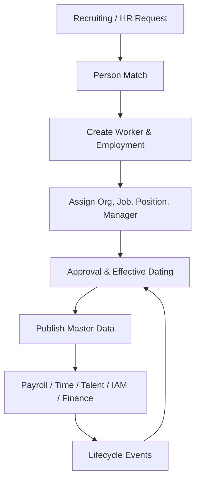

# Tổng quan phân hệ Nhân sự lõi, Cơ cấu tổ chức và Vị trí (Core HR, Organization & Position)

---

> [!NOTE]
> **Phạm vi tham khảo:** Tài liệu này chỉ sử dụng nguồn chính thức của SAP, gồm SAP SuccessFactors, SAP Employee Central, SAP Employee Central Payroll, SAP Fieldglass, SAP Help Portal và các giải pháp SAP liên quan. Thuật ngữ tiếng Anh được giữ trong ngoặc khi cần thiết để hỗ trợ BA/PO đối chiếu với tài liệu cấu hình và triển khai của SAP.


## Mục lục

```text
Tổng quan phân hệ Nhân sự lõi, Cơ cấu tổ chức và Vị trí (Core HR, Organization & Position)
├── 1. Bối cảnh nghiệp vụ (Domain Context)
│   ├── 1.1. Vị trí trong HRIS
│   ├── 1.2. Vai trò trong vận hành doanh nghiệp
│   └── 1.3. Mối liên hệ trong hệ sinh thái hệ thống
├── 2. Khái niệm nghiệp vụ cốt lõi (Core Business Concepts)
│   ├── 2.1. Cá nhân, Người lao động và Quan hệ việc làm (Person, Worker & Employment)
│   ├── 2.2. Tổ chức và Pháp nhân (Organization & Legal Entity)
│   ├── 2.3. Công việc, Vị trí và Phân công (Job, Position & Assignment)
│   ├── 2.4. Sự kiện việc làm (Employment Event)
│   ├── 2.5. Quản lý theo ngày hiệu lực (Effective Dating)
│   ├── 2.6. Tự phục vụ của nhân viên và quản lý (Employee & Manager Self-Service)
├── 3. Quy trình đầu-cuối điển hình (Typical End-to-End Process)
├── 4. So sánh chính sách (Policy) theo quy mô doanh nghiệp
├── 5. Các điểm đau phổ biến (Common Pain Points)
├── 6. Quy tắc nghiệp vụ trọng yếu (Key Business Rules)
│   ├── 6.1. Quy tắc định danh và trùng lặp (Identity & Duplicate Rule)
│   ├── 6.2. Quy tắc sức chứa vị trí (Position Capacity Rule)
│   ├── 6.3. Quy tắc ngày hiệu lực (Effective Date Rule)
│   ├── 6.4. Quy tắc xác định quản lý (Manager Derivation Rule)
│   ├── 6.5. Quy tắc trạng thái việc làm (Employment Status Rule)
│   ├── 6.6. Quy tắc truy cập dữ liệu (Data Access Rule)
├── 7. Góc nhìn dữ liệu và tích hợp (Data & Integration Perspective)
│   ├── 7.1. Dữ liệu cốt lõi trong miền nghiệp vụ (domain)
│   ├── 7.2. Logic quan hệ dữ liệu (Data Relationship Logic)
│   ├── 7.3. Luồng dữ liệu đầu-cuối (End-to-End Data Flow)
│   ├── 7.4. Rủi ro khuếch đại (Error Amplification Effect)
│   └── 7.5. Lưu ý cho BA/PO về dữ liệu và tích hợp
├── 8. Bản đồ phỏng vấn bên liên quan (Stakeholder Interview Mapping)
├── 9. Bảng thuật ngữ chuyên ngành
└── 10. Ghi chú nghiên cứu và nguồn SAP chính thức
```

---

## 1. Bối cảnh nghiệp vụ (Domain Context)

### 1.1. Vị trí trong HRIS
Core HR, Organization & Position là một miền nghiệp vụ quan trọng trong hệ sinh thái HCM/HRIS.

Trong cấu trúc HCM, miền nghiệp vụ (domain) này thường nằm trong:
* **Core HR / HRIS** – hệ thống hồ sơ nhân sự trung tâm
* **Organization Management** – cấu trúc pháp nhân, đơn vị, quản lý
* **Position & Job Architecture** – biên chế, vị trí, job family, grade
* **Employee Lifecycle** – hire, transfer, promotion, leave of absence, chấm dứt việc làm (termination)

> [!NOTE]
> Nếu Leave & Attendance trả lời “Nhân viên đã làm việc bao nhiêu?”, thì Core HR trả lời “Nhân viên là ai, thuộc tổ chức nào và quan hệ lao động nào đang có hiệu lực?”

#### Vai trò kiến trúc hệ thống
* Là hệ thống dữ liệu gốc (system of record) cho person, người lao động (worker), employment và organization
* Cung cấp dữ liệu chủ (master data) cho Payroll, Time, Talent, Finance và IAM
* Điều phối các sự kiện nhân sự có ngày hiệu lực
* Lưu lịch sử, kiểm toán (audit) và dữ liệu tuân thủ theo quốc gia

#### Tham chiếu giải pháp SAP

| Giải pháp/tài liệu SAP | Phạm vi tham khảo |
| :--- | :--- |
| [SAP SuccessFactors Employee Central](https://www.sap.com/products/hcm/employee-central-hris.html) | Nền tảng nhân sự lõi, hồ sơ nhân viên, sơ đồ tổ chức, tự phục vụ và bản địa hóa. |
| [SAP SuccessFactors Employee Central – SAP Help Portal](https://help.sap.com/docs/r/product/SAP_SUCCESSFACTORS_EMPLOYEE_CENTRAL/latest/en-US) | Mô hình tổ chức, cấu trúc công việc, vị trí và dữ liệu nhân viên theo ngày hiệu lực. |
| [Employee Central Integration to SAP Business Suite](https://help.sap.com/docs/successfactors-employee-central-integration-to-business-suite) | Sao chép dữ liệu nhân sự từ Employee Central sang hệ thống SAP khác. |

---

### 1.2. Vai trò trong vận hành doanh nghiệp

#### Độ tin cậy dữ liệu nhân sự
Sai pháp nhân, quản lý (manager) hoặc position sẽ lan sang quyền truy cập, payroll, báo cáo và phê duyệt.

#### Khả năng mở rộng tổ chức
Data model tốt cho phép tái cấu trúc, multi-company và multi-country mà không phải sửa logic ứng dụng.

#### Trải nghiệm employee/quản lý (manager) self-service
Nhân viên và quản lý có thể tự thực hiện thay đổi trong phạm vi được phân quyền.

#### Tuân thủ và kiểm toán
Hợp đồng, lịch sử công tác và thay đổi dữ liệu phải truy vết theo thời điểm có hiệu lực.

---

### 1.3. Mối liên hệ trong hệ sinh thái hệ thống

| miền nghiệp vụ (domain) liên quan | Mối quan hệ nghiệp vụ | Rủi ro nếu sai |
| :--- | :--- | :--- |
| Recruitment & tiếp nhận nhân viên (onboarding) | Nhận ứng viên (candidate)/new hire và tạo người lao động (worker)/employment | Trùng hồ sơ, sai ngày bắt đầu |
| Payroll | Cung cấp pháp nhân, hợp đồng, nhóm trả lương (pay group), lương cơ bản | Sai kỳ lương hoặc trả sai người |
| Time & Absence | Cung cấp shift group, location, employment status | Tính công sai đối tượng |
| Talent | Cung cấp job, position, quản lý (manager), grade, kỹ năng (skill) context | Sai chu kỳ đánh giá hoặc điều kiện áp dụng (eligibility) |
| IAM / ITSM | Kích hoạt, thay đổi, thu hồi tài khoản | Cấp thừa quyền hoặc không thu hồi quyền |
| Finance | Đồng bộ trung tâm chi phí (cost center) và lực lượng lao động (workforce) phân bổ chi phí (cost allocation) | Sai phân bổ chi phí |

> [!TIP]
> **Nhận định cho BA/PO:**
> miền nghiệp vụ (domain) không nên được thiết kế như một tập màn hình độc lập. Cần xác định rõ hệ thống dữ liệu gốc (system of record), ngày hiệu lực (effective date), chủ sở hữu luồng phê duyệt (workflow owner), tác động tới hệ thống phía sau (downstream impact) và cơ chế đối soát (reconciliation).

---

## 2. Khái niệm nghiệp vụ cốt lõi (Core Business Concepts)

### 2.1. Cá nhân, Người lao động và Quan hệ việc làm (Person, Worker & Employment)
Person là con người duy nhất; người lao động (worker) là vai trò trong lực lượng lao động; Employment là quan hệ lao động với một pháp nhân.

#### Thành phần hoặc biến số nghiệp vụ
* Một person có thể có nhiều employment
* Phân biệt employee, contingent người lao động (worker), intern và alumni
* Cần global identifier để tránh duplicate

#### Rủi ro phổ biến
* Merge nhầm hồ sơ
* Một người có hai mã không liên kết
* Sai lịch sử công tác

### 2.2. Tổ chức và Pháp nhân (Organization & Legal Entity)
Cấu trúc tổ chức mô tả doanh nghiệp, pháp nhân, business unit, department, team và quan hệ báo cáo.

#### Thành phần hoặc biến số nghiệp vụ
* Cấu trúc hierarchy và matrix
* Hiệu lực theo thời gian
* Gắn trung tâm chi phí (cost center), location và quản lý (manager)

#### Rủi ro phổ biến
* Circular hierarchy
* Đơn vị hết hiệu lực vẫn được sử dụng
* Sai báo cáo (reporting) line

### 2.3. Công việc, Vị trí và Phân công (Job, Position & Assignment)
Job mô tả loại công việc; Position là một ghế cụ thể; phân công (assignment) là phân công một người lao động (worker) vào position hoặc công việc.

#### Thành phần hoặc biến số nghiệp vụ
* Position control và số lượng nhân sự (headcount)
* Một position có thể trống hoặc có người
* Multiple phân công (assignment) và acting position

#### Rủi ro phổ biến
* Overfill position
* Tuyển khi chưa có số lượng nhân sự (headcount)
* Sai vacancy

### 2.4. Sự kiện việc làm (Employment Event)
Sự kiện nhân sự là giao dịch làm thay đổi quan hệ lao động: hire, transfer, promotion, change quản lý (manager), leave, chấm dứt việc làm (termination).

#### Thành phần hoặc biến số nghiệp vụ
* sự kiện (event) lý do (reason)
* Ngày hiệu lực
* luồng phê duyệt (workflow) và tác động tới hệ thống phía sau (downstream impact)

#### Rủi ro phổ biến
* Backdated change gây retro payroll
* Chọn sai sự kiện (event) lý do (reason)
* Không thu hồi quyền khi chấm dứt việc làm (termination)

### 2.5. Quản lý theo ngày hiệu lực (Effective Dating)
Cơ chế lưu bản ghi theo khoảng thời gian hiệu lực thay vì ghi đè trạng thái hiện tại.

#### Thành phần hoặc biến số nghiệp vụ
* Future-dated giao dịch (transaction)
* điều chỉnh (correction) và rescind
* Không cho khoảng thời gian chồng lấn

#### Rủi ro phổ biến
* Mất lịch sử
* Hai bản ghi cùng hiệu lực
* Báo cáo quá khứ sai

### 2.6. Tự phục vụ của nhân viên và quản lý (Employee & Manager Self-Service)
Cho phép người dùng tự xem, đề xuất và phê duyệt thay đổi trong giới hạn quyền.

#### Thành phần hoặc biến số nghiệp vụ
* Field-level permission
* Supporting tài liệu (document)
* Delegation và proxy

#### Rủi ro phổ biến
* Lộ dữ liệu nhạy cảm
* Cập nhật thiếu chứng từ
* phê duyệt (approval) routing sai

---

## 3. Quy trình đầu-cuối điển hình (Typical End-to-End Process)

1. Khởi tạo hoặc nhận người lao động (worker) từ Recruiting/tiếp nhận nhân viên (onboarding)
2. Kiểm tra duplicate person và định danh
3. Tạo employment theo pháp nhân (legal entity)
4. Gán organization, job, position, quản lý (manager) và location
5. Thiết lập hợp đồng, grade, nhóm trả lương (pay group) và điều kiện áp dụng (eligibility)
6. Phê duyệt personnel hành động (action)
7. Kích hoạt tích hợp tới hệ thống phía sau (downstream integration)
8. Trong vòng đời: transfer/promotion/change data/leave
9. chấm dứt việc làm (termination) hoặc conversion
10. Archive theo lưu giữ (retention) và kiểm toán (audit)



> [!IMPORTANT]
> BA cần mô tả riêng luồng chính (main flow), luồng thay thế (alternative flow), luồng ngoại lệ (exception flow), luồng phê duyệt (approval path) và luồng hoàn tác/sửa sai (rollback/correction path). Sơ đồ trên chỉ thể hiện luồng chuẩn (happy path) tổng quát.

---

## 4. So sánh chính sách (Policy) theo quy mô doanh nghiệp

| Yếu tố | Khởi nghiệp (Startup) | Doanh nghiệp vừa và nhỏ (SME) | Doanh nghiệp lớn (Enterprise) |
| :--- | :--- | :--- | :--- |
| Organization model | Flat, 1 pháp nhân | Nhiều phòng ban, một số chi nhánh | Multi-pháp nhân (legal entity), matrix, multi-country |
| Position management | Có thể chỉ dùng job title | Bắt đầu kiểm soát số lượng nhân sự (headcount) | Position control, vacancy, supervisory org |
| luồng phê duyệt (workflow) | 1 cấp hoặc HR cập nhật trực tiếp | quản lý (manager) + HR | Dynamic routing, HRBP, finance, compliance |
| quản lý theo ngày hiệu lực (effective dating) | Lịch sử cơ bản | Future-dated giao dịch (transaction) | Retro, điều chỉnh (correction), rescind, mass change |
| bản địa hóa (localization) | Một bộ trường dữ liệu | Theo pháp nhân | Country-specific mô hình dữ liệu (data model) và lưu giữ (retention) |
| tích hợp (integration) | Import/export thủ công | API định kỳ | sự kiện (event)-driven, IAM, payroll, finance, data lake |

### Xu hướng tăng độ phức tạp theo quy mô
1. Số biến số và số đối tượng áp dụng (population) tăng; cùng một rule có thể khác theo pháp nhân, quốc gia, người lao động (worker) type, job và thời điểm.
2. phê duyệt (approval) từ một cấp chuyển thành dynamic routing, delegation, SLA và ngoại lệ (exception) phê duyệt (approval).
3. Tích hợp chuyển từ file thủ công sang API/hướng sự kiện (event-driven), cần tính không trùng lặp (idempotency), thử lại (retry), monitoring và đối soát (reconciliation).
4. Chi phí sai sót tăng theo quy mô đối tượng áp dụng (population) và độ nhạy cảm của quyết định.

### Lưu ý cho BA/PO theo cấp độ

| Cấp độ | Trọng tâm phân tích |
| :--- | :--- |
| Startup | Thiết kế tối giản nhưng tránh mã hóa cứng (hard-code); vẫn cần ID chuẩn, kiểm toán (audit) tối thiểu và khả năng mở rộng. |
| SME | Chuẩn hóa policy, vai trò (role), SLA, phê duyệt (approval), ngoại lệ (exception) và tích hợp (integration) boundary. |
| Enterprise | Rule engine, quản lý theo ngày hiệu lực (effective dating), bản địa hóa (localization), segregation of duties, immutable kiểm toán (audit) và data quản trị (governance). |

---

## 5. Các điểm đau phổ biến (Common Pain Points)

| Điểm đau (Pain Point) | Biểu hiện thực tế | Nguyên nhân gốc rễ | Tác động kinh doanh | Lưu ý cho BA/PO |
| :--- | :--- | :--- | :--- | :--- |
| Duplicate employee/person | Một nhân viên có nhiều mã hoặc hồ sơ | Không có global identifier, kiểm tra trùng yếu | Sai payroll, phân tích (analytics) và quyền truy cập | Thiết kế matching rule, merge có kiểm soát |
| Org data không đồng nhất | Tên phòng ban/trung tâm chi phí (cost center) khác nhau giữa hệ thống | Không xác định master system | Sai báo cáo và phê duyệt | Chốt ownership và ánh xạ (mapping) reference data |
| Hard-code cấu trúc tổ chức | Mỗi lần tái cấu trúc phải sửa code | Data model không configurable | Chậm change request | Thiết kế foundation object và quản lý theo ngày hiệu lực (effective dating) |
| Backdated change không kiểm soát | Sửa quá khứ làm thay đổi payroll đã chốt | Không có retro impact assessment | Truy thu/truy lĩnh hàng loạt | Hiển thị impact và yêu cầu phê duyệt (approval) đặc biệt |
| Phân quyền quá rộng | quản lý (manager) xem dữ liệu ngoài team hoặc HR xem dư trường | vai trò (role) model đơn giản | Vi phạm riêng tư | Kết hợp vai trò (role) + organization + relationship + field bảo mật (security) |
| nghỉ việc (offboarding) thiếu đồng bộ | Nhân viên nghỉ nhưng tài khoản còn hoạt động | tích hợp (integration) không theo sự kiện (event) | Rủi ro bảo mật | Dùng chấm dứt việc làm (termination) sự kiện (event) làm trigger bắt buộc |

---

## 6. Quy tắc nghiệp vụ trọng yếu (Key Business Rules)

Business Rules là tầng quyết định hệ thống diễn giải dữ liệu và cho phép giao dịch (transaction) như thế nào. Rule cần có chủ sở hữu (owner), effective phiên bản (version), test case và kiểm toán (audit) thay đổi.

### Bảng tổng hợp quy tắc nghiệp vụ (Business Rules)

| Nhóm quy tắc (Rule) | Câu hỏi nghiệp vụ trọng tâm | Biến số cấu hình | Rủi ro nếu sai |
| :--- | :--- | :--- | :--- |
| Identity & Duplicate Rule | Khi nào coi hai hồ sơ là cùng một person? | ID quốc gia, email, ngày sinh, fuzzy matching | Merge sai hoặc duplicate |
| Position Capacity Rule | Một position được phép có bao nhiêu incumbent? | FTE, số lượng nhân sự (headcount), overfill threshold | Vượt biên chế |
| ngày hiệu lực (effective date) Rule | Cho phép backdate/future date đến mức nào? | chốt dữ liệu (cut-off), vai trò (role), sự kiện (event) type | Retro impact không kiểm soát |
| quản lý (manager) Derivation Rule | quản lý (manager) lấy từ position, organization hay nhập trực tiếp? | Supervisory org, matrix quản lý (manager) | phê duyệt (approval) routing sai |
| Employment Status Rule | Sự kiện nào làm người lao động (worker) Active/Leave/Terminated? | sự kiện (event) lý do (reason), start/end date | Tính lương cho người đã nghỉ |
| quyền truy cập dữ liệu (data access) Rule | Ai được xem/sửa trường nào và tập nhân viên nào? | vai trò (role), org scope, relationship, field sensitivity | Rò rỉ dữ liệu |

### 6.1. Quy tắc định danh và trùng lặp (Identity & Duplicate Rule)
* **Câu hỏi trọng tâm:** Khi nào coi hai hồ sơ là cùng một person?
* **Biến số cấu hình:** ID quốc gia, email, ngày sinh, fuzzy matching
* **Rủi ro:** Merge sai hoặc duplicate
* **BA cần xác nhận:** rule áp dụng cho đối tượng áp dụng (population) nào, theo ngày hiệu lực nào, ai được ghi đè đặc quyền (override) và ghi đè đặc quyền (override) có cần phê duyệt/kiểm toán (approval/audit) hay không.

### 6.2. Quy tắc sức chứa vị trí (Position Capacity Rule)
* **Câu hỏi trọng tâm:** Một position được phép có bao nhiêu incumbent?
* **Biến số cấu hình:** FTE, số lượng nhân sự (headcount), overfill threshold
* **Rủi ro:** Vượt biên chế
* **BA cần xác nhận:** rule áp dụng cho đối tượng áp dụng (population) nào, theo ngày hiệu lực nào, ai được ghi đè đặc quyền (override) và ghi đè đặc quyền (override) có cần phê duyệt/kiểm toán (approval/audit) hay không.

### 6.3. Quy tắc ngày hiệu lực (Effective Date Rule)
* **Câu hỏi trọng tâm:** Cho phép backdate/future date đến mức nào?
* **Biến số cấu hình:** chốt dữ liệu (cut-off), vai trò (role), sự kiện (event) type
* **Rủi ro:** Retro impact không kiểm soát
* **BA cần xác nhận:** rule áp dụng cho đối tượng áp dụng (population) nào, theo ngày hiệu lực nào, ai được ghi đè đặc quyền (override) và ghi đè đặc quyền (override) có cần phê duyệt/kiểm toán (approval/audit) hay không.

### 6.4. Quy tắc xác định quản lý (Manager Derivation Rule)
* **Câu hỏi trọng tâm:** quản lý (manager) lấy từ position, organization hay nhập trực tiếp?
* **Biến số cấu hình:** Supervisory org, matrix quản lý (manager)
* **Rủi ro:** phê duyệt (approval) routing sai
* **BA cần xác nhận:** rule áp dụng cho đối tượng áp dụng (population) nào, theo ngày hiệu lực nào, ai được ghi đè đặc quyền (override) và ghi đè đặc quyền (override) có cần phê duyệt/kiểm toán (approval/audit) hay không.

### 6.5. Quy tắc trạng thái việc làm (Employment Status Rule)
* **Câu hỏi trọng tâm:** Sự kiện nào làm người lao động (worker) Active/Leave/Terminated?
* **Biến số cấu hình:** sự kiện (event) lý do (reason), start/end date
* **Rủi ro:** Tính lương cho người đã nghỉ
* **BA cần xác nhận:** rule áp dụng cho đối tượng áp dụng (population) nào, theo ngày hiệu lực nào, ai được ghi đè đặc quyền (override) và ghi đè đặc quyền (override) có cần phê duyệt/kiểm toán (approval/audit) hay không.

### 6.6. Quy tắc truy cập dữ liệu (Data Access Rule)
* **Câu hỏi trọng tâm:** Ai được xem/sửa trường nào và tập nhân viên nào?
* **Biến số cấu hình:** vai trò (role), org scope, relationship, field sensitivity
* **Rủi ro:** Rò rỉ dữ liệu
* **BA cần xác nhận:** rule áp dụng cho đối tượng áp dụng (population) nào, theo ngày hiệu lực nào, ai được ghi đè đặc quyền (override) và ghi đè đặc quyền (override) có cần phê duyệt/kiểm toán (approval/audit) hay không.

---

## 7. Góc nhìn dữ liệu và tích hợp (Data & Integration Perspective)

### 7.1. Dữ liệu cốt lõi trong miền nghiệp vụ (domain)

| Đối tượng dữ liệu (Data Object) | Vai trò nghiệp vụ | Phụ thuộc vào | Rủi ro nếu sai |
| :--- | :--- | :--- | :--- |
| Person ID | Định danh con người | Identity/dữ liệu chủ (master data) | Duplicate hoặc merge sai |
| người lao động (worker) ID | Định danh vai trò lao động | Person | Sai liên kết lifecycle |
| Employment ID | Quan hệ với pháp nhân | pháp nhân (legal entity) | Sai payroll/bản địa hóa (localization) |
| Organization ID | Đơn vị quản lý | Org hierarchy | Sai báo cáo (reporting) |
| Job / Position ID | Kiến trúc công việc và biên chế | Job catalog/số lượng nhân sự (headcount) | Sai vacancy/grade |
| quản lý (manager) ID | Quan hệ quản lý | Position/org rule | Sai phê duyệt (approval)/bảo mật (security) |
| Effective Start/End | Khoảng hiệu lực | Personnel sự kiện (event) | Chồng lấn lịch sử |
| sự kiện (event) & lý do (reason) | Ngữ nghĩa thay đổi | luồng phê duyệt (workflow)/config | Sai downstream hành động (action) |

### 7.2. Logic quan hệ dữ liệu (Data Relationship Logic)
* `1 Person → N người lao động (worker) records`
* `1 người lao động (worker) → N Employment records theo pháp nhân hoặc thời kỳ`
* `1 Organization → N Positions`
* `1 Position → 0..N Assignments tùy capacity rule`
* `Personnel sự kiện (event) → tạo phiên bản dữ liệu mới có ngày hiệu lực (effective date)`
* `chấm dứt việc làm (termination) sự kiện (event) → trigger payroll final, IAM revoke và nghỉ việc (offboarding)`

### 7.3. Luồng dữ liệu đầu-cuối (End-to-End Data Flow)


### 7.4. Rủi ro khuếch đại (Error Amplification Effect)

**Hiệu ứng khuếch đại:** Sai quản lý (manager)/Position → sai luồng phê duyệt (workflow) → sai quyền truy cập → sai đánh giá hoặc payroll → sai báo cáo quản trị.

### 7.5. Lưu ý cho BA/PO về dữ liệu và tích hợp

* **Nguồn dữ liệu chuẩn (source of truth):** object nào do hệ thống nào sở hữu?
* **Dữ liệu theo thời gian (temporal data):** dữ liệu lấy theo trạng thái hiện tại, ngày hiệu lực (effective date) hay ảnh chụp dữ liệu (snapshot)?
* **Chất lượng dữ liệu (data quality):** validation, duplicate, referential integrity và đối soát (reconciliation) report là gì?
* **tích hợp (integration):** synchronous hay asynchronous; batch hay sự kiện (event); full hay phần chênh lệch (delta)?
* **Xử lý lỗi (error handling):** thử lại (retry), tính không trùng lặp (idempotency), dead-letter queue và manual điều chỉnh (correction)?
* **Bảo mật và quyền riêng tư (security & privacy):** row/field-level quyền truy cập (access), masking, lưu giữ (retention) và sự đồng ý (consent)?
* **kiểm toán (audit):** có lưu giá trị trước/sau (before/after), rule phiên bản (version), actor, timestamp và correlation ID?

---

## 8. Bản đồ phỏng vấn bên liên quan (Stakeholder Interview Mapping)

| Nhóm mục tiêu | Bên liên quan chính | Tập trung vào | Câu hỏi ví dụ |
| :--- | :--- | :--- | :--- |
| Data ownership | HR Operations, HRIS | Person/người lao động (worker)/employment, quản lý theo ngày hiệu lực (effective dating) | Hệ thống nào tạo mã nhân viên? Khi trùng hồ sơ xử lý thế nào? |
| Organization design | HRBP, Leadership | Org, job, position, số lượng nhân sự (headcount) | Position có bắt buộc không? Ai được tạo hoặc đóng position? |
| Payroll dependency | Payroll, C&B | nhóm trả lương (pay group), effective change, retro | Backdated transfer/tăng lương ảnh hưởng payroll thế nào? |
| bảo mật (security) | IT, Data Privacy | vai trò (role), field bảo mật (security), IAM | quản lý (manager) được xem các trường nào? Dữ liệu nào phải mask? |
| tích hợp (integration) | IT, Enterprise Architecture | Master system, API/sự kiện (event) | Downstream nhận phần chênh lệch (delta) hay full file? thử lại (retry) và đối soát (reconciliation) ra sao? |
| Compliance | Legal, HR | lưu giữ (retention), bản địa hóa (localization), kiểm toán (audit) | Hồ sơ cần lưu bao lâu? Quy tắc khác nhau theo quốc gia nào? |

## 9. Bảng thuật ngữ chuyên ngành

| Thuật ngữ (viết tắt) | Dịch | Mô tả |
| :--- | :--- | :--- |
| **HCM** | Quản trị nguồn nhân lực | Phạm vi quản trị toàn vòng đời và năng lực lực lượng lao động. |
| **HRIS** | Hệ thống thông tin nhân sự | Hệ thống lưu trữ và xử lý dữ liệu nhân sự cốt lõi. |
| **EC** | SAP SuccessFactors Employee Central | Giải pháp nhân sự lõi của SAP SuccessFactors. |
| **Cá nhân (Person)** | Con người duy nhất | Bản ghi định danh một cá nhân, có thể liên kết nhiều quan hệ việc làm. |
| **Người lao động (Worker)** | Vai trò trong lực lượng lao động | Thể hiện cá nhân đang tham gia tổ chức với tư cách nhân viên hoặc lao động khác. |
| **Quan hệ việc làm (Employment)** | Quan hệ với pháp nhân | Quan hệ lao động giữa người lao động và một pháp nhân cụ thể. |
| **Pháp nhân (Legal Entity)** | Đơn vị pháp lý | Tổ chức có tư cách ký hợp đồng và chịu nghĩa vụ pháp lý. |
| **Đơn vị kinh doanh (Business Unit)** | Khối kinh doanh | Cấp tổ chức phục vụ quản trị và báo cáo. |
| **Công việc (Job)** | Mẫu công việc | Định nghĩa chung về trách nhiệm, yêu cầu và cấp độ công việc. |
| **Vị trí (Position)** | Ghế biên chế cụ thể | Một chỗ làm cụ thể trong cơ cấu tổ chức có thể trống hoặc có người giữ. |
| **Phân công (Assignment)** | Giao nhiệm vụ/vị trí | Quan hệ gán người lao động vào công việc hoặc vị trí. |
| **Đối tượng nền tảng (Foundation Object)** | Dữ liệu cấu trúc dùng chung | Các đối tượng như pháp nhân, đơn vị, địa điểm, cấp bậc dùng xuyên suốt hệ thống. |
| **MDF** | Khung dữ liệu siêu dữ liệu | Nền tảng cấu hình đối tượng và quy tắc trong SAP SuccessFactors. |
| **Quản lý theo ngày hiệu lực (Effective Dating)** | Lưu phiên bản theo thời gian | Cơ chế lưu dữ liệu hiện tại, quá khứ và tương lai theo ngày hiệu lực. |
| **Lý do sự kiện (Event Reason)** | Nguyên nhân thay đổi nhân sự | Mã nghiệp vụ giải thích một thay đổi như tuyển mới, thăng chức, điều chuyển. |
| **ESS** | Tự phục vụ của nhân viên | Khả năng để nhân viên tự xem hoặc cập nhật thông tin được phép. |
| **MSS** | Tự phục vụ của quản lý | Khả năng để quản lý xem đội nhóm và thực hiện tác vụ nhân sự. |
| **RBP** | Phân quyền theo vai trò | Mô hình cấp quyền của SAP SuccessFactors theo vai trò và nhóm đối tượng. |
| **SoR** | Hệ thống dữ liệu gốc | Nguồn dữ liệu chính thức cho hồ sơ nhân sự và cơ cấu. |

---

## 10. Ghi chú nghiên cứu và nguồn SAP chính thức

### 10.1. Nguyên tắc nghiên cứu

* Chỉ sử dụng tài liệu và trang sản phẩm chính thức thuộc hệ sinh thái SAP.
* Nội dung được chuẩn hóa theo miền nghiệp vụ để BA/PO có thể dùng cho khám phá sản phẩm, phân rã quy trình, mô hình miền và quản lý tồn đọng sản phẩm.
* Tên tính năng cụ thể có thể thay đổi theo phiên bản phát hành và cấu hình của từng khách hàng SAP SuccessFactors.
* Quy tắc pháp lý theo quốc gia vẫn cần được xác minh riêng theo ngày hiệu lực trước khi chuyển thành yêu cầu chính thức.

### 10.2. Nguồn tham khảo

| Giải pháp/tài liệu SAP | Phạm vi sử dụng trong nghiên cứu |
| :--- | :--- |
| [SAP SuccessFactors Employee Central](https://www.sap.com/products/hcm/employee-central-hris.html) | Nền tảng nhân sự lõi, hồ sơ nhân viên, sơ đồ tổ chức, tự phục vụ và bản địa hóa. |
| [SAP SuccessFactors Employee Central – SAP Help Portal](https://help.sap.com/docs/r/product/SAP_SUCCESSFACTORS_EMPLOYEE_CENTRAL/latest/en-US) | Mô hình tổ chức, cấu trúc công việc, vị trí và dữ liệu nhân viên theo ngày hiệu lực. |
| [Employee Central Integration to SAP Business Suite](https://help.sap.com/docs/successfactors-employee-central-integration-to-business-suite) | Sao chép dữ liệu nhân sự từ Employee Central sang hệ thống SAP khác. |

