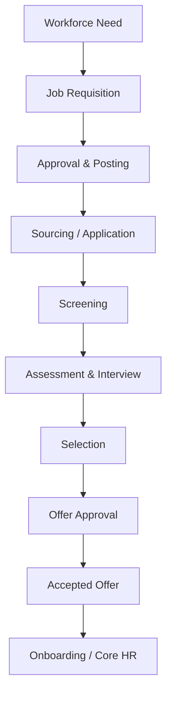

# Tổng quan phân hệ Tuyển dụng và Thu hút nhân tài (Recruitment & Talent Acquisition)

---

> [!NOTE]
> **Phạm vi tham khảo:** Tài liệu này chỉ sử dụng nguồn chính thức của SAP, gồm SAP SuccessFactors, SAP Employee Central, SAP Employee Central Payroll, SAP Fieldglass, SAP Help Portal và các giải pháp SAP liên quan. Thuật ngữ tiếng Anh được giữ trong ngoặc khi cần thiết để hỗ trợ BA/PO đối chiếu với tài liệu cấu hình và triển khai của SAP.


## Mục lục

```text
Tổng quan phân hệ Tuyển dụng và Thu hút nhân tài (Recruitment & Talent Acquisition)
├── 1. Bối cảnh nghiệp vụ (Domain Context)
│   ├── 1.1. Vị trí trong HRIS
│   ├── 1.2. Vai trò trong vận hành doanh nghiệp
│   └── 1.3. Mối liên hệ trong hệ sinh thái hệ thống
├── 2. Khái niệm nghiệp vụ cốt lõi (Core Business Concepts)
│   ├── 2.1. Yêu cầu tuyển dụng (Job Requisition)
│   ├── 2.2. Ứng viên và Nhân sự tiềm năng (Candidate & Prospect)
│   ├── 2.3. Hồ sơ ứng tuyển và Giai đoạn tuyển dụng (Application & Pipeline Stage)
│   ├── 2.4. Kế hoạch phỏng vấn và Phiếu chấm điểm (Interview Plan & Scorecard)
│   ├── 2.5. Thư mời nhận việc (Offer)
│   ├── 2.6. Nguồn ứng viên và Kho nhân tài (Talent Pool & Source)
├── 3. Quy trình đầu-cuối điển hình (Typical End-to-End Process)
├── 4. So sánh chính sách (Policy) theo quy mô doanh nghiệp
├── 5. Các điểm đau phổ biến (Common Pain Points)
├── 6. Quy tắc nghiệp vụ trọng yếu (Key Business Rules)
│   ├── 6.1. Quy tắc đủ điều kiện mở yêu cầu tuyển dụng (Requisition Eligibility Rule)
│   ├── 6.2. Quy tắc trùng ứng viên (Candidate Duplicate Rule)
│   ├── 6.3. Quy tắc chuyển giai đoạn (Stage Transition Rule)
│   ├── 6.4. Quy tắc hiển thị đánh giá phỏng vấn (Interview Visibility Rule)
│   ├── 6.5. Thư mời nhận việc (Offer) Guardrail Rule
│   ├── 6.6. Quy tắc đồng ý và lưu giữ dữ liệu (Consent & Retention Rule)
├── 7. Góc nhìn dữ liệu và tích hợp (Data & Integration Perspective)
│   ├── 7.1. Dữ liệu cốt lõi trong miền nghiệp vụ (domain)
│   ├── 7.2. Logic quan hệ dữ liệu (Data Relationship Logic)
│   ├── 7.3. Luồng dữ liệu đầu-cuối (End-to-End Data Flow)
│   ├── 7.4. Rủi ro khuếch đại (Error Amplification Effect)
│   └── 7.5. Lưu ý cho BA/PO về dữ liệu và tích hợp
├── 8. Bản đồ phỏng vấn bên liên quan (Stakeholder Interview Mapping)
├── 9. Bảng thuật ngữ chuyên ngành
└── 10. Ghi chú nghiên cứu và nguồn SAP chính thức
```

---

## 1. Bối cảnh nghiệp vụ (Domain Context)

### 1.1. Vị trí trong HRIS
Recruitment & thu hút nhân tài (Talent Acquisition) là một miền nghiệp vụ quan trọng trong hệ sinh thái HCM/HRIS.

Trong cấu trúc HCM, miền nghiệp vụ (domain) này thường nằm trong:
* **thu hút nhân tài (Talent Acquisition)** – sourcing, ATS, interview và thư mời nhận việc (offer)
* **hoạch định lực lượng lao động (workforce planning)** – nhận số lượng nhân sự (headcount) và nhu cầu kỹ năng
* **Employer Brand & ứng viên (candidate) trải nghiệm (experience)**
* **Recruit-to-Hire tích hợp (integration) với tiếp nhận nhân viên (onboarding) và Core HR**

> [!NOTE]
> Nếu Core HR quản lý người đã thuộc tổ chức, thì Recruitment quản lý nhu cầu tuyển và hành trình biến một prospect/ứng viên (candidate) thành new hire.

#### Vai trò kiến trúc hệ thống
* Quản lý yêu cầu tuyển dụng (requisition) và ứng viên (candidate) pipeline
* Duy trì ứng viên (candidate) identity, sự đồng ý (consent) và lịch sử tương tác
* Điều phối collaboration giữa hiring quản lý (manager), recruiter và interviewer
* Chuyển dữ liệu đã xác thực sang tiếp nhận nhân viên (onboarding)/core HR

#### Tham chiếu giải pháp SAP

| Giải pháp/tài liệu SAP | Phạm vi tham khảo |
| :--- | :--- |
| [SmartRecruiters for SAP SuccessFactors](https://www.sap.com/products/hcm/recruiting-software.html) | Thu hút, tìm nguồn, sàng lọc, giao tiếp và tuyển dụng đầu-cuối. |
| [SAP SuccessFactors Recruiting – SAP Help Portal](https://help.sap.com/docs/successfactors-recruiting) | Yêu cầu tuyển dụng, hồ sơ ứng viên, trang nghề nghiệp, lựa chọn và thư mời. |
| [Setting Up and Maintaining SAP SuccessFactors Recruiting](https://help.sap.com/docs/successfactors-recruiting/setting-up-and-maintaining-sap-successfactors-recruiting) | Quy trình tuyển dụng có thể cấu hình và các tính năng cốt lõi. |

---

### 1.2. Vai trò trong vận hành doanh nghiệp

#### Tốc độ tuyển dụng
Quy trình và automation ảnh hưởng trực tiếp time-to-fill và năng lực mở rộng kinh doanh.

#### Chất lượng tuyển
Scorecard, competency và structured interview giúp giảm quyết định cảm tính.

#### ứng viên (candidate) trải nghiệm (experience)
Giao tiếp chậm hoặc trạng thái không minh bạch làm giảm thư mời nhận việc (offer) acceptance.

#### Compliance và fairness
Phải quản lý sự đồng ý (consent), lưu giữ (retention), equal opportunity và kiểm toán (audit) quyết định.

---

### 1.3. Mối liên hệ trong hệ sinh thái hệ thống

| miền nghiệp vụ (domain) liên quan | Mối quan hệ nghiệp vụ | Rủi ro nếu sai |
| :--- | :--- | :--- |
| hoạch định lực lượng lao động (workforce planning) | Nhận số lượng nhân sự (headcount), budget và kỹ năng (skill) demand | Tuyển vượt kế hoạch |
| Core HR / Position | Kiểm tra vị trí và tạo pre-hire | Hire không có position hợp lệ |
| tiếp nhận nhân viên (onboarding) | Chuyển thư mời nhận việc (offer), tài liệu (document), start date | Nhập lại dữ liệu và sai ngày bắt đầu |
| Compensation | Kiểm tra range và thư mời nhận việc (offer) package | thư mời nhận việc (offer) vượt ngân sách/pay equity |
| xác minh lý lịch (background check) / Assessment | Gửi yêu cầu và nhận kết quả | Chậm SLA hoặc sử dụng dữ liệu sai mục đích |
| Job Boards / nghề nghiệp (career) Site | Đăng tin và nhận application | Nguồn ứng viên, sự đồng ý (consent) không nhất quán |

> [!TIP]
> **Nhận định cho BA/PO:**
> miền nghiệp vụ (domain) không nên được thiết kế như một tập màn hình độc lập. Cần xác định rõ hệ thống dữ liệu gốc (system of record), ngày hiệu lực (effective date), chủ sở hữu luồng phê duyệt (workflow owner), tác động tới hệ thống phía sau (downstream impact) và cơ chế đối soát (reconciliation).

---

## 2. Khái niệm nghiệp vụ cốt lõi (Core Business Concepts)

### 2.1. Yêu cầu tuyển dụng (Job Requisition)
Yêu cầu tuyển chính thức gắn với nhu cầu, position, budget và phê duyệt (approval).

#### Thành phần hoặc biến số nghiệp vụ
* Replacement/new số lượng nhân sự (headcount)
* Number of openings
* Target start date và recruiter

#### Rủi ro phổ biến
* Tuyển khi chưa duyệt ngân sách
* yêu cầu tuyển dụng (requisition) trùng
* Không đóng yêu cầu tuyển dụng (requisition) khi đủ người

### 2.2. Ứng viên và Nhân sự tiềm năng (Candidate & Prospect)
Prospect là người tiềm năng chưa ứng tuyển; ứng viên (candidate) là người đã tham gia một job application.

#### Thành phần hoặc biến số nghiệp vụ
* Global ứng viên (candidate) profile
* Multiple applications
* Duplicate detection

#### Rủi ro phổ biến
* Lịch sử phân mảnh
* Gửi email trùng
* Không tôn trọng sự đồng ý (consent)

### 2.3. Hồ sơ ứng tuyển và Giai đoạn tuyển dụng (Application & Pipeline Stage)
Application là quan hệ ứng viên (candidate)–yêu cầu tuyển dụng (requisition) và di chuyển qua các stage.

#### Thành phần hoặc biến số nghiệp vụ
* Configurable stage
* Disposition lý do (reason)
* Stage SLA

#### Rủi ro phổ biến
* Ứng viên mắc kẹt
* Báo cáo funnel sai
* Không có lý do loại

### 2.4. Kế hoạch phỏng vấn và Phiếu chấm điểm (Interview Plan & Scorecard)
Chuỗi vòng phỏng vấn và tiêu chí đánh giá được chuẩn hóa.

#### Thành phần hoặc biến số nghiệp vụ
* Panel, availability, phản hồi (feedback) deadline
* Competency/kỹ năng (skill) criteria
* Blind hoặc sequential phản hồi (feedback)

#### Rủi ro phổ biến
* Bias
* Lộ phản hồi (feedback)
* Thiếu phản hồi

### 2.5. Thư mời nhận việc (Offer)
Đề nghị tuyển dụng gồm compensation, start date, terms và phê duyệt (approval).

#### Thành phần hoặc biến số nghiệp vụ
* thư mời nhận việc (offer) phiên bản (version)
* Negotiation
* E-signature

#### Rủi ro phổ biến
* Vượt dải lương (salary range)
* Gửi nhầm phiên bản
* Không đồng bộ accepted thư mời nhận việc (offer)

### 2.6. Nguồn ứng viên và Kho nhân tài (Talent Pool & Source)
Kho ứng viên và nguồn tuyển phục vụ remarketing và đo hiệu quả.

#### Thành phần hoặc biến số nghiệp vụ
* sự đồng ý (consent) expiry
* Source attribution
* Campaign

#### Rủi ro phổ biến
* Spam ứng viên (candidate)
* ROI nguồn tuyển sai
* lưu giữ (retention) vi phạm

---

## 3. Quy trình đầu-cuối điển hình (Typical End-to-End Process)

1. Hiring quản lý (manager) tạo yêu cầu tuyển dụng (requisition)
2. Kiểm tra position/số lượng nhân sự (headcount)/budget
3. phê duyệt (approval) và assign recruiter
4. Tạo posting và sourcing campaign
5. Nhận/match ứng viên (candidate), kiểm tra duplicate và sự đồng ý (consent)
6. Screening và shortlist
7. Assessment/interview/scorecard
8. Selection và reference/xác minh lý lịch (background check)
9. thư mời nhận việc (offer) phê duyệt (approval), negotiation và e-sign
10. Convert to pre-hire và kích hoạt tiếp nhận nhân viên (onboarding)
11. Close yêu cầu tuyển dụng (requisition) và phân tích funnel



> [!IMPORTANT]
> BA cần mô tả riêng luồng chính (main flow), luồng thay thế (alternative flow), luồng ngoại lệ (exception flow), luồng phê duyệt (approval path) và luồng hoàn tác/sửa sai (rollback/correction path). Sơ đồ trên chỉ thể hiện luồng chuẩn (happy path) tổng quát.

---

## 4. So sánh chính sách (Policy) theo quy mô doanh nghiệp

| Yếu tố | Khởi nghiệp (Startup) | Doanh nghiệp vừa và nhỏ (SME) | Doanh nghiệp lớn (Enterprise) |
| :--- | :--- | :--- | :--- |
| Hiring volume | Tuyển ít, xử lý thủ công | Nhiều yêu cầu tuyển dụng (requisition) theo phòng ban | High-volume, campus, global sourcing |
| Pipeline | 3–4 stage cố định | Theo job family | Configurable theo country/business |
| phê duyệt (approval) | Hiring quản lý (manager) + founder | quản lý (manager) + HR + finance | số lượng nhân sự (headcount), compensation, legal, matrix |
| Interview | Lịch thủ công | Panel và scorecard | Scheduling automation, assessment tích hợp (integration) |
| ứng viên (candidate) data | CV/email | ATS profile | CRM, sự đồng ý (consent), lưu giữ (retention) theo khu vực |
| phân tích (analytics) | Số lượng ứng viên | Time-to-fill, source | Quality-of-hire, skills gap, diversity/fairness |

### Xu hướng tăng độ phức tạp theo quy mô
1. Số biến số và số đối tượng áp dụng (population) tăng; cùng một rule có thể khác theo pháp nhân, quốc gia, người lao động (worker) type, job và thời điểm.
2. phê duyệt (approval) từ một cấp chuyển thành dynamic routing, delegation, SLA và ngoại lệ (exception) phê duyệt (approval).
3. Tích hợp chuyển từ file thủ công sang API/hướng sự kiện (event-driven), cần tính không trùng lặp (idempotency), thử lại (retry), monitoring và đối soát (reconciliation).
4. Chi phí sai sót tăng theo quy mô đối tượng áp dụng (population) và độ nhạy cảm của quyết định.

### Lưu ý cho BA/PO theo cấp độ

| Cấp độ | Trọng tâm phân tích |
| :--- | :--- |
| Startup | Thiết kế tối giản nhưng tránh mã hóa cứng (hard-code); vẫn cần ID chuẩn, kiểm toán (audit) tối thiểu và khả năng mở rộng. |
| SME | Chuẩn hóa policy, vai trò (role), SLA, phê duyệt (approval), ngoại lệ (exception) và tích hợp (integration) boundary. |
| Enterprise | Rule engine, quản lý theo ngày hiệu lực (effective dating), bản địa hóa (localization), segregation of duties, immutable kiểm toán (audit) và data quản trị (governance). |

---

## 5. Các điểm đau phổ biến (Common Pain Points)

| Điểm đau (Pain Point) | Biểu hiện thực tế | Nguyên nhân gốc rễ | Tác động kinh doanh | Lưu ý cho BA/PO |
| :--- | :--- | :--- | :--- | :--- |
| yêu cầu tuyển dụng (requisition) không gắn số lượng nhân sự (headcount) | Tuyển vượt biên chế | ATS tách rời hoạch định (planning)/core HR | Vượt ngân sách | Bắt buộc position/budget validation |
| ứng viên (candidate) duplicate | Một người có nhiều profile | Nhiều nguồn import, matching yếu | Trải nghiệm kém và báo cáo sai | Thiết kế global ứng viên (candidate) identity |
| phản hồi (feedback) phỏng vấn chậm | Ứng viên chờ lâu | Không SLA/reminder | Mất ứng viên tốt | Stage SLA và escalation |
| Đánh giá cảm tính | Nhận xét tự do, thiếu tiêu chí | Không scorecard | Bias và quality-of-hire thấp | Structured interview và hiệu chỉnh (calibration) |
| thư mời nhận việc (offer) ngoài band | thư mời nhận việc (offer) vượt ngân sách hoặc bất bình đẳng | Không tích hợp compensation | Rủi ro tài chính/pay equity | Guardrail và ngoại lệ (exception) phê duyệt (approval) |
| Dữ liệu ứng viên lưu quá hạn | Không xóa theo sự đồng ý (consent) | Không có lưu giữ (retention) luồng phê duyệt (workflow) | Rủi ro privacy | sự đồng ý (consent) phiên bản (version) và auto purge/anonymize |

---

## 6. Quy tắc nghiệp vụ trọng yếu (Key Business Rules)

Business Rules là tầng quyết định hệ thống diễn giải dữ liệu và cho phép giao dịch (transaction) như thế nào. Rule cần có chủ sở hữu (owner), effective phiên bản (version), test case và kiểm toán (audit) thay đổi.

### Bảng tổng hợp quy tắc nghiệp vụ (Business Rules)

| Nhóm quy tắc (Rule) | Câu hỏi nghiệp vụ trọng tâm | Biến số cấu hình | Rủi ro nếu sai |
| :--- | :--- | :--- | :--- |
| yêu cầu tuyển dụng (requisition) điều kiện áp dụng (eligibility) Rule | Ai được tạo yêu cầu tuyển dụng (requisition) và khi nào? | Position status, budget, replacement/new | Tuyển không hợp lệ |
| ứng viên (candidate) Duplicate Rule | Khi nào merge ứng viên (candidate)? | Email, phone, name, ID, fuzzy match | Merge sai hoặc duplicate |
| Stage Transition Rule | Điều kiện chuyển stage? | Required phản hồi (feedback), score threshold, assessment | Bypass kiểm soát |
| Interview Visibility Rule | Ai xem phản hồi (feedback) và xem khi nào? | Blind phản hồi (feedback), panel vai trò (role) | Bias/lộ thông tin |
| thư mời nhận việc (offer) Guardrail Rule | thư mời nhận việc (offer) được phép nằm trong range nào? | Grade, location, internal equity, budget | Vượt ngân sách/bất công |
| sự đồng ý (consent) & lưu giữ (retention) Rule | Được lưu và liên hệ ứng viên (candidate) bao lâu? | Region, sự đồng ý (consent) purpose, expiry | Vi phạm privacy |

### 6.1. Quy tắc đủ điều kiện mở yêu cầu tuyển dụng (Requisition Eligibility Rule)
* **Câu hỏi trọng tâm:** Ai được tạo yêu cầu tuyển dụng (requisition) và khi nào?
* **Biến số cấu hình:** Position status, budget, replacement/new
* **Rủi ro:** Tuyển không hợp lệ
* **BA cần xác nhận:** rule áp dụng cho đối tượng áp dụng (population) nào, theo ngày hiệu lực nào, ai được ghi đè đặc quyền (override) và ghi đè đặc quyền (override) có cần phê duyệt/kiểm toán (approval/audit) hay không.

### 6.2. Quy tắc trùng ứng viên (Candidate Duplicate Rule)
* **Câu hỏi trọng tâm:** Khi nào merge ứng viên (candidate)?
* **Biến số cấu hình:** Email, phone, name, ID, fuzzy match
* **Rủi ro:** Merge sai hoặc duplicate
* **BA cần xác nhận:** rule áp dụng cho đối tượng áp dụng (population) nào, theo ngày hiệu lực nào, ai được ghi đè đặc quyền (override) và ghi đè đặc quyền (override) có cần phê duyệt/kiểm toán (approval/audit) hay không.

### 6.3. Quy tắc chuyển giai đoạn (Stage Transition Rule)
* **Câu hỏi trọng tâm:** Điều kiện chuyển stage?
* **Biến số cấu hình:** Required phản hồi (feedback), score threshold, assessment
* **Rủi ro:** Bypass kiểm soát
* **BA cần xác nhận:** rule áp dụng cho đối tượng áp dụng (population) nào, theo ngày hiệu lực nào, ai được ghi đè đặc quyền (override) và ghi đè đặc quyền (override) có cần phê duyệt/kiểm toán (approval/audit) hay không.

### 6.4. Quy tắc hiển thị đánh giá phỏng vấn (Interview Visibility Rule)
* **Câu hỏi trọng tâm:** Ai xem phản hồi (feedback) và xem khi nào?
* **Biến số cấu hình:** Blind phản hồi (feedback), panel vai trò (role)
* **Rủi ro:** Bias/lộ thông tin
* **BA cần xác nhận:** rule áp dụng cho đối tượng áp dụng (population) nào, theo ngày hiệu lực nào, ai được ghi đè đặc quyền (override) và ghi đè đặc quyền (override) có cần phê duyệt/kiểm toán (approval/audit) hay không.

### 6.5. Thư mời nhận việc (Offer) Guardrail Rule
* **Câu hỏi trọng tâm:** thư mời nhận việc (offer) được phép nằm trong range nào?
* **Biến số cấu hình:** Grade, location, internal equity, budget
* **Rủi ro:** Vượt ngân sách/bất công
* **BA cần xác nhận:** rule áp dụng cho đối tượng áp dụng (population) nào, theo ngày hiệu lực nào, ai được ghi đè đặc quyền (override) và ghi đè đặc quyền (override) có cần phê duyệt/kiểm toán (approval/audit) hay không.

### 6.6. Quy tắc đồng ý và lưu giữ dữ liệu (Consent & Retention Rule)
* **Câu hỏi trọng tâm:** Được lưu và liên hệ ứng viên (candidate) bao lâu?
* **Biến số cấu hình:** Region, sự đồng ý (consent) purpose, expiry
* **Rủi ro:** Vi phạm privacy
* **BA cần xác nhận:** rule áp dụng cho đối tượng áp dụng (population) nào, theo ngày hiệu lực nào, ai được ghi đè đặc quyền (override) và ghi đè đặc quyền (override) có cần phê duyệt/kiểm toán (approval/audit) hay không.

---

## 7. Góc nhìn dữ liệu và tích hợp (Data & Integration Perspective)

### 7.1. Dữ liệu cốt lõi trong miền nghiệp vụ (domain)

| Đối tượng dữ liệu (Data Object) | Vai trò nghiệp vụ | Phụ thuộc vào | Rủi ro nếu sai |
| :--- | :--- | :--- | :--- |
| yêu cầu tuyển dụng (requisition) ID | Định danh nhu cầu tuyển | Position/số lượng nhân sự (headcount) | Trùng hoặc tuyển sai vị trí |
| ứng viên (candidate) ID | Hồ sơ ứng viên | Identity/sự đồng ý (consent) | Duplicate/privacy |
| Application ID | Quan hệ ứng viên (candidate)-job | ứng viên (candidate) + yêu cầu tuyển dụng (requisition) | Funnel sai |
| Stage & Status | Tiến trình tuyển | luồng phê duyệt (workflow) | SLA/báo cáo (reporting) sai |
| Interview Score | Bằng chứng lựa chọn | Scorecard | Bias/thiếu kiểm toán (audit) |
| thư mời nhận việc (offer) phiên bản (version) | Điều khoản đề nghị | Compensation/phê duyệt (approval) | Gửi sai package |
| Source | Nguồn ứng viên | Campaign/job board | ROI sai |
| sự đồng ý (consent) Record | Cơ sở xử lý dữ liệu | Privacy policy | Không chứng minh được sự đồng ý (consent) |

### 7.2. Logic quan hệ dữ liệu (Data Relationship Logic)
* `1 yêu cầu tuyển dụng (requisition) → N Openings`
* `1 ứng viên (candidate) → N Applications`
* `1 Application → N Stage Events và Interviews`
* `1 Interview → N Evaluations`
* `1 Selected Application → 1..N thư mời nhận việc (offer) Versions`
* `Accepted thư mời nhận việc (offer) → Pre-Hire/New Hire payload`

### 7.3. Luồng dữ liệu đầu-cuối (End-to-End Data Flow)


### 7.4. Rủi ro khuếch đại (Error Amplification Effect)

**Hiệu ứng khuếch đại:** Sai số lượng nhân sự (headcount) hoặc job profile → thu hút sai ứng viên → đánh giá sai → thư mời nhận việc (offer) sai → new hire không phù hợp → tăng early turnover.

### 7.5. Lưu ý cho BA/PO về dữ liệu và tích hợp

* **Nguồn dữ liệu chuẩn (source of truth):** object nào do hệ thống nào sở hữu?
* **Dữ liệu theo thời gian (temporal data):** dữ liệu lấy theo trạng thái hiện tại, ngày hiệu lực (effective date) hay ảnh chụp dữ liệu (snapshot)?
* **Chất lượng dữ liệu (data quality):** validation, duplicate, referential integrity và đối soát (reconciliation) report là gì?
* **tích hợp (integration):** synchronous hay asynchronous; batch hay sự kiện (event); full hay phần chênh lệch (delta)?
* **Xử lý lỗi (error handling):** thử lại (retry), tính không trùng lặp (idempotency), dead-letter queue và manual điều chỉnh (correction)?
* **Bảo mật và quyền riêng tư (security & privacy):** row/field-level quyền truy cập (access), masking, lưu giữ (retention) và sự đồng ý (consent)?
* **kiểm toán (audit):** có lưu giá trị trước/sau (before/after), rule phiên bản (version), actor, timestamp và correlation ID?

---

## 8. Bản đồ phỏng vấn bên liên quan (Stakeholder Interview Mapping)

| Nhóm mục tiêu | Bên liên quan chính | Tập trung vào | Câu hỏi ví dụ |
| :--- | :--- | :--- | :--- |
| Demand & phê duyệt (approval) | Hiring quản lý (manager), HRBP, Finance | số lượng nhân sự (headcount), budget, yêu cầu tuyển dụng (requisition) | Tuyển mới khác replacement thế nào? Ai phê duyệt mức lương? |
| Recruiting operations | Recruiter | Pipeline, sourcing, SLA | Stage nào gây nghẽn? Có xử lý ngoài ATS không? |
| Selection quality | Interviewer, Hiring quản lý (manager) | Scorecard, assessment | Tiêu chí bắt buộc là gì? Có blind phản hồi (feedback) không? |
| ứng viên (candidate) trải nghiệm (experience) | ứng viên (candidate) trải nghiệm (experience)/Employer Brand | Communication, portal, sự đồng ý (consent) | Ứng viên nhận thông báo ở những mốc nào? |
| Compliance | Legal, Data Privacy | lưu giữ (retention), sự đồng ý (consent), fairness | Hồ sơ ứng viên giữ bao lâu và theo mục đích nào? |
| tích hợp (integration) | IT/HRIS | Job boards, assessment, tiếp nhận nhân viên (onboarding) | System of record cho ứng viên (candidate) và pre-hire là gì? |

## 9. Bảng thuật ngữ chuyên ngành

| Thuật ngữ (viết tắt) | Dịch | Mô tả |
| :--- | :--- | :--- |
| **ATS** | Hệ thống theo dõi ứng viên | Hệ thống quản lý yêu cầu tuyển dụng, hồ sơ và trạng thái ứng viên. |
| **CRM tuyển dụng** | Quản lý quan hệ ứng viên | Cơ chế nuôi dưỡng và tương tác với nguồn ứng viên tiềm năng. |
| **Yêu cầu tuyển dụng (Job Requisition)** | Đề nghị mở nhu cầu tuyển | Giao dịch chính thức nêu vị trí, số lượng, ngân sách và người phụ trách tuyển. |
| **Ứng viên tiềm năng (Prospect)** | Người chưa nộp hồ sơ | Cá nhân được tìm thấy hoặc tiếp cận nhưng chưa ứng tuyển chính thức. |
| **Ứng viên (Candidate)** | Người tham gia tuyển dụng | Cá nhân đã được ghi nhận trong quy trình tuyển dụng. |
| **Hồ sơ ứng tuyển (Application)** | Quan hệ ứng viên–vị trí | Hồ sơ của một ứng viên cho một yêu cầu tuyển dụng cụ thể. |
| **Luồng ứng viên (Pipeline)** | Chuỗi giai đoạn tuyển dụng | Tập hợp các bước ứng viên đi qua từ tiếp nhận đến tuyển hoặc loại. |
| **Lý do loại (Disposition Reason)** | Nguyên nhân kết thúc hồ sơ | Mã lý do khi ứng viên bị loại hoặc rút khỏi quy trình. |
| **Trang nghề nghiệp (Career Site)** | Trang tuyển dụng của doanh nghiệp | Kênh công bố việc làm và nhận hồ sơ ứng viên. |
| **Kho nhân tài (Talent Pool)** | Nhóm ứng viên tiềm năng | Tập hợp ứng viên được phân nhóm để sử dụng cho nhu cầu tương lai. |
| **Tìm nguồn (Sourcing)** | Tìm kiếm ứng viên | Hoạt động xác định và tiếp cận nguồn nhân lực phù hợp. |
| **Sàng lọc (Screening)** | Đánh giá ban đầu | Bước kiểm tra mức độ phù hợp trước phỏng vấn. |
| **Phiếu chấm điểm (Scorecard)** | Biểu mẫu đánh giá chuẩn hóa | Bộ tiêu chí và điểm số dùng trong phỏng vấn hoặc đánh giá. |
| **Thư mời nhận việc (Offer)** | Đề nghị tuyển dụng | Tài liệu nêu lương, điều kiện và ngày bắt đầu dự kiến. |
| **Nhân sự chờ tiếp nhận (Pre-hire)** | Ứng viên đã được chọn | Bản ghi trung gian trước khi trở thành nhân viên chính thức. |
| **Thời gian lấp đầy vị trí (Time to Fill)** | Thời gian từ mở đến lấp vị trí | Chỉ số đo tốc độ hoàn tất một yêu cầu tuyển dụng. |
| **Thời gian tuyển (Time to Hire)** | Thời gian ứng viên trong quy trình | Khoảng từ lúc ứng viên tham gia đến khi chấp nhận thư mời. |

---

## 10. Ghi chú nghiên cứu và nguồn SAP chính thức

### 10.1. Nguyên tắc nghiên cứu

* Chỉ sử dụng tài liệu và trang sản phẩm chính thức thuộc hệ sinh thái SAP.
* Nội dung được chuẩn hóa theo miền nghiệp vụ để BA/PO có thể dùng cho khám phá sản phẩm, phân rã quy trình, mô hình miền và quản lý tồn đọng sản phẩm.
* Tên tính năng cụ thể có thể thay đổi theo phiên bản phát hành và cấu hình của từng khách hàng SAP SuccessFactors.
* Quy tắc pháp lý theo quốc gia vẫn cần được xác minh riêng theo ngày hiệu lực trước khi chuyển thành yêu cầu chính thức.

### 10.2. Nguồn tham khảo

| Giải pháp/tài liệu SAP | Phạm vi sử dụng trong nghiên cứu |
| :--- | :--- |
| [SmartRecruiters for SAP SuccessFactors](https://www.sap.com/products/hcm/recruiting-software.html) | Thu hút, tìm nguồn, sàng lọc, giao tiếp và tuyển dụng đầu-cuối. |
| [SAP SuccessFactors Recruiting – SAP Help Portal](https://help.sap.com/docs/successfactors-recruiting) | Yêu cầu tuyển dụng, hồ sơ ứng viên, trang nghề nghiệp, lựa chọn và thư mời. |
| [Setting Up and Maintaining SAP SuccessFactors Recruiting](https://help.sap.com/docs/successfactors-recruiting/setting-up-and-maintaining-sap-successfactors-recruiting) | Quy trình tuyển dụng có thể cấu hình và các tính năng cốt lõi. |

