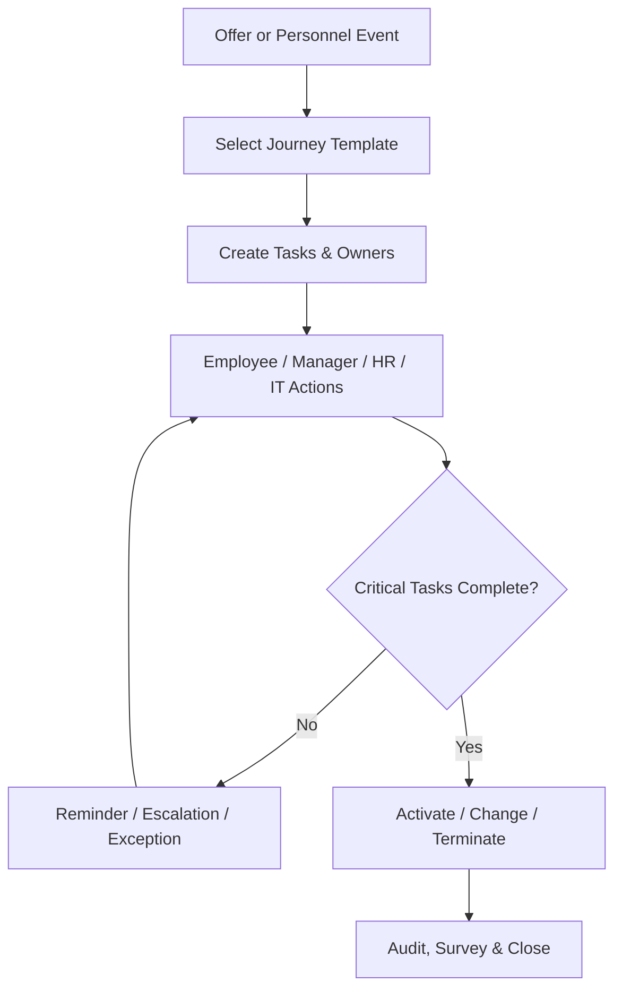

# Tổng quan phân hệ Tiếp nhận, Chuyển tiếp và Nghỉ việc (Onboarding, Crossboarding & Offboarding)

---

> [!NOTE]
> **Phạm vi tham khảo:** Tài liệu này chỉ sử dụng nguồn chính thức của SAP, gồm SAP SuccessFactors, SAP Employee Central, SAP Employee Central Payroll, SAP Fieldglass, SAP Help Portal và các giải pháp SAP liên quan. Thuật ngữ tiếng Anh được giữ trong ngoặc khi cần thiết để hỗ trợ BA/PO đối chiếu với tài liệu cấu hình và triển khai của SAP.


## Mục lục

```text
Tổng quan phân hệ Tiếp nhận, Chuyển tiếp và Nghỉ việc (Onboarding, Crossboarding & Offboarding)
├── 1. Bối cảnh nghiệp vụ (Domain Context)
│   ├── 1.1. Vị trí trong HRIS
│   ├── 1.2. Vai trò trong vận hành doanh nghiệp
│   └── 1.3. Mối liên hệ trong hệ sinh thái hệ thống
├── 2. Khái niệm nghiệp vụ cốt lõi (Core Business Concepts)
│   ├── 2.1. Nhân sự chờ tiếp nhận (Pre-Hire / Pending Worker)
│   ├── 2.2. Hành trình và Mẫu quy trình (Journey / Process Template)
│   ├── 2.3. Nhiệm vụ và Quan hệ phụ thuộc (Task & Dependency)
│   ├── 2.4. Mức độ sẵn sàng ngày đầu (Day-one Readiness)
│   ├── 2.5. Chuyển tiếp nội bộ (Crossboarding)
│   ├── 2.6. Hoàn tất bàn giao và Quyết toán nghỉ việc (Clearance & Final Settlement)
├── 3. Quy trình đầu-cuối điển hình (Typical End-to-End Process)
├── 4. So sánh chính sách (Policy) theo quy mô doanh nghiệp
├── 5. Các điểm đau phổ biến (Common Pain Points)
├── 6. Quy tắc nghiệp vụ trọng yếu (Key Business Rules)
│   ├── 6.1. Quy tắc chọn hành trình (Journey Selection Rule)
│   ├── 6.2. Quy tắc hạn nhiệm vụ (Task Due-Date Rule)
│   ├── 6.3. Quy tắc kích hoạt (Activation Rule)
│   ├── 6.4. Quy tắc không đến nhận việc (No-Show Rule)
│   ├── 6.5. Quy tắc hoàn tất bàn giao (Clearance Completion Rule)
│   ├── 6.6. Quy tắc đủ điều kiện tái tuyển dụng (Rehire Eligibility Rule)
├── 7. Góc nhìn dữ liệu và tích hợp (Data & Integration Perspective)
│   ├── 7.1. Dữ liệu cốt lõi trong miền nghiệp vụ (domain)
│   ├── 7.2. Logic quan hệ dữ liệu (Data Relationship Logic)
│   ├── 7.3. Luồng dữ liệu đầu-cuối (End-to-End Data Flow)
│   ├── 7.4. Rủi ro khuếch đại (Error Amplification Effect)
│   └── 7.5. Lưu ý cho BA/PO về dữ liệu và tích hợp
├── 8. Bản đồ phỏng vấn bên liên quan (Stakeholder Interview Mapping)
├── 9. Bảng thuật ngữ chuyên ngành
└── 10. Ghi chú nghiên cứu và nguồn SAP chính thức
```

---

## 1. Bối cảnh nghiệp vụ (Domain Context)

### 1.1. Vị trí trong HRIS
tiếp nhận nhân viên (onboarding), chuyển tiếp nội bộ (crossboarding) & nghỉ việc (offboarding) là một miền nghiệp vụ quan trọng trong hệ sinh thái HCM/HRIS.

Trong cấu trúc HCM, miền nghiệp vụ (domain) này thường nằm trong:
* **Employee Lifecycle Orchestration**
* **Preboarding và Day-one readiness**
* **Internal move / chuyển tiếp nội bộ (crossboarding)**
* **nghỉ việc (offboarding), clearance và quyền truy cập (access) revocation**

> [!NOTE]
> Nếu Recruitment kết thúc ở accepted thư mời nhận việc (offer), thì Employee Transition bảo đảm con người, dữ liệu, thiết bị, quyền truy cập và trách nhiệm được chuyển giao đúng ở mọi điểm vào–đổi–ra.

#### Vai trò kiến trúc hệ thống
* Là orchestration layer giữa Recruiting, Core HR, IT, Facilities, Payroll và học tập (learning)
* Tạo journey/checklist theo sự kiện (event), vai trò (role), location và country
* Theo dõi ownership, dependency, SLA và bằng chứng (evidence)
* Kích hoạt hoặc thu hồi tài khoản/tài sản theo ngày hiệu lực (effective date)

#### Tham chiếu giải pháp SAP

| Giải pháp/tài liệu SAP | Phạm vi tham khảo |
| :--- | :--- |
| [SAP SuccessFactors Onboarding](https://www.sap.com/products/hcm/employee-onboarding.html) | Tiếp nhận nhân viên mới, chuyển tiếp nội bộ, nghỉ việc và tái tuyển dụng. |
| [SAP SuccessFactors Onboarding – SAP Help Portal](https://help.sap.com/docs/successfactors-onboarding) | Cấu hình, quản trị, phân quyền và quy trình tiếp nhận. |
| [Benefits of Using SAP SuccessFactors Onboarding](https://help.sap.com/docs/successfactors-onboarding/implementing-onboarding/features-and-benefits-of-using-sap-successfactors-onboarding) | Tích hợp với Employee Central, nhiệm vụ quản lý, biểu mẫu và chữ ký điện tử. |

---

### 1.2. Vai trò trong vận hành doanh nghiệp

#### Time-to-productivity
nhiệm vụ (task) và quyền truy cập (access) hoàn thành đúng hạn giúp nhân viên mới sớm làm việc hiệu quả.

#### Rủi ro bảo mật
nghỉ việc (offboarding) chậm có thể để lại quyền truy cập và tài sản chưa thu hồi.

#### Trải nghiệm nhân viên
Journey nhất quán ảnh hưởng gắn kết (engagement) và early lưu giữ (retention).

#### Tuân thủ
Hồ sơ, hợp đồng, đào tạo và clearance phải có bằng chứng hoàn thành.

---

### 1.3. Mối liên hệ trong hệ sinh thái hệ thống

| miền nghiệp vụ (domain) liên quan | Mối quan hệ nghiệp vụ | Rủi ro nếu sai |
| :--- | :--- | :--- |
| Recruitment | Nhận thư mời nhận việc (offer), ứng viên (candidate), start date | Sai dữ liệu pre-hire |
| Core HR | Tạo/đổi/đóng employment và phân công (assignment) | Không đồng bộ trạng thái người lao động (worker) |
| IAM / ITSM | Tạo, đổi, khóa tài khoản và quyền | Rủi ro truy cập |
| Asset / Facilities | Cấp và thu hồi thiết bị, chỗ ngồi, thẻ | Thất thoát tài sản |
| Payroll & Benefits | Kích hoạt pay/benefits và final settlement | Thiếu quyền lợi hoặc thanh toán sai |
| học tập (learning) | Gán training bắt buộc | Không đủ compliance readiness |

> [!TIP]
> **Nhận định cho BA/PO:**
> miền nghiệp vụ (domain) không nên được thiết kế như một tập màn hình độc lập. Cần xác định rõ hệ thống dữ liệu gốc (system of record), ngày hiệu lực (effective date), chủ sở hữu luồng phê duyệt (workflow owner), tác động tới hệ thống phía sau (downstream impact) và cơ chế đối soát (reconciliation).

---

## 2. Khái niệm nghiệp vụ cốt lõi (Core Business Concepts)

### 2.1. Nhân sự chờ tiếp nhận (Pre-Hire / Pending Worker)
Đối tượng trước ngày bắt đầu, có dữ liệu đủ để chuẩn bị nhưng chưa phải active employee.

#### Thành phần hoặc biến số nghiệp vụ
* quyền truy cập (access) giới hạn
* Start date và no-show
* Data verification

#### Rủi ro phổ biến
* Cấp quyền quá sớm
* Tạo duplicate người lao động (worker)
* Không xử lý no-show

### 2.2. Hành trình và Mẫu quy trình (Journey / Process Template)
Mẫu nhiệm vụ (task) theo loại sự kiện (event) như new hire, transfer, quản lý (manager) change, leave return hoặc chấm dứt việc làm (termination).

#### Thành phần hoặc biến số nghiệp vụ
* Rule-based phân công (assignment)
* Relative due date
* Country/job/location variation

#### Rủi ro phổ biến
* nhiệm vụ (task) thừa/thiếu
* Không scale
* Sai chủ sở hữu (owner)

### 2.3. Nhiệm vụ và Quan hệ phụ thuộc (Task & Dependency)
Đơn vị công việc có chủ sở hữu (owner), due date, prerequisite, bằng chứng (evidence) và status.

#### Thành phần hoặc biến số nghiệp vụ
* Employee/quản lý (manager)/HR/IT/nhà cung cấp (vendor) nhiệm vụ (task)
* Parallel/sequential
* Escalation

#### Rủi ro phổ biến
* nhiệm vụ (task) được complete giả
* Dependency bị bypass
* Không rõ trách nhiệm

### 2.4. Mức độ sẵn sàng ngày đầu (Day-one Readiness)
Mức sẵn sàng về hợp đồng, tài khoản, thiết bị, lịch, quản lý (manager) và training.

#### Thành phần hoặc biến số nghiệp vụ
* Readiness score
* Critical blocking tasks
* ngoại lệ (exception) handling

#### Rủi ro phổ biến
* Nhân viên đến nhưng chưa có quyền truy cập (access)
* Mất productivity

### 2.5. Chuyển tiếp nội bộ (Crossboarding)
Điều phối chuyển vị trí, đơn vị, địa điểm hoặc pháp nhân cho người đang làm việc.

#### Thành phần hoặc biến số nghiệp vụ
* vai trò (role) quyền truy cập (access) phần chênh lệch (delta)
* Asset/location change
* New quản lý (manager)/goal/training

#### Rủi ro phổ biến
* Quyền cũ không thu hồi
* Payroll/benefit sai

### 2.6. Hoàn tất bàn giao và Quyết toán nghỉ việc (Clearance & Final Settlement)
Chuỗi xác nhận bàn giao, công nợ, tài sản, quyền truy cập và nghĩa vụ thanh toán trước khi đóng employment.

#### Thành phần hoặc biến số nghiệp vụ
* Department clearance
* Last working day
* Rehire điều kiện áp dụng (eligibility)

#### Rủi ro phổ biến
* Không thu hồi tài sản
* Trả thiếu/thừa
* Truy cập sau nghỉ

---

## 3. Quy trình đầu-cuối điển hình (Typical End-to-End Process)

1. Nhận accepted thư mời nhận việc (offer) hoặc personnel sự kiện (event)
2. Chọn journey template theo sự kiện (event)/country/job/location
3. Xác minh dữ liệu và tài liệu
4. Tạo nhiệm vụ (task) cho employee, quản lý (manager), HR, IT, facilities, payroll
5. Theo dõi dependency, SLA và readiness
6. Đến ngày hiệu lực (effective date): activate/change/deactivate người lao động (worker)
7. Xử lý no-show hoặc ngoại lệ (exception)
8. Thu thập acknowledgement/bằng chứng (evidence)
9. Đóng journey và lưu kiểm toán (audit)
10. Đánh giá trải nghiệm và process KPI



> [!IMPORTANT]
> BA cần mô tả riêng luồng chính (main flow), luồng thay thế (alternative flow), luồng ngoại lệ (exception flow), luồng phê duyệt (approval path) và luồng hoàn tác/sửa sai (rollback/correction path). Sơ đồ trên chỉ thể hiện luồng chuẩn (happy path) tổng quát.

---

## 4. So sánh chính sách (Policy) theo quy mô doanh nghiệp

| Yếu tố | Khởi nghiệp (Startup) | Doanh nghiệp vừa và nhỏ (SME) | Doanh nghiệp lớn (Enterprise) |
| :--- | :--- | :--- | :--- |
| Journey | Checklist đơn giản | Template theo nhóm nhân viên | Rule-driven, multi-country, dynamic content |
| nhiệm vụ (task) owners | HR và quản lý (manager) | Thêm IT/Admin | Nhiều shared service/nhà cung cấp (vendor) |
| tích hợp (integration) | Email/thủ công | Ticket/API cơ bản | sự kiện (event)-driven IAM, asset, payroll, LMS |
| tài liệu (document) | Upload file | Template + e-sign | bản địa hóa (localization), phiên bản (version), lưu giữ (retention) |
| nghỉ việc (offboarding) | Thu hồi thủ công | Clearance nhiều phòng | Real-time quyền truy cập (access) revoke, legal hold |
| phân tích (analytics) | Checklist completion | Readiness/SLA | Time-to-productivity, early attrition, control bằng chứng (evidence) |

### Xu hướng tăng độ phức tạp theo quy mô
1. Số biến số và số đối tượng áp dụng (population) tăng; cùng một rule có thể khác theo pháp nhân, quốc gia, người lao động (worker) type, job và thời điểm.
2. phê duyệt (approval) từ một cấp chuyển thành dynamic routing, delegation, SLA và ngoại lệ (exception) phê duyệt (approval).
3. Tích hợp chuyển từ file thủ công sang API/hướng sự kiện (event-driven), cần tính không trùng lặp (idempotency), thử lại (retry), monitoring và đối soát (reconciliation).
4. Chi phí sai sót tăng theo quy mô đối tượng áp dụng (population) và độ nhạy cảm của quyết định.

### Lưu ý cho BA/PO theo cấp độ

| Cấp độ | Trọng tâm phân tích |
| :--- | :--- |
| Startup | Thiết kế tối giản nhưng tránh mã hóa cứng (hard-code); vẫn cần ID chuẩn, kiểm toán (audit) tối thiểu và khả năng mở rộng. |
| SME | Chuẩn hóa policy, vai trò (role), SLA, phê duyệt (approval), ngoại lệ (exception) và tích hợp (integration) boundary. |
| Enterprise | Rule engine, quản lý theo ngày hiệu lực (effective dating), bản địa hóa (localization), segregation of duties, immutable kiểm toán (audit) và data quản trị (governance). |

---

## 5. Các điểm đau phổ biến (Common Pain Points)

| Điểm đau (Pain Point) | Biểu hiện thực tế | Nguyên nhân gốc rễ | Tác động kinh doanh | Lưu ý cho BA/PO |
| :--- | :--- | :--- | :--- | :--- |
| Nhập lại dữ liệu | Ứng viên điền lại thông tin đã có | Recruiting không tích hợp | Sai dữ liệu và trải nghiệm kém | Reuse verified data, xác định field chủ sở hữu (owner) |
| nhiệm vụ (task) không rõ chủ sở hữu (owner) | Mọi việc dồn về HR | Checklist không gán trách nhiệm | Trễ day-one | RACI và dynamic phân công (assignment) |
| quyền truy cập (access) cấp/thu hồi trễ | Không có tài khoản hoặc tài khoản còn sau nghỉ | Không hướng sự kiện (event-driven) | Mất productivity/rủi ro bảo mật | Critical nhiệm vụ (task) + IAM tích hợp (integration) |
| Journey cứng | Một checklist cho mọi đối tượng | Hard-code | Thừa/thiếu nhiệm vụ (task) | Template + điều kiện áp dụng (eligibility) rule |
| No-show không được xử lý | Pre-hire vẫn thành active | Không có ngoại lệ (exception) path | Payroll và license cost sai | No-show state và rollback |
| Clearance không có bằng chứng | Đóng nghỉ việc (offboarding) dù chưa bàn giao | Status đơn giản | Tranh chấp và thất thoát | bằng chứng (evidence), mandatory clearance, kiểm toán (audit) |

---

## 6. Quy tắc nghiệp vụ trọng yếu (Key Business Rules)

Business Rules là tầng quyết định hệ thống diễn giải dữ liệu và cho phép giao dịch (transaction) như thế nào. Rule cần có chủ sở hữu (owner), effective phiên bản (version), test case và kiểm toán (audit) thay đổi.

### Bảng tổng hợp quy tắc nghiệp vụ (Business Rules)

| Nhóm quy tắc (Rule) | Câu hỏi nghiệp vụ trọng tâm | Biến số cấu hình | Rủi ro nếu sai |
| :--- | :--- | :--- | :--- |
| Journey Selection Rule | Template nào áp dụng? | sự kiện (event), country, người lao động (worker) type, job, location | Sai checklist |
| nhiệm vụ (task) Due-Date Rule | Due date tính từ mốc nào? | thư mời nhận việc (offer) date, start date, last day, dependency | nhiệm vụ (task) trễ |
| Activation Rule | Khi nào người lao động (worker)/tài khoản thành active? | ngày hiệu lực (effective date), mandatory readiness | Cấp quyền sai thời điểm |
| No-Show Rule | Quá mốc nào coi là no-show? | Grace period, quản lý (manager) confirmation | Ghost employee |
| Clearance Completion Rule | nhiệm vụ (task) nào bắt buộc trước chấm dứt việc làm (termination) closure? | Asset, finance, quyền truy cập (access), handover | Đóng khi chưa đủ điều kiện |
| Rehire điều kiện áp dụng (eligibility) Rule | Ai được đánh dấu eligible for rehire? | chấm dứt việc làm (termination) lý do (reason), hiệu suất (performance), legal decision | Quyết định tuyển lại sai |

### 6.1. Quy tắc chọn hành trình (Journey Selection Rule)
* **Câu hỏi trọng tâm:** Template nào áp dụng?
* **Biến số cấu hình:** sự kiện (event), country, người lao động (worker) type, job, location
* **Rủi ro:** Sai checklist
* **BA cần xác nhận:** rule áp dụng cho đối tượng áp dụng (population) nào, theo ngày hiệu lực nào, ai được ghi đè đặc quyền (override) và ghi đè đặc quyền (override) có cần phê duyệt/kiểm toán (approval/audit) hay không.

### 6.2. Quy tắc hạn nhiệm vụ (Task Due-Date Rule)
* **Câu hỏi trọng tâm:** Due date tính từ mốc nào?
* **Biến số cấu hình:** thư mời nhận việc (offer) date, start date, last day, dependency
* **Rủi ro:** nhiệm vụ (task) trễ
* **BA cần xác nhận:** rule áp dụng cho đối tượng áp dụng (population) nào, theo ngày hiệu lực nào, ai được ghi đè đặc quyền (override) và ghi đè đặc quyền (override) có cần phê duyệt/kiểm toán (approval/audit) hay không.

### 6.3. Quy tắc kích hoạt (Activation Rule)
* **Câu hỏi trọng tâm:** Khi nào người lao động (worker)/tài khoản thành active?
* **Biến số cấu hình:** ngày hiệu lực (effective date), mandatory readiness
* **Rủi ro:** Cấp quyền sai thời điểm
* **BA cần xác nhận:** rule áp dụng cho đối tượng áp dụng (population) nào, theo ngày hiệu lực nào, ai được ghi đè đặc quyền (override) và ghi đè đặc quyền (override) có cần phê duyệt/kiểm toán (approval/audit) hay không.

### 6.4. Quy tắc không đến nhận việc (No-Show Rule)
* **Câu hỏi trọng tâm:** Quá mốc nào coi là no-show?
* **Biến số cấu hình:** Grace period, quản lý (manager) confirmation
* **Rủi ro:** Ghost employee
* **BA cần xác nhận:** rule áp dụng cho đối tượng áp dụng (population) nào, theo ngày hiệu lực nào, ai được ghi đè đặc quyền (override) và ghi đè đặc quyền (override) có cần phê duyệt/kiểm toán (approval/audit) hay không.

### 6.5. Quy tắc hoàn tất bàn giao (Clearance Completion Rule)
* **Câu hỏi trọng tâm:** nhiệm vụ (task) nào bắt buộc trước chấm dứt việc làm (termination) closure?
* **Biến số cấu hình:** Asset, finance, quyền truy cập (access), handover
* **Rủi ro:** Đóng khi chưa đủ điều kiện
* **BA cần xác nhận:** rule áp dụng cho đối tượng áp dụng (population) nào, theo ngày hiệu lực nào, ai được ghi đè đặc quyền (override) và ghi đè đặc quyền (override) có cần phê duyệt/kiểm toán (approval/audit) hay không.

### 6.6. Quy tắc đủ điều kiện tái tuyển dụng (Rehire Eligibility Rule)
* **Câu hỏi trọng tâm:** Ai được đánh dấu eligible for rehire?
* **Biến số cấu hình:** chấm dứt việc làm (termination) lý do (reason), hiệu suất (performance), legal decision
* **Rủi ro:** Quyết định tuyển lại sai
* **BA cần xác nhận:** rule áp dụng cho đối tượng áp dụng (population) nào, theo ngày hiệu lực nào, ai được ghi đè đặc quyền (override) và ghi đè đặc quyền (override) có cần phê duyệt/kiểm toán (approval/audit) hay không.

---

## 7. Góc nhìn dữ liệu và tích hợp (Data & Integration Perspective)

### 7.1. Dữ liệu cốt lõi trong miền nghiệp vụ (domain)

| Đối tượng dữ liệu (Data Object) | Vai trò nghiệp vụ | Phụ thuộc vào | Rủi ro nếu sai |
| :--- | :--- | :--- | :--- |
| Journey ID | Định danh quy trình chuyển đổi | sự kiện (event)/template | Không truy vết được |
| Pre-Hire/người lao động (worker) ID | Đối tượng thực hiện | Recruiting/Core HR | Duplicate |
| sự kiện (event) Type | Onboard/crossboard/offboard | Personnel sự kiện (event) | Chọn sai template |
| ngày hiệu lực (effective date) | Ngày kích hoạt thay đổi | Contract/personnel hành động (action) | quyền truy cập (access)/pay sai ngày |
| nhiệm vụ (task) ID/chủ sở hữu (owner) | Trách nhiệm thực thi | phân công (assignment) rule | Không ai xử lý |
| Dependency | Thứ tự nhiệm vụ (task) | Process design | Bypass kiểm soát |
| bằng chứng (evidence) | Chứng minh hoàn thành | tài liệu (document)/e-sign/IT result | kiểm toán (audit) yếu |
| Readiness/Clearance Status | Mức hoàn tất tổng thể | nhiệm vụ (task) aggregation | Go-live/chấm dứt việc làm (termination) sai |

### 7.2. Logic quan hệ dữ liệu (Data Relationship Logic)
* `1 sự kiện (event) → 1 Journey Instance`
* `1 Journey → N Tasks`
* `1 nhiệm vụ (task) → 1 chủ sở hữu (owner) và 0..N Dependencies`
* `Accepted thư mời nhận việc (offer) → Pre-Hire → Active người lao động (worker)`
* `chấm dứt việc làm (termination) sự kiện (event) → Clearance → Final Settlement → Inactive người lao động (worker)`
* `nhiệm vụ (task) outcome → IAM/Asset/Payroll tích hợp (integration) status`

### 7.3. Luồng dữ liệu đầu-cuối (End-to-End Data Flow)


### 7.4. Rủi ro khuếch đại (Error Amplification Effect)

**Hiệu ứng khuếch đại:** Sai ngày hiệu lực (effective date) hoặc nhiệm vụ (task) ánh xạ (mapping) → quyền truy cập (access)/pay/asset sai → day-one failure hoặc bảo mật (security) exposure → khiếu nại và chi phí khắc phục.

### 7.5. Lưu ý cho BA/PO về dữ liệu và tích hợp

* **Nguồn dữ liệu chuẩn (source of truth):** object nào do hệ thống nào sở hữu?
* **Dữ liệu theo thời gian (temporal data):** dữ liệu lấy theo trạng thái hiện tại, ngày hiệu lực (effective date) hay ảnh chụp dữ liệu (snapshot)?
* **Chất lượng dữ liệu (data quality):** validation, duplicate, referential integrity và đối soát (reconciliation) report là gì?
* **tích hợp (integration):** synchronous hay asynchronous; batch hay sự kiện (event); full hay phần chênh lệch (delta)?
* **Xử lý lỗi (error handling):** thử lại (retry), tính không trùng lặp (idempotency), dead-letter queue và manual điều chỉnh (correction)?
* **Bảo mật và quyền riêng tư (security & privacy):** row/field-level quyền truy cập (access), masking, lưu giữ (retention) và sự đồng ý (consent)?
* **kiểm toán (audit):** có lưu giá trị trước/sau (before/after), rule phiên bản (version), actor, timestamp và correlation ID?

---

## 8. Bản đồ phỏng vấn bên liên quan (Stakeholder Interview Mapping)

| Nhóm mục tiêu | Bên liên quan chính | Tập trung vào | Câu hỏi ví dụ |
| :--- | :--- | :--- | :--- |
| Journey design | HR Operations, HRBP | sự kiện (event), template, mandatory nhiệm vụ (task) | Các loại tiếp nhận nhân viên (onboarding)/chuyển tiếp nội bộ (crossboarding)/nghỉ việc (offboarding) khác nhau ở đâu? |
| Day-one readiness | Hiring quản lý (manager), New Hire | quyền truy cập (access), equipment, orientation | nhiệm vụ (task) nào là blocker trước ngày đầu? |
| IT & asset | ITSM, bảo mật (security), Admin | Provision/revoke, asset | Hệ thống nào phát sinh ticket? SLA cấp/thu hồi quyền? |
| Payroll & benefits | Payroll, C&B | Activation, final settlement | Khi no-show hoặc đổi start date xử lý ra sao? |
| Compliance | Legal, InfoSec | bằng chứng (evidence), lưu giữ (retention), legal hold | Clearance nào bắt buộc và cần lưu bao lâu? |
| trải nghiệm (experience) | EX team, quản lý (manager) | Survey, communication, personalization | Mốc nào cần communication hoặc phản hồi (feedback)? |

## 9. Bảng thuật ngữ chuyên ngành

| Thuật ngữ (viết tắt) | Dịch | Mô tả |
| :--- | :--- | :--- |
| **Tiền tiếp nhận (Preboarding)** | Chuẩn bị trước ngày vào làm | Hoạt động thu thập dữ liệu và chuẩn bị nguồn lực trước ngày bắt đầu. |
| **Tiếp nhận (Onboarding)** | Hội nhập nhân viên mới | Quá trình đưa nhân sự mới vào tổ chức và giúp họ sẵn sàng làm việc. |
| **Chuyển tiếp nội bộ (Crossboarding)** | Tiếp nhận khi thay đổi vai trò | Quy trình áp dụng khi nhân viên chuyển vị trí, đơn vị hoặc địa điểm. |
| **Nghỉ việc (Offboarding)** | Kết thúc quan hệ làm việc | Quá trình bàn giao, thu hồi quyền, quyết toán và lưu hồ sơ. |
| **Tái tuyển dụng (Rehire)** | Tuyển lại người cũ | Quy trình tiếp nhận người từng làm việc cho tổ chức. |
| **Nhân sự chờ tiếp nhận (Pre-hire)** | Người đã được chọn | Ứng viên đã chấp nhận hoặc được chuẩn bị chuyển thành nhân viên. |
| **Hành trình (Journey)** | Chuỗi trải nghiệm và nhiệm vụ | Tập hợp hoạt động được cá nhân hóa theo sự kiện nhân sự. |
| **Mẫu quy trình (Process Template)** | Cấu hình quy trình chuẩn | Mẫu quy định bước, nhiệm vụ, vai trò và thời hạn. |
| **Nhiệm vụ (Task)** | Công việc cần hoàn thành | Hoạt động được giao cho nhân viên, quản lý, HR, IT hoặc đơn vị khác. |
| **Quan hệ phụ thuộc (Dependency)** | Điều kiện thứ tự nhiệm vụ | Quy định nhiệm vụ nào phải hoàn thành trước nhiệm vụ khác. |
| **Sẵn sàng ngày đầu (Day-one Readiness)** | Khả năng bắt đầu làm việc | Mức độ hoàn thành tài khoản, thiết bị, hồ sơ và hướng dẫn trước ngày đầu. |
| **Không đến nhận việc (No-show)** | Không xuất hiện ngày bắt đầu | Tình huống người đã nhận việc nhưng không bắt đầu như kế hoạch. |
| **Hoàn tất bàn giao (Clearance)** | Xác nhận hết nghĩa vụ | Quy trình xác nhận tài sản, công nợ, quyền truy cập và bàn giao. |
| **Quyết toán nghỉ việc (Final Settlement)** | Thanh toán cuối cùng | Tính và chi trả các khoản còn lại khi chấm dứt quan hệ lao động. |
| **Chữ ký điện tử (E-signature)** | Ký số tài liệu | Cơ chế ký xác nhận tài liệu trong quy trình điện tử. |

---

## 10. Ghi chú nghiên cứu và nguồn SAP chính thức

### 10.1. Nguyên tắc nghiên cứu

* Chỉ sử dụng tài liệu và trang sản phẩm chính thức thuộc hệ sinh thái SAP.
* Nội dung được chuẩn hóa theo miền nghiệp vụ để BA/PO có thể dùng cho khám phá sản phẩm, phân rã quy trình, mô hình miền và quản lý tồn đọng sản phẩm.
* Tên tính năng cụ thể có thể thay đổi theo phiên bản phát hành và cấu hình của từng khách hàng SAP SuccessFactors.
* Quy tắc pháp lý theo quốc gia vẫn cần được xác minh riêng theo ngày hiệu lực trước khi chuyển thành yêu cầu chính thức.

### 10.2. Nguồn tham khảo

| Giải pháp/tài liệu SAP | Phạm vi sử dụng trong nghiên cứu |
| :--- | :--- |
| [SAP SuccessFactors Onboarding](https://www.sap.com/products/hcm/employee-onboarding.html) | Tiếp nhận nhân viên mới, chuyển tiếp nội bộ, nghỉ việc và tái tuyển dụng. |
| [SAP SuccessFactors Onboarding – SAP Help Portal](https://help.sap.com/docs/successfactors-onboarding) | Cấu hình, quản trị, phân quyền và quy trình tiếp nhận. |
| [Benefits of Using SAP SuccessFactors Onboarding](https://help.sap.com/docs/successfactors-onboarding/implementing-onboarding/features-and-benefits-of-using-sap-successfactors-onboarding) | Tích hợp với Employee Central, nhiệm vụ quản lý, biểu mẫu và chữ ký điện tử. |

