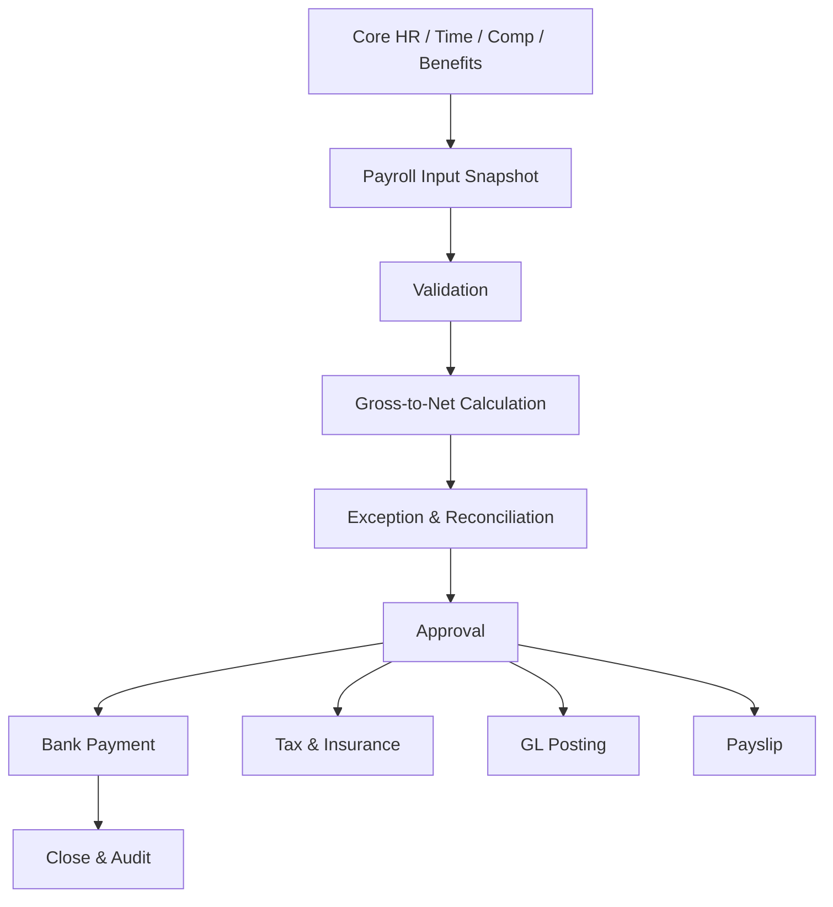

# Tổng quan phân hệ Tính lương (Payroll)

---

> [!NOTE]
> **Phạm vi tham khảo:** Tài liệu này chỉ sử dụng nguồn chính thức của SAP, gồm SAP SuccessFactors, SAP Employee Central, SAP Employee Central Payroll, SAP Fieldglass, SAP Help Portal và các giải pháp SAP liên quan. Thuật ngữ tiếng Anh được giữ trong ngoặc khi cần thiết để hỗ trợ BA/PO đối chiếu với tài liệu cấu hình và triển khai của SAP.


## Mục lục

```text
Tổng quan phân hệ Tính lương (Payroll)
├── 1. Bối cảnh nghiệp vụ (Domain Context)
│   ├── 1.1. Vị trí trong HRIS
│   ├── 1.2. Vai trò trong vận hành doanh nghiệp
│   └── 1.3. Mối liên hệ trong hệ sinh thái hệ thống
├── 2. Khái niệm nghiệp vụ cốt lõi (Core Business Concepts)
│   ├── 2.1. Kỳ lương và Nhóm tính lương (Payroll Period & Pay Group)
│   ├── 2.2. Khoản thu nhập, Khấu trừ và Đóng góp (Earning, Deduction & Contribution)
│   ├── 2.3. Tính từ tổng thu nhập đến thực nhận (Gross-to-Net)
│   ├── 2.4. Tính lương hồi tố (Retroactive Payroll)
│   ├── 2.5. Tính lương ngoài kỳ (Off-Cycle Payroll)
│   ├── 2.6. Kiểm soát và Đối soát lương (Payroll Control & Reconciliation)
│   ├── 2.7. Phiếu lương và Giải thích lương (Payslip & Explain Pay)
├── 3. Quy trình đầu-cuối điển hình (Typical End-to-End Process)
├── 4. So sánh chính sách (Policy) theo quy mô doanh nghiệp
├── 5. Các điểm đau phổ biến (Common Pain Points)
├── 6. Quy tắc nghiệp vụ trọng yếu (Key Business Rules)
│   ├── 6.1. Quy tắc đủ điều kiện (Eligibility Rule)
│   ├── 6.2. Quy tắc tính theo tỷ lệ (Proration Rule)
│   ├── 6.3. Quy tắc thứ tự tính (Calculation Sequence Rule)
│   ├── 6.4. Quy tắc hồi tố (Retro Rule)
│   ├── 6.5. Quy tắc làm tròn (Rounding Rule)
│   ├── 6.6. Quy tắc khóa và ghi đè kỳ lương (Payroll Lock & Override Rule)
│   ├── 6.7. Quy tắc kiểm soát thanh toán (Payment Control Rule)
├── 7. Góc nhìn dữ liệu và tích hợp (Data & Integration Perspective)
│   ├── 7.1. Dữ liệu cốt lõi trong miền nghiệp vụ (domain)
│   ├── 7.2. Logic quan hệ dữ liệu (Data Relationship Logic)
│   ├── 7.3. Luồng dữ liệu đầu-cuối (End-to-End Data Flow)
│   ├── 7.4. Rủi ro khuếch đại (Error Amplification Effect)
│   └── 7.5. Lưu ý cho BA/PO về dữ liệu và tích hợp
├── 8. Bản đồ phỏng vấn bên liên quan (Stakeholder Interview Mapping)
├── 9. Bảng thuật ngữ chuyên ngành
└── 10. Ghi chú nghiên cứu và nguồn SAP chính thức
```

---

## 1. Bối cảnh nghiệp vụ (Domain Context)

### 1.1. Vị trí trong HRIS
Payroll là một miền nghiệp vụ quan trọng trong hệ sinh thái HCM/HRIS.

Trong cấu trúc HCM, miền nghiệp vụ (domain) này thường nằm trong:
* **Core HR & Payroll**
* **tính toán từ tổng thu nhập đến thực nhận (gross-to-net calculation)**
* **tuân thủ pháp định (statutory compliance)**
* **thanh toán, hạch toán và kế toán lương (payment, posting & payroll accounting)**

> [!NOTE]
> Nếu Attendance xác định thời gian được trả, Payroll chuyển toàn bộ dữ liệu nhân sự và chính sách thành nghĩa vụ thanh toán, thuế, bảo hiểm và bút toán tài chính.

#### Vai trò kiến trúc hệ thống
* Là bộ máy tính toán (calculation engine) tài chính có độ nhạy cảm và kiểm soát cao
* Nhận sự kiện (event) từ Core HR, Time, Absence, Compensation và Benefits
* Tạo kết quả tính lương (payroll result) bất biến theo kỳ và hỗ trợ retro/ngoài chu kỳ (off-cycle)
* Kết nối ngân hàng, thuế, bảo hiểm và sổ cái kế toán (general ledger)

#### Tham chiếu giải pháp SAP

| Giải pháp/tài liệu SAP | Phạm vi tham khảo |
| :--- | :--- |
| [SAP SuccessFactors Employee Central Payroll](https://www.sap.com/products/hcm/employee-central-payroll.html) | Tính lương toàn cầu, tự động hóa, kiểm soát và tích hợp với nhân sự lõi, thời gian và tài chính. |
| [Employee Central Payroll – SAP Help Portal](https://help.sap.com/docs/SAP_SUCCESSFACTORS_EMPLOYEE_CENTRAL_PAYROLL?source=redirect) | Triển khai, tích hợp, xử lý lương và kiểm soát kết quả. |
| [Employee Central Integration to SAP Business Suite](https://help.sap.com/docs/successfactors-employee-central-integration-to-business-suite) | Sao chép dữ liệu nhân viên và dữ liệu thời gian vào hệ thống tính lương SAP. |

---

### 1.2. Vai trò trong vận hành doanh nghiệp

#### Niềm tin nhân viên
Sai một khoản nhỏ trên phiếu lương (payslip) có thể tạo khiếu nại và giảm niềm tin.

#### Tuân thủ pháp lý
Thuế, bảo hiểm và thời hạn trả lương thay đổi theo quốc gia.

#### Báo cáo tài chính
Payroll là một trong các khoản chi lớn và phải hạch toán đúng trung tâm chi phí (cost center).

#### Vận hành cuối kỳ
chốt dữ liệu (cut-off), đối soát (reconciliation) và phê duyệt (approval) quyết định khả năng trả lương đúng hạn.

---

### 1.3. Mối liên hệ trong hệ sinh thái hệ thống

| miền nghiệp vụ (domain) liên quan | Mối quan hệ nghiệp vụ | Rủi ro nếu sai |
| :--- | :--- | :--- |
| Core HR | Employment, nhóm trả lương (pay group), contract, lương (salary), sự kiện (event) | Trả sai người/sai pháp nhân |
| Time & Absence | thời gian làm việc (worked time), OT, nghỉ không lương (unpaid leave) | Sai thu nhập biến đổi (variable pay) |
| Compensation & Benefits | thay đổi lương (salary change), thưởng (bonus), deductions | Thiếu/thừa khoản |
| Finance | phân bổ chi phí (cost allocation), bút toán kế toán (journal entry), tích lũy/trích trước (accrual) | Sai báo cáo tài chính |
| Bank/thanh toán (payment) | lương thực nhận (net pay) instruction | Chuyển sai tài khoản/số tiền |
| Tax & bảo hiểm xã hội (Social Insurance) | Kê khai và nghĩa vụ pháp định (statutory) | Phạt, truy thu |

> [!TIP]
> **Nhận định cho BA/PO:**
> miền nghiệp vụ (domain) không nên được thiết kế như một tập màn hình độc lập. Cần xác định rõ hệ thống dữ liệu gốc (system of record), ngày hiệu lực (effective date), chủ sở hữu luồng phê duyệt (workflow owner), tác động tới hệ thống phía sau (downstream impact) và cơ chế đối soát (reconciliation).

---

## 2. Khái niệm nghiệp vụ cốt lõi (Core Business Concepts)

### 2.1. Kỳ lương và Nhóm tính lương (Payroll Period & Pay Group)
Nhóm người có cùng lịch và logic chạy lương.

#### Thành phần hoặc biến số nghiệp vụ
* hàng tháng/hai tuần/hàng tuần (monthly/biweekly/weekly)
* chốt dữ liệu (cut-off) và ngày thanh toán (payment date)
* pháp nhân/quốc gia (legal entity/country)

#### Rủi ro phổ biến
* Nhân viên vào sai nhóm trả lương (pay group)
* Lệch kỳ

### 2.2. Khoản thu nhập, Khấu trừ và Đóng góp (Earning, Deduction & Contribution)
Các thành phần tổng thu nhập (gross), khấu trừ và phần đóng góp của doanh nghiệp.

#### Thành phần hoặc biến số nghiệp vụ
* định kỳ (recurring)/một lần (one-time)
* chịu thuế (taxable)/không chịu thuế (non-taxable)
* thứ tự ưu tiên/giới hạn (priority/cap)

#### Rủi ro phổ biến
* thanh toán trùng (double payment)
* Sai cơ sở chịu thuế (taxable basis)

### 2.3. Tính từ tổng thu nhập đến thực nhận (Gross-to-Net)
Chuỗi tính từ thu nhập tổng thu nhập (gross) đến lương thực nhận (net pay) sau thuế, bảo hiểm và khoản khấu trừ (deduction).

#### Thành phần hoặc biến số nghiệp vụ
* thứ tự tính toán (calculation sequence)
* quan hệ phụ thuộc/công thức (dependency/formula)
* làm tròn (rounding)

#### Rủi ro phổ biến
* Sai thứ tự tính
* Sai lương thực nhận (net pay)

### 2.4. Tính lương hồi tố (Retroactive Payroll)
Tính lại kỳ quá khứ khi dữ liệu có hiệu lực hồi tố và chuyển phần chênh lệch (delta) sang kỳ hiện tại.

#### Thành phần hoặc biến số nghiệp vụ
* điều kiện kích hoạt hồi tố (retro trigger)
* khoảng thời gian tính lại (recalculation window)
* xử lý chênh lệch (difference handling)

#### Rủi ro phổ biến
* Truy lĩnh/truy thu sai
* mở lại (reopen) kỳ đã đóng

### 2.5. Tính lương ngoài kỳ (Off-Cycle Payroll)
Kỳ trả ngoài chu kỳ thường kỳ cho thưởng (bonus), điều chỉnh (correction), chấm dứt việc làm (termination) hoặc khẩn cấp (emergency).

#### Thành phần hoặc biến số nghiệp vụ
* lý do (reason), phê duyệt (approval), cách xử lý thuế (tax treatment)
* đợt thanh toán (payment run)

#### Rủi ro phổ biến
* Lạm dụng ngoài chu kỳ (off-cycle)
* thanh toán trùng (duplicate payment)

### 2.6. Kiểm soát và Đối soát lương (Payroll Control & Reconciliation)
Các kiểm tra tổng hợp, bất thường (anomaly), chênh lệch (variance) và xác nhận cuối (sign-off) trước khi thanh toán (payment).

#### Thành phần hoặc biến số nghiệp vụ
* tổng kiểm soát (control totals)
* ngưỡng ngoại lệ (exception thresholds)
* người lập-người kiểm tra (maker-checker)

#### Rủi ro phổ biến
* Không phát hiện lỗi diện rộng

### 2.7. Phiếu lương và Giải thích lương (Payslip & Explain Pay)
Bản giải thích kết quả lương cho nhân viên.

#### Thành phần hoặc biến số nghiệp vụ
* chi tiết cấu thành (breakdown), bản địa hóa (localization), quyền truy cập (access)
* phiên bản điều chỉnh (correction version)

#### Rủi ro phổ biến
* Lộ dữ liệu
* Nhân viên không hiểu khoản tính

---

## 3. Quy trình đầu-cuối điển hình (Typical End-to-End Process)

1. Mở kỳ lương và xác định đối tượng áp dụng (population)
2. đóng băng (freeze)/ảnh chụp dữ liệu (snapshot) dữ liệu đầu vào
3. nạp dữ liệu (load) định kỳ (recurring) và dữ liệu biến động (variable inputs)
4. kiểm tra tính đầy đủ (validate completeness) và điều kiện áp dụng (eligibility)
5. Run từ tổng thu nhập đến thực nhận (gross-to-net)
6. Phát hiện ngoại lệ (exception)/bất thường (anomaly)
7. đối soát (reconcile) với kỳ trước và hệ thống nguồn (source system)
8. Payroll phê duyệt (approval)/xác nhận cuối (sign-off)
9. tạo (generate) tệp thanh toán ngân hàng (bank file)/chỉ thị thanh toán (payment instruction)
10. tạo (generate) báo cáo pháp định (statutory report) và hạch toán kế toán (accounting posting)
11. phát hành (publish) phiếu lương (payslip)
12. đóng kỳ (close period) và xử lý retro/ngoài chu kỳ (off-cycle)



> [!IMPORTANT]
> BA cần mô tả riêng luồng chính (main flow), luồng thay thế (alternative flow), luồng ngoại lệ (exception flow), luồng phê duyệt (approval path) và luồng hoàn tác/sửa sai (rollback/correction path). Sơ đồ trên chỉ thể hiện luồng chuẩn (happy path) tổng quát.

---

## 4. So sánh chính sách (Policy) theo quy mô doanh nghiệp

| Yếu tố | Khởi nghiệp (Startup) | Doanh nghiệp vừa và nhỏ (SME) | Doanh nghiệp lớn (Enterprise) |
| :--- | :--- | :--- | :--- |
| Coverage | Một pháp nhân, một kỳ | Nhiều nhóm trả lương (pay group) | Multi-country, nhiều provider |
| tính toán (calculation) | Công thức đơn giản | Rule theo nhóm | bản địa hóa (localization), retro phức tạp, continuous calc |
| đầu vào (input) | Excel/manual | File tích hợp | sự kiện (event)-driven từ HCM/time/benefits |
| Control | Kiểm tra tổng | chênh lệch (variance) và checklist | Automated controls, bất thường (anomaly) detection, người lập-người kiểm tra (maker-checker) |
| thanh toán (payment) | Một file ngân hàng | Nhiều bank format | thanh toán (payment) hub, multi-currency |
| Compliance | Báo cáo cơ bản | Theo pháp nhân | Tax/social filing, kiểm toán (audit), country updates |

### Xu hướng tăng độ phức tạp theo quy mô
1. Số biến số và số đối tượng áp dụng (population) tăng; cùng một rule có thể khác theo pháp nhân, quốc gia, người lao động (worker) type, job và thời điểm.
2. phê duyệt (approval) từ một cấp chuyển thành dynamic routing, delegation, SLA và ngoại lệ (exception) phê duyệt (approval).
3. Tích hợp chuyển từ file thủ công sang API/hướng sự kiện (event-driven), cần tính không trùng lặp (idempotency), thử lại (retry), monitoring và đối soát (reconciliation).
4. Chi phí sai sót tăng theo quy mô đối tượng áp dụng (population) và độ nhạy cảm của quyết định.

### Lưu ý cho BA/PO theo cấp độ

| Cấp độ | Trọng tâm phân tích |
| :--- | :--- |
| Startup | Thiết kế tối giản nhưng tránh mã hóa cứng (hard-code); vẫn cần ID chuẩn, kiểm toán (audit) tối thiểu và khả năng mở rộng. |
| SME | Chuẩn hóa policy, vai trò (role), SLA, phê duyệt (approval), ngoại lệ (exception) và tích hợp (integration) boundary. |
| Enterprise | Rule engine, quản lý theo ngày hiệu lực (effective dating), bản địa hóa (localization), segregation of duties, immutable kiểm toán (audit) và data quản trị (governance). |

---

## 5. Các điểm đau phổ biến (Common Pain Points)

| Điểm đau (Pain Point) | Biểu hiện thực tế | Nguyên nhân gốc rễ | Tác động kinh doanh | Lưu ý cho BA/PO |
| :--- | :--- | :--- | :--- | :--- |
| đầu vào (input) đến trễ | OT/thưởng (bonus)/change chưa duyệt trước chốt dữ liệu (cut-off) | luồng phê duyệt (workflow) và lịch không đồng bộ | Trễ payroll hoặc kỳ sau adjustment | Payroll calendar và SLA rõ ràng |
| Phụ thuộc Excel | Sửa đầu vào (input) ngoài hệ thống | Rule thiếu hoặc tích hợp (integration) yếu | Không kiểm toán (audit) và dễ sai | Control import, eliminate shadow tính toán (calculation) |
| Retro không giải thích được | Nhân viên thấy khoản truy lĩnh/truy thu khó hiểu | Không lưu lineage | Ticket tăng | Trace source sự kiện (event) → recalculation → phần chênh lệch (delta) |
| Không đối soát (reconcile) | Tổng thanh toán (payment) khác payroll hoặc GL | Thiếu control total | Sai tiền và tài chính | Three-way đối soát (reconciliation) payroll-bank-GL |
| Sai bản địa hóa (localization) | Thuế/bảo hiểm không cập nhật | Rule pháp lý lỗi thời | Phạt/truy thu | Versioned pháp định (statutory) rule và ngày hiệu lực (effective date) |
| Quyền quá rộng | Một người nhập, sửa và duyệt | Không segregation of duties | Gian lận | người lập-người kiểm tra (maker-checker) và privileged quyền truy cập (access) kiểm toán (audit) |

---

## 6. Quy tắc nghiệp vụ trọng yếu (Key Business Rules)

Business Rules là tầng quyết định hệ thống diễn giải dữ liệu và cho phép giao dịch (transaction) như thế nào. Rule cần có chủ sở hữu (owner), effective phiên bản (version), test case và kiểm toán (audit) thay đổi.

### Bảng tổng hợp quy tắc nghiệp vụ (Business Rules)

| Nhóm quy tắc (Rule) | Câu hỏi nghiệp vụ trọng tâm | Biến số cấu hình | Rủi ro nếu sai |
| :--- | :--- | :--- | :--- |
| điều kiện áp dụng (eligibility) Rule | Ai nhận khoản thu nhập (earning)/benefit/khoản khấu trừ (deduction)? | Employment status, date, grade, location | Trả sai đối tượng |
| Proration Rule | Khoản nào prorate và theo ngày nào? | ngày lịch/ngày làm việc, ngày vào làm/ngày nghỉ việc, làm tròn (rounding) | Sai lương tháng đầu/cuối |
| thứ tự tính toán (calculation sequence) Rule | Thứ tự chịu thuế (taxable) khoản thu nhập (earning), khoản đóng góp (contribution), khoản khấu trừ (deduction)? | Priority, basis, cap | Sai từ tổng thu nhập đến thực nhận (gross-to-net) |
| Retro Rule | Sự kiện nào kích hoạt retro và tính lại bao xa? | ngày hiệu lực (effective date), closed period, threshold | phần chênh lệch (delta) sai |
| làm tròn (rounding) Rule | Làm tròn ở component hay net? | Currency precision, pháp định (statutory) method | Sai lệch tích lũy |
| Payroll Lock & ghi đè đặc quyền (override) Rule | Ai được sửa sau đóng băng (freeze)/close? | vai trò (role), lý do (reason), phê duyệt (approval), kiểm toán (audit) | Thay đổi ngầm |
| thanh toán (payment) Control Rule | Điều kiện phát hành thanh toán (payment)? | phê duyệt (approval), tổng kiểm soát (control totals), bank validation | Chuyển sai tiền |

### 6.1. Quy tắc đủ điều kiện (Eligibility Rule)
* **Câu hỏi trọng tâm:** Ai nhận khoản thu nhập (earning)/benefit/khoản khấu trừ (deduction)?
* **Biến số cấu hình:** Employment status, date, grade, location
* **Rủi ro:** Trả sai đối tượng
* **BA cần xác nhận:** rule áp dụng cho đối tượng áp dụng (population) nào, theo ngày hiệu lực nào, ai được ghi đè đặc quyền (override) và ghi đè đặc quyền (override) có cần phê duyệt/kiểm toán (approval/audit) hay không.

### 6.2. Quy tắc tính theo tỷ lệ (Proration Rule)
* **Câu hỏi trọng tâm:** Khoản nào prorate và theo ngày nào?
* **Biến số cấu hình:** ngày lịch/ngày làm việc, ngày vào làm/ngày nghỉ việc, làm tròn (rounding)
* **Rủi ro:** Sai lương tháng đầu/cuối
* **BA cần xác nhận:** rule áp dụng cho đối tượng áp dụng (population) nào, theo ngày hiệu lực nào, ai được ghi đè đặc quyền (override) và ghi đè đặc quyền (override) có cần phê duyệt/kiểm toán (approval/audit) hay không.

### 6.3. Quy tắc thứ tự tính (Calculation Sequence Rule)
* **Câu hỏi trọng tâm:** Thứ tự chịu thuế (taxable) khoản thu nhập (earning), khoản đóng góp (contribution), khoản khấu trừ (deduction)?
* **Biến số cấu hình:** Priority, basis, cap
* **Rủi ro:** Sai từ tổng thu nhập đến thực nhận (gross-to-net)
* **BA cần xác nhận:** rule áp dụng cho đối tượng áp dụng (population) nào, theo ngày hiệu lực nào, ai được ghi đè đặc quyền (override) và ghi đè đặc quyền (override) có cần phê duyệt/kiểm toán (approval/audit) hay không.

### 6.4. Quy tắc hồi tố (Retro Rule)
* **Câu hỏi trọng tâm:** Sự kiện nào kích hoạt retro và tính lại bao xa?
* **Biến số cấu hình:** ngày hiệu lực (effective date), closed period, threshold
* **Rủi ro:** phần chênh lệch (delta) sai
* **BA cần xác nhận:** rule áp dụng cho đối tượng áp dụng (population) nào, theo ngày hiệu lực nào, ai được ghi đè đặc quyền (override) và ghi đè đặc quyền (override) có cần phê duyệt/kiểm toán (approval/audit) hay không.

### 6.5. Quy tắc làm tròn (Rounding Rule)
* **Câu hỏi trọng tâm:** Làm tròn ở component hay net?
* **Biến số cấu hình:** Currency precision, pháp định (statutory) method
* **Rủi ro:** Sai lệch tích lũy
* **BA cần xác nhận:** rule áp dụng cho đối tượng áp dụng (population) nào, theo ngày hiệu lực nào, ai được ghi đè đặc quyền (override) và ghi đè đặc quyền (override) có cần phê duyệt/kiểm toán (approval/audit) hay không.

### 6.6. Quy tắc khóa và ghi đè kỳ lương (Payroll Lock & Override Rule)
* **Câu hỏi trọng tâm:** Ai được sửa sau đóng băng (freeze)/close?
* **Biến số cấu hình:** vai trò (role), lý do (reason), phê duyệt (approval), kiểm toán (audit)
* **Rủi ro:** Thay đổi ngầm
* **BA cần xác nhận:** rule áp dụng cho đối tượng áp dụng (population) nào, theo ngày hiệu lực nào, ai được ghi đè đặc quyền (override) và ghi đè đặc quyền (override) có cần phê duyệt/kiểm toán (approval/audit) hay không.

### 6.7. Quy tắc kiểm soát thanh toán (Payment Control Rule)
* **Câu hỏi trọng tâm:** Điều kiện phát hành thanh toán (payment)?
* **Biến số cấu hình:** phê duyệt (approval), tổng kiểm soát (control totals), bank validation
* **Rủi ro:** Chuyển sai tiền
* **BA cần xác nhận:** rule áp dụng cho đối tượng áp dụng (population) nào, theo ngày hiệu lực nào, ai được ghi đè đặc quyền (override) và ghi đè đặc quyền (override) có cần phê duyệt/kiểm toán (approval/audit) hay không.

---

## 7. Góc nhìn dữ liệu và tích hợp (Data & Integration Perspective)

### 7.1. Dữ liệu cốt lõi trong miền nghiệp vụ (domain)

| Đối tượng dữ liệu (Data Object) | Vai trò nghiệp vụ | Phụ thuộc vào | Rủi ro nếu sai |
| :--- | :--- | :--- | :--- |
| Payroll Period | Chu kỳ tính/trả | Payroll calendar | Sai kỳ |
| nhóm trả lương (pay group) | đối tượng áp dụng (population) payroll | Employment/pháp nhân (legal entity) | Bỏ sót hoặc tính trùng |
| Pay Component | khoản thu nhập (earning)/khoản khấu trừ (deduction)/khoản đóng góp (contribution) | Compensation/benefit/time | Sai công thức |
| tính toán (calculation) Result | Kết quả theo component | Rule engine | lương thực nhận (net pay) sai |
| Retro phần chênh lệch (delta) | Chênh lệch kỳ quá khứ | Backdated sự kiện (event) | Truy lĩnh/truy thu sai |
| Net thanh toán (payment) | Số tiền thực trả | Bank account/thanh toán (payment) method | Chuyển sai |
| Tax/Insurance Result | Nghĩa vụ pháp định (statutory) | bản địa hóa (localization) | Không tuân thủ |
| GL Posting | Chi phí và công nợ | Finance ánh xạ (mapping) | Sai báo cáo |

### 7.2. Logic quan hệ dữ liệu (Data Relationship Logic)
* `1 nhóm trả lương (pay group) → N Workers và N Payroll Periods`
* `1 người lao động (worker) + Period → 1 kết quả tính lương (payroll result) phiên bản (version)`
* `1 kết quả tính lương (payroll result) → N Pay Component Results`
* `Backdated sự kiện (event) → Retro Recalculation → phần chênh lệch (delta)`
* `Final Payroll → chỉ thị thanh toán (payment instruction) + phiếu lương (payslip) + pháp định (statutory) đầu ra (output) + GL Posting`
* `Payroll close → immutable ảnh chụp dữ liệu (snapshot) và kiểm toán (audit)`

### 7.3. Luồng dữ liệu đầu-cuối (End-to-End Data Flow)


### 7.4. Rủi ro khuếch đại (Error Amplification Effect)

**Hiệu ứng khuếch đại:** Sai đầu vào (input) nhỏ → sai từ tổng thu nhập đến thực nhận (gross-to-net) → sai thuế/bảo hiểm → sai net thanh toán (payment) → sai GL và báo cáo tài chính.

### 7.5. Lưu ý cho BA/PO về dữ liệu và tích hợp

* **Nguồn dữ liệu chuẩn (source of truth):** object nào do hệ thống nào sở hữu?
* **Dữ liệu theo thời gian (temporal data):** dữ liệu lấy theo trạng thái hiện tại, ngày hiệu lực (effective date) hay ảnh chụp dữ liệu (snapshot)?
* **Chất lượng dữ liệu (data quality):** validation, duplicate, referential integrity và đối soát (reconciliation) report là gì?
* **tích hợp (integration):** synchronous hay asynchronous; batch hay sự kiện (event); full hay phần chênh lệch (delta)?
* **Xử lý lỗi (error handling):** thử lại (retry), tính không trùng lặp (idempotency), dead-letter queue và manual điều chỉnh (correction)?
* **Bảo mật và quyền riêng tư (security & privacy):** row/field-level quyền truy cập (access), masking, lưu giữ (retention) và sự đồng ý (consent)?
* **kiểm toán (audit):** có lưu giá trị trước/sau (before/after), rule phiên bản (version), actor, timestamp và correlation ID?

---

## 8. Bản đồ phỏng vấn bên liên quan (Stakeholder Interview Mapping)

| Nhóm mục tiêu | Bên liên quan chính | Tập trung vào | Câu hỏi ví dụ |
| :--- | :--- | :--- | :--- |
| Payroll calendar | Payroll Lead, HR Ops | chốt dữ liệu (cut-off), run, thanh toán (payment), close | Kỳ lương có những mốc nào và ai chịu SLA? |
| tính toán (calculation) | C&B, Payroll | Component, formula, proration, retro | Công thức nào đang tính ngoài hệ thống? |
| Compliance | Tax, Legal, Provider | pháp định (statutory) rule, filing | Ai cập nhật thay đổi pháp lý? Có effective phiên bản (version) không? |
| Controls | Finance Controller, Internal kiểm toán (audit) | đối soát (reconciliation), SoD, phê duyệt (approval) | tổng kiểm soát (control totals) và ngưỡng bất thường (anomaly) là gì? |
| thanh toán (payment) | Treasury, Bank tích hợp (integration) | tệp thanh toán ngân hàng (bank file), rejection, thử lại (retry) | Nếu ngân hàng từ chối một giao dịch thì xử lý thế nào? |
| Employee support | HR Service, Employee | phiếu lương (payslip), explain pay, điều chỉnh (correction) | Nhân viên cần xem lineage đến mức nào? |

## 9. Bảng thuật ngữ chuyên ngành

| Thuật ngữ (viết tắt) | Dịch | Mô tả |
| :--- | :--- | :--- |
| **ECP** | SAP SuccessFactors Employee Central Payroll | Giải pháp tính lương đám mây của SAP SuccessFactors. |
| **Kỳ lương (Payroll Period)** | Khoảng thời gian tính lương | Kỳ được xác định bởi lịch tính lương và ngày trả. |
| **Nhóm tính lương (Pay Group)** | Nhóm nhân viên cùng lịch lương | Nhóm người lao động dùng chung chu kỳ và quy tắc chạy lương. |
| **Loại tiền lương (Wage Type)** | Mã thành phần lương | Đối tượng dùng để biểu diễn khoản thu nhập, khấu trừ hoặc kết quả tính. |
| **Khoản thu nhập (Earning)** | Khoản cộng vào lương | Lương cơ bản, phụ cấp, thưởng hoặc làm thêm giờ. |
| **Khoản khấu trừ (Deduction)** | Khoản trừ khỏi lương | Thuế, bảo hiểm, công nợ hoặc khấu trừ tự nguyện. |
| **Khoản đóng góp (Contribution)** | Khoản doanh nghiệp/người lao động đóng | Khoản phục vụ bảo hiểm, hưu trí hoặc quỹ theo quy định. |
| **Gross-to-Net** | Từ tổng thu nhập đến thực nhận | Chuỗi tính toán chuyển tổng thu nhập thành số tiền nhân viên nhận. |
| **Tính lương hồi tố (Retroactive Payroll)** | Tính lại kỳ quá khứ | Xử lý ảnh hưởng của thay đổi có ngày hiệu lực trong kỳ đã chạy. |
| **Tính lương ngoài kỳ (Off-Cycle Payroll)** | Thanh toán ngoài lịch chuẩn | Lần tính lương riêng cho thưởng, điều chỉnh hoặc thanh toán khẩn. |
| **PCC** | Trung tâm kiểm soát tính lương | Công cụ hỗ trợ theo dõi, phát hiện ngoại lệ và xử lý kỳ lương. |
| **Đối soát (Reconciliation)** | So sánh và xác nhận dữ liệu | Kiểm tra tổng số, biến động và tính nhất quán giữa nguồn và kết quả. |
| **Tính theo tỷ lệ (Proration)** | Phân bổ theo thời gian đủ điều kiện | Điều chỉnh khoản lương theo ngày vào, ngày nghỉ hoặc thời gian tham gia. |
| **Phiếu lương (Payslip)** | Bảng chi tiết thu nhập | Tài liệu giải thích khoản thu nhập, khấu trừ và số thực nhận. |
| **Hạch toán sổ cái (GL Posting)** | Ghi nhận vào kế toán | Chuyển chi phí và nghĩa vụ lương sang hệ thống tài chính. |
| **Thanh toán ròng (Net Payment)** | Số tiền thực trả | Khoản còn lại sau khi tính thu nhập và khấu trừ. |

---

## 10. Ghi chú nghiên cứu và nguồn SAP chính thức

### 10.1. Nguyên tắc nghiên cứu

* Chỉ sử dụng tài liệu và trang sản phẩm chính thức thuộc hệ sinh thái SAP.
* Nội dung được chuẩn hóa theo miền nghiệp vụ để BA/PO có thể dùng cho khám phá sản phẩm, phân rã quy trình, mô hình miền và quản lý tồn đọng sản phẩm.
* Tên tính năng cụ thể có thể thay đổi theo phiên bản phát hành và cấu hình của từng khách hàng SAP SuccessFactors.
* Quy tắc pháp lý theo quốc gia vẫn cần được xác minh riêng theo ngày hiệu lực trước khi chuyển thành yêu cầu chính thức.

### 10.2. Nguồn tham khảo

| Giải pháp/tài liệu SAP | Phạm vi sử dụng trong nghiên cứu |
| :--- | :--- |
| [SAP SuccessFactors Employee Central Payroll](https://www.sap.com/products/hcm/employee-central-payroll.html) | Tính lương toàn cầu, tự động hóa, kiểm soát và tích hợp với nhân sự lõi, thời gian và tài chính. |
| [Employee Central Payroll – SAP Help Portal](https://help.sap.com/docs/SAP_SUCCESSFACTORS_EMPLOYEE_CENTRAL_PAYROLL?source=redirect) | Triển khai, tích hợp, xử lý lương và kiểm soát kết quả. |
| [Employee Central Integration to SAP Business Suite](https://help.sap.com/docs/successfactors-employee-central-integration-to-business-suite) | Sao chép dữ liệu nhân viên và dữ liệu thời gian vào hệ thống tính lương SAP. |

