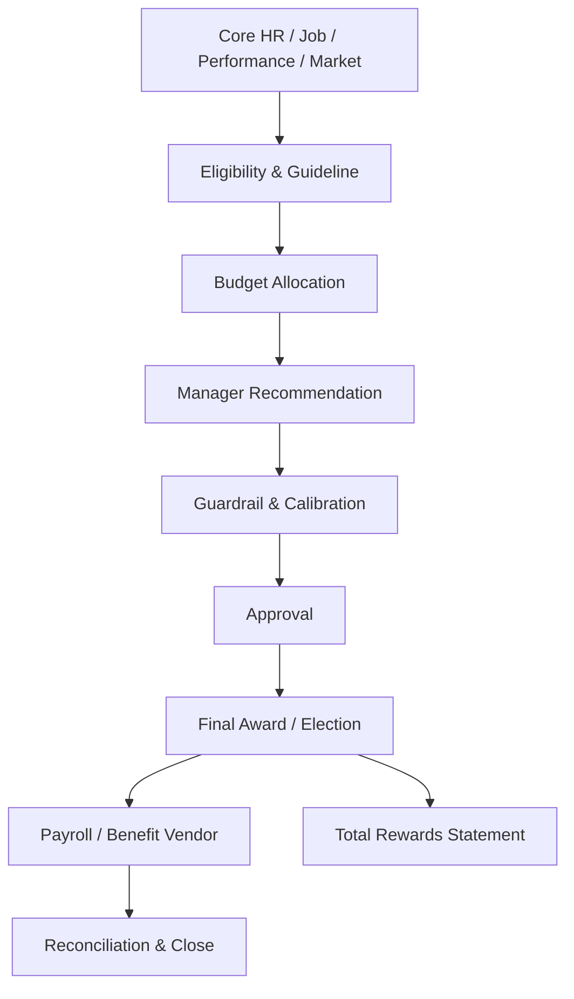

# Tổng quan phân hệ Đãi ngộ, Phúc lợi và Tổng thu nhập (Compensation, Benefits & Total Rewards)

---

> [!NOTE]
> **Phạm vi tham khảo:** Tài liệu này chỉ sử dụng nguồn chính thức của SAP, gồm SAP SuccessFactors, SAP Employee Central, SAP Employee Central Payroll, SAP Fieldglass, SAP Help Portal và các giải pháp SAP liên quan. Thuật ngữ tiếng Anh được giữ trong ngoặc khi cần thiết để hỗ trợ BA/PO đối chiếu với tài liệu cấu hình và triển khai của SAP.


## Mục lục

```text
Tổng quan phân hệ Đãi ngộ, Phúc lợi và Tổng thu nhập (Compensation, Benefits & Total Rewards)
├── 1. Bối cảnh nghiệp vụ (Domain Context)
│   ├── 1.1. Vị trí trong HRIS
│   ├── 1.2. Vai trò trong vận hành doanh nghiệp
│   └── 1.3. Mối liên hệ trong hệ sinh thái hệ thống
├── 2. Khái niệm nghiệp vụ cốt lõi (Core Business Concepts)
│   ├── 2.1. Kế hoạch đãi ngộ (Compensation Plan)
│   ├── 2.2. Ngạch, Dải lương và Khoảng lương (Grade, Band & Salary Range)
│   ├── 2.3. Tăng lương theo thành tích và Thăng chức (Merit & Promotion Increase)
│   ├── 2.4. Thu nhập biến đổi (Variable Pay)
│   ├── 2.5. Kế hoạch và Đăng ký phúc lợi (Benefit Plan & Election)
│   ├── 2.6. Báo cáo tổng đãi ngộ (Total Rewards Statement)
│   ├── 2.7. Công bằng tiền lương (Pay Equity)
├── 3. Quy trình đầu-cuối điển hình (Typical End-to-End Process)
├── 4. So sánh chính sách (Policy) theo quy mô doanh nghiệp
├── 5. Các điểm đau phổ biến (Common Pain Points)
├── 6. Quy tắc nghiệp vụ trọng yếu (Key Business Rules)
│   ├── 6.1. Quy tắc đủ điều kiện tham gia kế hoạch (Plan Eligibility Rule)
│   ├── 6.2. Quy tắc phân bổ ngân sách (Budget Allocation Rule)
│   ├── 6.3. Quy tắc khuyến nghị (Guideline Rule)
│   ├── 6.4. Quy tắc tính theo tỷ lệ (Proration Rule)
│   ├── 6.5. Quy tắc trần/sàn (Cap/Floor Rule)
│   ├── 6.6. Quy tắc sự kiện thay đổi phúc lợi (Benefit Life-Event Rule)
│   ├── 6.7. Quy tắc ngày hiệu lực và tính lương (Effective & Payroll Rule)
├── 7. Góc nhìn dữ liệu và tích hợp (Data & Integration Perspective)
│   ├── 7.1. Dữ liệu cốt lõi trong miền nghiệp vụ (domain)
│   ├── 7.2. Logic quan hệ dữ liệu (Data Relationship Logic)
│   ├── 7.3. Luồng dữ liệu đầu-cuối (End-to-End Data Flow)
│   ├── 7.4. Rủi ro khuếch đại (Error Amplification Effect)
│   └── 7.5. Lưu ý cho BA/PO về dữ liệu và tích hợp
├── 8. Bản đồ phỏng vấn bên liên quan (Stakeholder Interview Mapping)
├── 9. Bảng thuật ngữ chuyên ngành
└── 10. Ghi chú nghiên cứu và nguồn SAP chính thức
```

---

## 1. Bối cảnh nghiệp vụ (Domain Context)

### 1.1. Vị trí trong HRIS
Compensation, Benefits & tổng thu nhập và đãi ngộ (total rewards) là một miền nghiệp vụ quan trọng trong hệ sinh thái HCM/HRIS.

Trong cấu trúc HCM, miền nghiệp vụ (domain) này thường nằm trong:
* **Compensation hoạch định (planning)**
* **thu nhập biến đổi (variable pay) / thưởng (bonus)**
* **Benefits Administration**
* **tổng thu nhập và đãi ngộ (total rewards), Pay Equity và Employee Communication**

> [!NOTE]
> Nếu Payroll thực thi việc trả tiền, thì tổng thu nhập và đãi ngộ (total rewards) quyết định ai đủ điều kiện nhận gì, theo ngân sách, hiệu suất, thị trường và chính sách công bằng nào.

#### Vai trò kiến trúc hệ thống
* Định nghĩa kế hoạch (plan), điều kiện áp dụng (eligibility), budget và award
* Kết nối hiệu suất (performance), job/grade, market data và payroll
* Cung cấp hoạch định (planning) worksheet và phê duyệt (approval) cho quản lý (manager)
* Theo dõi chi phí, equity, employee election và nhà cung cấp (vendor) enrollment

#### Tham chiếu giải pháp SAP

| Giải pháp/tài liệu SAP | Phạm vi tham khảo |
| :--- | :--- |
| [SAP SuccessFactors Compensation](https://www.sap.com/products/hcm/compensation-management.html) | Lập kế hoạch lương, ngân sách, tăng lương và quyết định đãi ngộ. |
| [SAP SuccessFactors Compensation – SAP Help Portal](https://help.sap.com/docs/SAP_SUCCESSFACTORS_COMPENSATION) | Compensation, thu nhập biến đổi (variable pay), Reward and Recognition và Total Compensation kế hoạch (plan). |
| [Employee Central Global Benefits](https://help.sap.com/docs/successfactors-employee-central/implementing-global-benefits/462ec1def36f4281b596358cdb9cc5b8.html) | Phúc lợi toàn cầu, quyền lợi, đăng ký và các mẫu phúc lợi trong Employee Central. |

---

### 1.2. Vai trò trong vận hành doanh nghiệp

#### Thu hút và giữ chân
Mức đãi ngộ cạnh tranh ảnh hưởng tuyển dụng và lưu giữ (retention).

#### Kiểm soát chi phí
Merit, thưởng (bonus) và benefit là khoản chi lớn cần guardrail.

#### Công bằng nội bộ
Pay range, compa-ratio và pay equity giúp phát hiện chênh lệch không hợp lý.

#### Minh bạch
tổng thu nhập và đãi ngộ (total rewards) statement giúp nhân viên hiểu tổng giá trị nhận được.

---

### 1.3. Mối liên hệ trong hệ sinh thái hệ thống

| miền nghiệp vụ (domain) liên quan | Mối quan hệ nghiệp vụ | Rủi ro nếu sai |
| :--- | :--- | :--- |
| Core HR / Job Architecture | Grade, band, location, người lao động (worker) type | Sai điều kiện áp dụng (eligibility)/range |
| hiệu suất (performance) | Rating, goal achievement | Pay-for-hiệu suất (performance) sai |
| Payroll | Award, election, khoản khấu trừ (deduction), ngày hiệu lực (effective date) | Không chi trả hoặc khấu trừ sai |
| Finance / hoạch định (planning) | Budget, forecast, actual | Vượt quỹ |
| Benefits nhà cung cấp (vendor) | Enrollment và coverage | Nhân viên không được bảo hiểm |
| Market Data | Benchmark lương (salary)/rate | Range lỗi thời |

> [!TIP]
> **Nhận định cho BA/PO:**
> miền nghiệp vụ (domain) không nên được thiết kế như một tập màn hình độc lập. Cần xác định rõ hệ thống dữ liệu gốc (system of record), ngày hiệu lực (effective date), chủ sở hữu luồng phê duyệt (workflow owner), tác động tới hệ thống phía sau (downstream impact) và cơ chế đối soát (reconciliation).

---

## 2. Khái niệm nghiệp vụ cốt lõi (Core Business Concepts)

### 2.1. Kế hoạch đãi ngộ (Compensation Plan)
Chương trình điều chỉnh lương, thưởng (bonus), stock hoặc phụ cấp (allowance) cho một đối tượng áp dụng (population).

#### Thành phần hoặc biến số nghiệp vụ
* Cycle, điều kiện áp dụng (eligibility), budget
* Guideline matrix
* quản lý (manager) worksheet

#### Rủi ro phổ biến
* Gán sai đối tượng áp dụng (population)
* Double award

### 2.2. Ngạch, Dải lương và Khoảng lương (Grade, Band & Salary Range)
Khung lương theo job level/location với min-mid-max.

#### Thành phần hoặc biến số nghiệp vụ
* Market reference
* Range penetration/compa-ratio
* Effective phiên bản (version)

#### Rủi ro phổ biến
* thư mời nhận việc (offer)/adjustment ngoài range
* Range lỗi thời

### 2.3. Tăng lương theo thành tích và Thăng chức (Merit & Promotion Increase)
Điều chỉnh lương cơ bản (base salary) dựa trên hiệu suất (performance), position hoặc market.

#### Thành phần hoặc biến số nghiệp vụ
* Guideline theo rating và compa-ratio
* Budget limit
* ngày hiệu lực (effective date)

#### Rủi ro phổ biến
* Vượt budget
* Bias

### 2.4. Thu nhập biến đổi (Variable Pay)
Thưởng dựa trên kết quả cá nhân, đội nhóm, doanh nghiệp hoặc sales.

#### Thành phần hoặc biến số nghiệp vụ
* Target thưởng (bonus)
* Proration
* Payout curve/cap

#### Rủi ro phổ biến
* Tính sai điều kiện áp dụng (eligibility) hoặc target

### 2.5. Kế hoạch và Đăng ký phúc lợi (Benefit Plan & Election)
Gói quyền lợi cùng điều kiện tham gia, coverage và khoản đóng góp (contribution).

#### Thành phần hoặc biến số nghiệp vụ
* Open enrollment
* Life sự kiện (event)
* Dependent

#### Rủi ro phổ biến
* Coverage gap
* Sai khoản khấu trừ (deduction)

### 2.6. Báo cáo tổng đãi ngộ (Total Rewards Statement)
Tổng hợp lương, thưởng, benefit và giá trị khác cho nhân viên.

#### Thành phần hoặc biến số nghiệp vụ
* Current/estimated value
* Visibility
* Explainability

#### Rủi ro phổ biến
* Hiển thị sai hoặc lộ dữ liệu

### 2.7. Công bằng tiền lương (Pay Equity)
Phân tích chênh lệch sau khi kiểm soát job, level, location, tenure và hiệu suất (performance).

#### Thành phần hoặc biến số nghiệp vụ
* Peer group
* Adjustment hành động (action)
* kiểm toán (audit)

#### Rủi ro phổ biến
* Kết luận sai do dữ liệu không chuẩn

---

## 3. Quy trình đầu-cuối điển hình (Typical End-to-End Process)

1. Thiết kế kế hoạch (plan), cycle và đối tượng áp dụng (population)
2. nạp dữ liệu (load) budget và market range
3. Tính điều kiện áp dụng (eligibility) và guideline
4. quản lý (manager) đề xuất award/election
5. System kiểm tra guardrail và bất thường (anomaly)
6. hiệu chỉnh (calibration) và phê duyệt (approval)
7. Finalize award/election
8. Employee communication/e-sign nếu cần
9. Đẩy effective change/khoản khấu trừ (deduction) sang Core HR/Payroll/nhà cung cấp (vendor)
10. đối soát (reconcile) cost và actual
11. Close cycle và phân tích equity



> [!IMPORTANT]
> BA cần mô tả riêng luồng chính (main flow), luồng thay thế (alternative flow), luồng ngoại lệ (exception flow), luồng phê duyệt (approval path) và luồng hoàn tác/sửa sai (rollback/correction path). Sơ đồ trên chỉ thể hiện luồng chuẩn (happy path) tổng quát.

---

## 4. So sánh chính sách (Policy) theo quy mô doanh nghiệp

| Yếu tố | Khởi nghiệp (Startup) | Doanh nghiệp vừa và nhỏ (SME) | Doanh nghiệp lớn (Enterprise) |
| :--- | :--- | :--- | :--- |
| Compensation | Điều chỉnh từng người | Merit cycle theo phòng ban | Global cycle, multiple plans, executive/equity |
| Budget | Theo tổng quỹ | Theo quản lý (manager)/trung tâm chi phí (cost center) | Top-down + bottom-up, scenario modeling |
| Guideline | Quy tắc đơn giản | Rating + grade | hiệu suất (performance), compa-ratio, market, location, skills |
| Benefits | Một vài gói cố định | điều kiện áp dụng (eligibility) theo nhóm | Country kế hoạch (plan), flex credits, life events |
| phê duyệt (approval) | Founder/HR | quản lý (manager) + HR | Matrix, finance, executive committee |
| phân tích (analytics) | Tổng chi phí | Budget chênh lệch (variance) | Pay equity, lưu giữ (retention), reward effectiveness |

### Xu hướng tăng độ phức tạp theo quy mô
1. Số biến số và số đối tượng áp dụng (population) tăng; cùng một rule có thể khác theo pháp nhân, quốc gia, người lao động (worker) type, job và thời điểm.
2. phê duyệt (approval) từ một cấp chuyển thành dynamic routing, delegation, SLA và ngoại lệ (exception) phê duyệt (approval).
3. Tích hợp chuyển từ file thủ công sang API/hướng sự kiện (event-driven), cần tính không trùng lặp (idempotency), thử lại (retry), monitoring và đối soát (reconciliation).
4. Chi phí sai sót tăng theo quy mô đối tượng áp dụng (population) và độ nhạy cảm của quyết định.

### Lưu ý cho BA/PO theo cấp độ

| Cấp độ | Trọng tâm phân tích |
| :--- | :--- |
| Startup | Thiết kế tối giản nhưng tránh mã hóa cứng (hard-code); vẫn cần ID chuẩn, kiểm toán (audit) tối thiểu và khả năng mở rộng. |
| SME | Chuẩn hóa policy, vai trò (role), SLA, phê duyệt (approval), ngoại lệ (exception) và tích hợp (integration) boundary. |
| Enterprise | Rule engine, quản lý theo ngày hiệu lực (effective dating), bản địa hóa (localization), segregation of duties, immutable kiểm toán (audit) và data quản trị (governance). |

---

## 5. Các điểm đau phổ biến (Common Pain Points)

| Điểm đau (Pain Point) | Biểu hiện thực tế | Nguyên nhân gốc rễ | Tác động kinh doanh | Lưu ý cho BA/PO |
| :--- | :--- | :--- | :--- | :--- |
| Spreadsheet merit cycle | Gửi file qua nhiều quản lý (manager) | Hệ thống không có worksheet | Sai phiên bản (version) và lộ lương | vai trò (role)-based worksheet + lock/phiên bản (version) |
| điều kiện áp dụng (eligibility) sai | Nhân viên thiếu hoặc nhận thừa kế hoạch (plan) | Rule không effective-dated | Khiếu nại/chi phí | điều kiện áp dụng (eligibility) explainability và test đối tượng áp dụng (population) |
| Vượt ngân sách | quản lý (manager) đề xuất quá quỹ | Không thời gian thực (real-time) guardrail | Chi phí tăng | Budget ledger và hard/soft limit |
| Range lỗi thời | Nhiều nhân viên dưới/ngoài range | Market data không cập nhật | Khó tuyển/giữ người | phiên bản (version) market data và range đánh giá (review) |
| Benefit enrollment lỗi | Dependent hoặc khoản khấu trừ (deduction) không đồng bộ | nhà cung cấp (vendor)/payroll tích hợp (integration) yếu | Mất coverage | Enrollment confirmation và đối soát (reconciliation) |
| Thiếu minh bạch | Nhân viên chỉ thấy lương cơ bản (base salary) | Không tổng thu nhập và đãi ngộ (total rewards) statement | Đánh giá thấp quyền lợi | Personalized statement và explanation |

---

## 6. Quy tắc nghiệp vụ trọng yếu (Key Business Rules)

Business Rules là tầng quyết định hệ thống diễn giải dữ liệu và cho phép giao dịch (transaction) như thế nào. Rule cần có chủ sở hữu (owner), effective phiên bản (version), test case và kiểm toán (audit) thay đổi.

### Bảng tổng hợp quy tắc nghiệp vụ (Business Rules)

| Nhóm quy tắc (Rule) | Câu hỏi nghiệp vụ trọng tâm | Biến số cấu hình | Rủi ro nếu sai |
| :--- | :--- | :--- | :--- |
| kế hoạch (plan) điều kiện áp dụng (eligibility) Rule | Ai tham gia kế hoạch (plan)? | người lao động (worker) type, hire date, status, grade, country | Sai đối tượng áp dụng (population) |
| Budget Allocation Rule | Ngân sách phân theo gì? | trung tâm chi phí (cost center), quản lý (manager), đối tượng áp dụng (population), currency | Vượt hoặc phân bổ sai |
| Guideline Rule | Đề xuất chuẩn dựa trên yếu tố nào? | Rating, compa-ratio, market, skills | Pay decision thiếu nhất quán |
| Proration Rule | thưởng (bonus)/benefit prorate ra sao? | Service period, leave, FTE, sự kiện (event) date | Payout sai |
| Cap/Floor Rule | Award tối đa/tối thiểu? | kế hoạch (plan), grade, legal, ngoại lệ (exception) | Vượt chính sách |
| Benefit Life-sự kiện (event) Rule | Sự kiện nào mở cửa sổ thay đổi? | Marriage, birth, transfer, deadline | Enrollment không hợp lệ |
| Effective & Payroll Rule | Khi nào award/election có hiệu lực? | Cycle close, payroll chốt dữ liệu (cut-off) | Không trả đúng kỳ |

### 6.1. Quy tắc đủ điều kiện tham gia kế hoạch (Plan Eligibility Rule)
* **Câu hỏi trọng tâm:** Ai tham gia kế hoạch (plan)?
* **Biến số cấu hình:** người lao động (worker) type, hire date, status, grade, country
* **Rủi ro:** Sai đối tượng áp dụng (population)
* **BA cần xác nhận:** rule áp dụng cho đối tượng áp dụng (population) nào, theo ngày hiệu lực nào, ai được ghi đè đặc quyền (override) và ghi đè đặc quyền (override) có cần phê duyệt/kiểm toán (approval/audit) hay không.

### 6.2. Quy tắc phân bổ ngân sách (Budget Allocation Rule)
* **Câu hỏi trọng tâm:** Ngân sách phân theo gì?
* **Biến số cấu hình:** trung tâm chi phí (cost center), quản lý (manager), đối tượng áp dụng (population), currency
* **Rủi ro:** Vượt hoặc phân bổ sai
* **BA cần xác nhận:** rule áp dụng cho đối tượng áp dụng (population) nào, theo ngày hiệu lực nào, ai được ghi đè đặc quyền (override) và ghi đè đặc quyền (override) có cần phê duyệt/kiểm toán (approval/audit) hay không.

### 6.3. Quy tắc khuyến nghị (Guideline Rule)
* **Câu hỏi trọng tâm:** Đề xuất chuẩn dựa trên yếu tố nào?
* **Biến số cấu hình:** Rating, compa-ratio, market, skills
* **Rủi ro:** Pay decision thiếu nhất quán
* **BA cần xác nhận:** rule áp dụng cho đối tượng áp dụng (population) nào, theo ngày hiệu lực nào, ai được ghi đè đặc quyền (override) và ghi đè đặc quyền (override) có cần phê duyệt/kiểm toán (approval/audit) hay không.

### 6.4. Quy tắc tính theo tỷ lệ (Proration Rule)
* **Câu hỏi trọng tâm:** thưởng (bonus)/benefit prorate ra sao?
* **Biến số cấu hình:** Service period, leave, FTE, sự kiện (event) date
* **Rủi ro:** Payout sai
* **BA cần xác nhận:** rule áp dụng cho đối tượng áp dụng (population) nào, theo ngày hiệu lực nào, ai được ghi đè đặc quyền (override) và ghi đè đặc quyền (override) có cần phê duyệt/kiểm toán (approval/audit) hay không.

### 6.5. Quy tắc trần/sàn (Cap/Floor Rule)
* **Câu hỏi trọng tâm:** Award tối đa/tối thiểu?
* **Biến số cấu hình:** kế hoạch (plan), grade, legal, ngoại lệ (exception)
* **Rủi ro:** Vượt chính sách
* **BA cần xác nhận:** rule áp dụng cho đối tượng áp dụng (population) nào, theo ngày hiệu lực nào, ai được ghi đè đặc quyền (override) và ghi đè đặc quyền (override) có cần phê duyệt/kiểm toán (approval/audit) hay không.

### 6.6. Quy tắc sự kiện thay đổi phúc lợi (Benefit Life-Event Rule)
* **Câu hỏi trọng tâm:** Sự kiện nào mở cửa sổ thay đổi?
* **Biến số cấu hình:** Marriage, birth, transfer, deadline
* **Rủi ro:** Enrollment không hợp lệ
* **BA cần xác nhận:** rule áp dụng cho đối tượng áp dụng (population) nào, theo ngày hiệu lực nào, ai được ghi đè đặc quyền (override) và ghi đè đặc quyền (override) có cần phê duyệt/kiểm toán (approval/audit) hay không.

### 6.7. Quy tắc ngày hiệu lực và tính lương (Effective & Payroll Rule)
* **Câu hỏi trọng tâm:** Khi nào award/election có hiệu lực?
* **Biến số cấu hình:** Cycle close, payroll chốt dữ liệu (cut-off)
* **Rủi ro:** Không trả đúng kỳ
* **BA cần xác nhận:** rule áp dụng cho đối tượng áp dụng (population) nào, theo ngày hiệu lực nào, ai được ghi đè đặc quyền (override) và ghi đè đặc quyền (override) có cần phê duyệt/kiểm toán (approval/audit) hay không.

---

## 7. Góc nhìn dữ liệu và tích hợp (Data & Integration Perspective)

### 7.1. Dữ liệu cốt lõi trong miền nghiệp vụ (domain)

| Đối tượng dữ liệu (Data Object) | Vai trò nghiệp vụ | Phụ thuộc vào | Rủi ro nếu sai |
| :--- | :--- | :--- | :--- |
| Comp kế hoạch (plan)/Cycle | Chương trình và kỳ xét | Policy/calendar | Sai đối tượng áp dụng (population)/timing |
| điều kiện áp dụng (eligibility) Record | Kết quả đủ điều kiện | Core HR rule | Award sai |
| dải lương (salary range) | Min-mid-max | Job/location/market | Decision ngoài band |
| Budget | Quỹ phân bổ | Finance/trung tâm chi phí (cost center) | Vượt quỹ |
| Recommendation/Award | Đề xuất và kết quả | quản lý (manager)/phê duyệt (approval) | phiên bản (version) sai |
| Benefit Election | Lựa chọn coverage | kế hoạch (plan)/dependent/life sự kiện (event) | Mất quyền lợi |
| khoản đóng góp (contribution)/khoản khấu trừ (deduction) | Phần công ty và nhân viên | Benefit/payroll | Khấu trừ sai |
| Total Reward Value | Giá trị tổng đãi ngộ | Payroll/benefit/equity | Truyền thông sai |

### 7.2. Logic quan hệ dữ liệu (Data Relationship Logic)
* `1 kế hoạch (plan) → N điều kiện áp dụng (eligibility) Records`
* `1 Cycle → N quản lý (manager) Worksheets`
* `1 Employee → N Recommendations/Awards`
* `Job/Grade/Location → dải lương (salary range)`
* `Benefit kế hoạch (plan) → N Elections + Dependents`
* `Final Award/Election → dữ liệu đầu vào tính lương (payroll input) và nhà cung cấp (vendor) Enrollment`

### 7.3. Luồng dữ liệu đầu-cuối (End-to-End Data Flow)


### 7.4. Rủi ro khuếch đại (Error Amplification Effect)

**Hiệu ứng khuếch đại:** Sai job/grade hoặc điều kiện áp dụng (eligibility) → guideline sai → quản lý (manager) award sai → payroll/benefit sai → pay equity và chi phí bị ảnh hưởng.

### 7.5. Lưu ý cho BA/PO về dữ liệu và tích hợp

* **Nguồn dữ liệu chuẩn (source of truth):** object nào do hệ thống nào sở hữu?
* **Dữ liệu theo thời gian (temporal data):** dữ liệu lấy theo trạng thái hiện tại, ngày hiệu lực (effective date) hay ảnh chụp dữ liệu (snapshot)?
* **Chất lượng dữ liệu (data quality):** validation, duplicate, referential integrity và đối soát (reconciliation) report là gì?
* **tích hợp (integration):** synchronous hay asynchronous; batch hay sự kiện (event); full hay phần chênh lệch (delta)?
* **Xử lý lỗi (error handling):** thử lại (retry), tính không trùng lặp (idempotency), dead-letter queue và manual điều chỉnh (correction)?
* **Bảo mật và quyền riêng tư (security & privacy):** row/field-level quyền truy cập (access), masking, lưu giữ (retention) và sự đồng ý (consent)?
* **kiểm toán (audit):** có lưu giá trị trước/sau (before/after), rule phiên bản (version), actor, timestamp và correlation ID?

---

## 8. Bản đồ phỏng vấn bên liên quan (Stakeholder Interview Mapping)

| Nhóm mục tiêu | Bên liên quan chính | Tập trung vào | Câu hỏi ví dụ |
| :--- | :--- | :--- | :--- |
| Reward strategy | C&B, CHRO | kế hoạch (plan), philosophy, market position | Công ty định vị pay percentile nào? kế hoạch (plan) nào pay-for-hiệu suất (performance)? |
| Budget control | Finance, C&B | Allocation, cap, forecast | Hard limit hay soft warning? Ai được ghi đè đặc quyền (override)? |
| quản lý (manager) luồng phê duyệt (workflow) | quản lý (manager), HRBP | Worksheet, guideline, hiệu chỉnh (calibration) | quản lý (manager) cần thấy dữ liệu nào và không được thấy gì? |
| Benefits | C&B, nhà cung cấp (vendor) | điều kiện áp dụng (eligibility), enrollment, khoản đóng góp (contribution) | Life sự kiện (event) và dependent validation xử lý thế nào? |
| Payroll tích hợp (integration) | Payroll | ngày hiệu lực (effective date), component ánh xạ (mapping) | Award chốt sau chốt dữ liệu (cut-off) vào kỳ nào? |
| Equity & compliance | Legal, DEI, kiểm toán (audit) | Peer group, báo cáo (reporting), bằng chứng (evidence) | Quy tắc pay transparency và kiểm toán (audit) là gì? |

## 9. Bảng thuật ngữ chuyên ngành

| Thuật ngữ (viết tắt) | Dịch | Mô tả |
| :--- | :--- | :--- |
| **Đãi ngộ (Compensation)** | Khoản trả cho người lao động | Tổng các khoản lương, thưởng và khuyến khích tài chính. |
| **Phúc lợi (Benefits)** | Quyền lợi ngoài lương | Bảo hiểm, trợ cấp, hoàn trả, hưu trí và các chương trình hỗ trợ. |
| **Tổng đãi ngộ (Total Rewards)** | Tổng giá trị nhận được | Kết hợp lương, thưởng, phúc lợi, ghi nhận và cơ hội phát triển. |
| **Ngạch lương (Salary Grade)** | Cấp phân loại lương | Nhóm công việc có mức trách nhiệm và khoảng lương tương tự. |
| **Dải lương (Salary Band)** | Khoảng nhóm mức lương | Khung rộng dùng để quản lý nhiều ngạch hoặc cấp độ. |
| **Khoảng lương (Salary Range)** | Mức tối thiểu–trung vị–tối đa | Biên lương chuẩn cho công việc, ngạch hoặc thị trường. |
| **Compa-ratio** | Tỷ lệ lương so với trung vị | Lương hiện tại chia cho mức giữa của khoảng lương. |
| **Tăng lương thành tích (Merit Increase)** | Tăng dựa trên hiệu suất | Khoản điều chỉnh lương dựa trên kết quả đánh giá. |
| **Thu nhập biến đổi (Variable Pay)** | Khoản trả biến động | Thưởng phụ thuộc kết quả cá nhân, nhóm hoặc doanh nghiệp. |
| **Khuyến khích dài hạn (LTI)** | Thưởng dài hạn | Khoản thưởng gắn với nhiều năm, thường gồm cổ phiếu hoặc quyền lợi dài hạn. |
| **Nguyên tắc khuyến nghị (Guideline)** | Khung đề xuất quyết định | Khoảng tăng hoặc thưởng được gợi ý theo hiệu suất, vị trí và ngân sách. |
| **Đăng ký phúc lợi (Benefit Election)** | Lựa chọn quyền lợi | Quyết định của nhân viên về chương trình phúc lợi đủ điều kiện. |
| **Sự kiện cuộc sống (Life Event)** | Sự kiện thay đổi quyền lợi | Sự kiện như kết hôn, sinh con hoặc thay đổi người phụ thuộc. |
| **Công bằng tiền lương (Pay Equity)** | Trả lương công bằng | Đánh giá chênh lệch lương giữa các nhóm tương đồng và nguyên nhân hợp lý. |
| **Kế hoạch tổng đãi ngộ (Total Compensation Plan)** | Kế hoạch lương và thưởng hợp nhất | Biểu mẫu tổng hợp lương, thưởng biến đổi và thành phần tài chính khác. |

---

## 10. Ghi chú nghiên cứu và nguồn SAP chính thức

### 10.1. Nguyên tắc nghiên cứu

* Chỉ sử dụng tài liệu và trang sản phẩm chính thức thuộc hệ sinh thái SAP.
* Nội dung được chuẩn hóa theo miền nghiệp vụ để BA/PO có thể dùng cho khám phá sản phẩm, phân rã quy trình, mô hình miền và quản lý tồn đọng sản phẩm.
* Tên tính năng cụ thể có thể thay đổi theo phiên bản phát hành và cấu hình của từng khách hàng SAP SuccessFactors.
* Quy tắc pháp lý theo quốc gia vẫn cần được xác minh riêng theo ngày hiệu lực trước khi chuyển thành yêu cầu chính thức.

### 10.2. Nguồn tham khảo

| Giải pháp/tài liệu SAP | Phạm vi sử dụng trong nghiên cứu |
| :--- | :--- |
| [SAP SuccessFactors Compensation](https://www.sap.com/products/hcm/compensation-management.html) | Lập kế hoạch lương, ngân sách, tăng lương và quyết định đãi ngộ. |
| [SAP SuccessFactors Compensation – SAP Help Portal](https://help.sap.com/docs/SAP_SUCCESSFACTORS_COMPENSATION) | Compensation, Variable Pay, Reward and Recognition và Total Compensation Plan. |
| [Employee Central Global Benefits](https://help.sap.com/docs/successfactors-employee-central/implementing-global-benefits/462ec1def36f4281b596358cdb9cc5b8.html) | Phúc lợi toàn cầu, quyền lợi, đăng ký và các mẫu phúc lợi trong Employee Central. |

