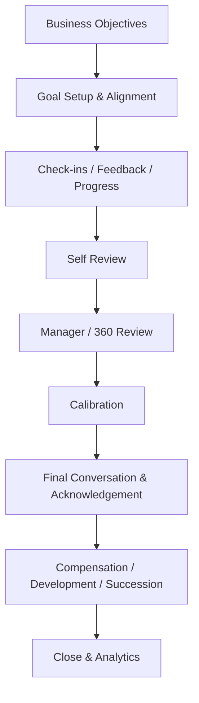

# Tổng quan phân hệ Hiệu suất, Mục tiêu và Phản hồi (Performance, Goals & Feedback)

---

> [!NOTE]
> **Phạm vi tham khảo:** Tài liệu này chỉ sử dụng nguồn chính thức của SAP, gồm SAP SuccessFactors, SAP Employee Central, SAP Employee Central Payroll, SAP Fieldglass, SAP Help Portal và các giải pháp SAP liên quan. Thuật ngữ tiếng Anh được giữ trong ngoặc khi cần thiết để hỗ trợ BA/PO đối chiếu với tài liệu cấu hình và triển khai của SAP.


## Mục lục

```text
Tổng quan phân hệ Hiệu suất, Mục tiêu và Phản hồi (Performance, Goals & Feedback)
├── 1. Bối cảnh nghiệp vụ (Domain Context)
│   ├── 1.1. Vị trí trong HRIS
│   ├── 1.2. Vai trò trong vận hành doanh nghiệp
│   └── 1.3. Mối liên hệ trong hệ sinh thái hệ thống
├── 2. Khái niệm nghiệp vụ cốt lõi (Core Business Concepts)
│   ├── 2.1. Mục tiêu / OKR (Goal / OKR)
│   ├── 2.2. Chu kỳ và Biểu mẫu đánh giá (Review Cycle & Form)
│   ├── 2.3. Thang điểm đánh giá (Rating Scale)
│   ├── 2.4. Năng lực và Hành vi (Competency & Behavior)
│   ├── 2.5. Phản hồi liên tục và Trao đổi định kỳ (Continuous Feedback & Check-in)
│   ├── 2.6. Đánh giá 360 độ (360 Review)
│   ├── 2.7. Hiệu chỉnh đánh giá (Calibration)
│   ├── 2.8. Kế hoạch cải thiện hiệu suất (Performance Improvement Plan)
├── 3. Quy trình đầu-cuối điển hình (Typical End-to-End Process)
├── 4. So sánh chính sách (Policy) theo quy mô doanh nghiệp
├── 5. Các điểm đau phổ biến (Common Pain Points)
├── 6. Quy tắc nghiệp vụ trọng yếu (Key Business Rules)
│   ├── 6.1. Quy tắc đối tượng tham gia chu kỳ (Cycle Eligibility Rule)
│   ├── 6.2. Quy tắc trọng số mục tiêu (Goal Weight Rule)
│   ├── 6.3. Quy tắc chỉnh sửa mục tiêu (Goal Edit Rule)
│   ├── 6.4. Quy tắc tính điểm đánh giá (Rating Calculation Rule)
│   ├── 6.5. Quy tắc hiển thị phản hồi (Feedback Visibility Rule)
│   ├── 6.6. Hiệu chỉnh đánh giá (Calibration) Rule
│   ├── 6.7. Quy tắc hoàn tất (Completion Rule)
├── 7. Góc nhìn dữ liệu và tích hợp (Data & Integration Perspective)
│   ├── 7.1. Dữ liệu cốt lõi trong miền nghiệp vụ (domain)
│   ├── 7.2. Logic quan hệ dữ liệu (Data Relationship Logic)
│   ├── 7.3. Luồng dữ liệu đầu-cuối (End-to-End Data Flow)
│   ├── 7.4. Rủi ro khuếch đại (Error Amplification Effect)
│   └── 7.5. Lưu ý cho BA/PO về dữ liệu và tích hợp
├── 8. Bản đồ phỏng vấn bên liên quan (Stakeholder Interview Mapping)
├── 9. Bảng thuật ngữ chuyên ngành
└── 10. Ghi chú nghiên cứu và nguồn SAP chính thức
```

---

## 1. Bối cảnh nghiệp vụ (Domain Context)

### 1.1. Vị trí trong HRIS
hiệu suất (performance), Goals & phản hồi (feedback) là một miền nghiệp vụ quan trọng trong hệ sinh thái HCM/HRIS.

Trong cấu trúc HCM, miền nghiệp vụ (domain) này thường nằm trong:
* **Goal/OKR Management**
* **đánh giá hiệu suất (performance review)**
* **Continuous phản hồi (feedback) & Check-in**
* **hiệu chỉnh (calibration) và hiệu suất (performance) Improvement**

> [!NOTE]
> Nếu Core HR biết nhân viên đang giữ vai trò nào, thì hiệu suất (performance) xác định kỳ vọng, kết quả, hành vi và phản hồi của họ trong một chu kỳ có kiểm soát.

#### Vai trò kiến trúc hệ thống
* Liên kết mục tiêu công ty–đội nhóm–cá nhân
* Thu thập đánh giá từ employee, quản lý (manager), peer và matrix relationship
* Tạo rating/result dùng cho talent, compensation và development
* Bảo đảm process fairness, kiểm toán (audit) và visibility control

#### Tham chiếu giải pháp SAP

| Giải pháp/tài liệu SAP | Phạm vi tham khảo |
| :--- | :--- |
| [SAP SuccessFactors Performance and Goals](https://www.sap.com/mena/products/hcm/performance-goals.html) | Quản lý mục tiêu, phản hồi thời gian thực, đánh giá hiệu suất và OKR. |
| [Performance and Goals – SAP Help Portal](https://help.sap.com/docs/successfactors-performance-and-goals) | quản lý mục tiêu (goal management), hiệu suất (performance) Management, 360 Reviews và hiệu chỉnh (calibration). |
| [SAP Best Practices for Performance and Goals](https://help.sap.com/docs/SAP_SUCCESSFACTORS_PERFORMANCE_AND_GOALS/fb61f3925d1446aabd50747b9ce3f6a8) | Các luồng chuẩn cho mục tiêu, phản hồi liên tục, đánh giá và hiệu chỉnh. |

---

### 1.2. Vai trò trong vận hành doanh nghiệp

#### Alignment
Mục tiêu rõ và liên kết giúp nhân viên ưu tiên đúng kết quả kinh doanh.

#### quản lý (manager) effectiveness
Check-in và phản hồi (feedback) giúp giải quyết vấn đề sớm hơn annual đánh giá (review).

#### Talent decision
Rating ảnh hưởng compensation, promotion, kế nhiệm (succession) và PIP.

#### Công bằng
hiệu chỉnh (calibration) và structured criteria giảm rating inflation và bias.

---

### 1.3. Mối liên hệ trong hệ sinh thái hệ thống

| miền nghiệp vụ (domain) liên quan | Mối quan hệ nghiệp vụ | Rủi ro nếu sai |
| :--- | :--- | :--- |
| Core HR | Employee, quản lý (manager), job, org, điều kiện áp dụng (eligibility) | Sai đối tượng áp dụng (population)/route |
| Compensation | hiệu suất (performance) rating và goal result | Merit/thưởng (bonus) sai |
| học tập (learning) & Skills | Gap và development hành động (action) | Không phát triển đúng nhu cầu |
| nghề nghiệp (career)/kế nhiệm (succession) | Potential, readiness, talent đánh giá (review) | Pipeline sai |
| Project/Business KPI | Actual result | Đánh giá thủ công/không nhất quán |
| trải nghiệm nhân viên (employee experience) | phản hồi (feedback), recognition, gắn kết (engagement) | đánh giá (review) gây mất niềm tin |

> [!TIP]
> **Nhận định cho BA/PO:**
> miền nghiệp vụ (domain) không nên được thiết kế như một tập màn hình độc lập. Cần xác định rõ hệ thống dữ liệu gốc (system of record), ngày hiệu lực (effective date), chủ sở hữu luồng phê duyệt (workflow owner), tác động tới hệ thống phía sau (downstream impact) và cơ chế đối soát (reconciliation).

---

## 2. Khái niệm nghiệp vụ cốt lõi (Core Business Concepts)

### 2.1. Mục tiêu / OKR (Goal / OKR)
Cam kết kết quả có chủ sở hữu (owner), metric, target, weight và thời gian.

#### Thành phần hoặc biến số nghiệp vụ
* Corporate/team/individual
* Cascade/align
* Progress bằng chứng (evidence)

#### Rủi ro phổ biến
* Mục tiêu mơ hồ
* Tổng weight sai
* Chỉnh mục tiêu cuối kỳ

### 2.2. Chu kỳ và Biểu mẫu đánh giá (Review Cycle & Form)
Kỳ và biểu mẫu xác định đối tượng áp dụng (population), section, vai trò (role) và timeline.

#### Thành phần hoặc biến số nghiệp vụ
* Annual/quarterly/probation/project
* Template theo đối tượng áp dụng (population)
* Routing steps

#### Rủi ro phổ biến
* Gán sai form
* đánh giá (review) trễ

### 2.3. Thang điểm đánh giá (Rating Scale)
Thang đo kết quả hoặc competency.

#### Thành phần hoặc biến số nghiệp vụ
* Numeric/text
* Normalization
* No-rating option

#### Rủi ro phổ biến
* Người dùng hiểu khác nhau
* Inflation

### 2.4. Năng lực và Hành vi (Competency & Behavior)
Kỳ vọng hành vi theo job/level và bằng chứng thể hiện.

#### Thành phần hoặc biến số nghiệp vụ
* Core/leadership/functional competency
* Weight
* Behavior anchors

#### Rủi ro phổ biến
* Đánh giá chủ quan

### 2.5. Phản hồi liên tục và Trao đổi định kỳ (Continuous Feedback & Check-in)
Trao đổi định kỳ, phản hồi (feedback) và hành động (action) giữa quản lý (manager)–employee.

#### Thành phần hoặc biến số nghiệp vụ
* Private/shared
* Requested/given
* Follow-up

#### Rủi ro phổ biến
* phản hồi (feedback) không được sử dụng
* Lộ nội dung nhạy cảm

### 2.6. Đánh giá 360 độ (360 Review)
Thu thập đánh giá từ nhiều nhóm quan hệ.

#### Thành phần hoặc biến số nghiệp vụ
* Rater nomination
* Anonymity threshold
* Report visibility

#### Rủi ro phổ biến
* Mất ẩn danh
* Rater bias

### 2.7. Hiệu chỉnh đánh giá (Calibration)
So sánh và điều chỉnh rating giữa nhóm để tăng tính nhất quán.

#### Thành phần hoặc biến số nghiệp vụ
* đối tượng áp dụng (population), facilitator, distribution
* lý do (reason) for change

#### Rủi ro phổ biến
* Ép curve máy móc
* Không kiểm toán (audit) thay đổi

### 2.8. Kế hoạch cải thiện hiệu suất (Performance Improvement Plan)
Kế hoạch có mục tiêu, hỗ trợ, mốc đánh giá (review) và outcome cho hiệu suất (performance) chưa đạt.

#### Thành phần hoặc biến số nghiệp vụ
* Duration, bằng chứng (evidence), phê duyệt (approval)
* Legal sensitivity

#### Rủi ro phổ biến
* Thiếu bằng chứng
* Xử lý không công bằng

---

## 3. Quy trình đầu-cuối điển hình (Typical End-to-End Process)

1. Thiết lập cycle, template, rating và điều kiện áp dụng (eligibility)
2. Khởi tạo/cascade goals
3. Employee và quản lý (manager) thống nhất mục tiêu
4. Theo dõi progress, check-in, phản hồi (feedback)
5. Điều chỉnh goal có kiểm soát
6. Self đánh giá (review) và quản lý (manager) đánh giá (review)
7. Peer/360 đầu vào (input) nếu áp dụng
8. hiệu chỉnh (calibration)
9. Final đánh giá (review) conversation và acknowledgement
10. Tạo development/PIP/recognition hành động (action)
11. Đẩy kết quả sang compensation/talent/phân tích (analytics)
12. Close và archive



> [!IMPORTANT]
> BA cần mô tả riêng luồng chính (main flow), luồng thay thế (alternative flow), luồng ngoại lệ (exception flow), luồng phê duyệt (approval path) và luồng hoàn tác/sửa sai (rollback/correction path). Sơ đồ trên chỉ thể hiện luồng chuẩn (happy path) tổng quát.

---

## 4. So sánh chính sách (Policy) theo quy mô doanh nghiệp

| Yếu tố | Khởi nghiệp (Startup) | Doanh nghiệp vừa và nhỏ (SME) | Doanh nghiệp lớn (Enterprise) |
| :--- | :--- | :--- | :--- |
| Cycle | Annual đơn giản | Mid-year + annual | Continuous, multiple populations/countries |
| Goals | Nhập tự do | Template và cascade | OKR alignment, tích hợp (integration) KPI |
| Rating | quản lý (manager) rating | Self + quản lý (manager) | 360, hiệu chỉnh (calibration), matrix đầu vào (input) |
| luồng phê duyệt (workflow) | 2 bước | Nhiều vai trò (role) | Dynamic routing và ngoại lệ (exception) |
| hiệu chỉnh (calibration) | Không có | Theo phòng ban | Cross-org, executive, kiểm toán (audit) |
| phân tích (analytics) | Completion/rating | Distribution/trend | Bias, goal quality, hiệu suất (performance)–reward linkage |

### Xu hướng tăng độ phức tạp theo quy mô
1. Số biến số và số đối tượng áp dụng (population) tăng; cùng một rule có thể khác theo pháp nhân, quốc gia, người lao động (worker) type, job và thời điểm.
2. phê duyệt (approval) từ một cấp chuyển thành dynamic routing, delegation, SLA và ngoại lệ (exception) phê duyệt (approval).
3. Tích hợp chuyển từ file thủ công sang API/hướng sự kiện (event-driven), cần tính không trùng lặp (idempotency), thử lại (retry), monitoring và đối soát (reconciliation).
4. Chi phí sai sót tăng theo quy mô đối tượng áp dụng (population) và độ nhạy cảm của quyết định.

### Lưu ý cho BA/PO theo cấp độ

| Cấp độ | Trọng tâm phân tích |
| :--- | :--- |
| Startup | Thiết kế tối giản nhưng tránh mã hóa cứng (hard-code); vẫn cần ID chuẩn, kiểm toán (audit) tối thiểu và khả năng mở rộng. |
| SME | Chuẩn hóa policy, vai trò (role), SLA, phê duyệt (approval), ngoại lệ (exception) và tích hợp (integration) boundary. |
| Enterprise | Rule engine, quản lý theo ngày hiệu lực (effective dating), bản địa hóa (localization), segregation of duties, immutable kiểm toán (audit) và data quản trị (governance). |

---

## 5. Các điểm đau phổ biến (Common Pain Points)

| Điểm đau (Pain Point) | Biểu hiện thực tế | Nguyên nhân gốc rễ | Tác động kinh doanh | Lưu ý cho BA/PO |
| :--- | :--- | :--- | :--- | :--- |
| Mục tiêu không đo được | Goal mô tả chung chung | Không guideline/template | đánh giá (review) chủ quan | SMART validation và example library |
| đánh giá (review) dồn cuối năm | Không có bằng chứng (evidence)/check-in | Process annual-only | Recency bias | Continuous checkpoint và progress log |
| Rating inflation | Hầu hết nhân viên rating cao | Scale mơ hồ/quản lý (manager) avoidance | Compensation mất phân hóa | Behavior anchor và hiệu chỉnh (calibration) |
| Form quá dài | Completion thấp | Nhồi nhiều section | Trải nghiệm kém | Thiết kế theo decision need |
| hiệu chỉnh (calibration) thiếu minh bạch | Rating bị đổi không rõ lý do | Không capture rationale | Mất niềm tin | kiểm toán (audit) giá trị trước/sau (before/after) + lý do (reason) |
| Kết quả không tạo hành động (action) | đánh giá (review) xong rồi đóng | Không link học tập (learning)/nghề nghiệp (career)/PIP | Không cải thiện hiệu suất (performance) | Mandatory development outcome |

---

## 6. Quy tắc nghiệp vụ trọng yếu (Key Business Rules)

Business Rules là tầng quyết định hệ thống diễn giải dữ liệu và cho phép giao dịch (transaction) như thế nào. Rule cần có chủ sở hữu (owner), effective phiên bản (version), test case và kiểm toán (audit) thay đổi.

### Bảng tổng hợp quy tắc nghiệp vụ (Business Rules)

| Nhóm quy tắc (Rule) | Câu hỏi nghiệp vụ trọng tâm | Biến số cấu hình | Rủi ro nếu sai |
| :--- | :--- | :--- | :--- |
| Cycle điều kiện áp dụng (eligibility) Rule | Ai vào kỳ nào? | Hire date, status, job, country, tenure | Thiếu/thừa participant |
| Goal Weight Rule | Tổng weight và loại goal? | Min/max, mandatory corporate goal | Score sai |
| Goal Edit Rule | Được sửa goal đến khi nào? | Lock date, phê duyệt (approval), change lý do (reason) | Gaming cuối kỳ |
| Rating tính toán (calculation) Rule | Score tổng hợp thế nào? | Weight, làm tròn (rounding), ghi đè đặc quyền (override) | Final rating sai |
| phản hồi (feedback) Visibility Rule | Ai được xem phản hồi (feedback)? | Source, anonymity, relationship | Rò rỉ/mất ẩn danh |
| hiệu chỉnh (calibration) Rule | Ai được điều chỉnh và cần bằng chứng gì? | Facilitator, distribution, lý do (reason) | Can thiệp không kiểm soát |
| Completion Rule | Bước nào bắt buộc trước close? | xác nhận cuối (sign-off), acknowledgement, conversation | Đóng thiếu dữ liệu |

### 6.1. Quy tắc đối tượng tham gia chu kỳ (Cycle Eligibility Rule)
* **Câu hỏi trọng tâm:** Ai vào kỳ nào?
* **Biến số cấu hình:** Hire date, status, job, country, tenure
* **Rủi ro:** Thiếu/thừa participant
* **BA cần xác nhận:** rule áp dụng cho đối tượng áp dụng (population) nào, theo ngày hiệu lực nào, ai được ghi đè đặc quyền (override) và ghi đè đặc quyền (override) có cần phê duyệt/kiểm toán (approval/audit) hay không.

### 6.2. Quy tắc trọng số mục tiêu (Goal Weight Rule)
* **Câu hỏi trọng tâm:** Tổng weight và loại goal?
* **Biến số cấu hình:** Min/max, mandatory corporate goal
* **Rủi ro:** Score sai
* **BA cần xác nhận:** rule áp dụng cho đối tượng áp dụng (population) nào, theo ngày hiệu lực nào, ai được ghi đè đặc quyền (override) và ghi đè đặc quyền (override) có cần phê duyệt/kiểm toán (approval/audit) hay không.

### 6.3. Quy tắc chỉnh sửa mục tiêu (Goal Edit Rule)
* **Câu hỏi trọng tâm:** Được sửa goal đến khi nào?
* **Biến số cấu hình:** Lock date, phê duyệt (approval), change lý do (reason)
* **Rủi ro:** Gaming cuối kỳ
* **BA cần xác nhận:** rule áp dụng cho đối tượng áp dụng (population) nào, theo ngày hiệu lực nào, ai được ghi đè đặc quyền (override) và ghi đè đặc quyền (override) có cần phê duyệt/kiểm toán (approval/audit) hay không.

### 6.4. Quy tắc tính điểm đánh giá (Rating Calculation Rule)
* **Câu hỏi trọng tâm:** Score tổng hợp thế nào?
* **Biến số cấu hình:** Weight, làm tròn (rounding), ghi đè đặc quyền (override)
* **Rủi ro:** Final rating sai
* **BA cần xác nhận:** rule áp dụng cho đối tượng áp dụng (population) nào, theo ngày hiệu lực nào, ai được ghi đè đặc quyền (override) và ghi đè đặc quyền (override) có cần phê duyệt/kiểm toán (approval/audit) hay không.

### 6.5. Quy tắc hiển thị phản hồi (Feedback Visibility Rule)
* **Câu hỏi trọng tâm:** Ai được xem phản hồi (feedback)?
* **Biến số cấu hình:** Source, anonymity, relationship
* **Rủi ro:** Rò rỉ/mất ẩn danh
* **BA cần xác nhận:** rule áp dụng cho đối tượng áp dụng (population) nào, theo ngày hiệu lực nào, ai được ghi đè đặc quyền (override) và ghi đè đặc quyền (override) có cần phê duyệt/kiểm toán (approval/audit) hay không.

### 6.6. Hiệu chỉnh đánh giá (Calibration) Rule
* **Câu hỏi trọng tâm:** Ai được điều chỉnh và cần bằng chứng gì?
* **Biến số cấu hình:** Facilitator, distribution, lý do (reason)
* **Rủi ro:** Can thiệp không kiểm soát
* **BA cần xác nhận:** rule áp dụng cho đối tượng áp dụng (population) nào, theo ngày hiệu lực nào, ai được ghi đè đặc quyền (override) và ghi đè đặc quyền (override) có cần phê duyệt/kiểm toán (approval/audit) hay không.

### 6.7. Quy tắc hoàn tất (Completion Rule)
* **Câu hỏi trọng tâm:** Bước nào bắt buộc trước close?
* **Biến số cấu hình:** xác nhận cuối (sign-off), acknowledgement, conversation
* **Rủi ro:** Đóng thiếu dữ liệu
* **BA cần xác nhận:** rule áp dụng cho đối tượng áp dụng (population) nào, theo ngày hiệu lực nào, ai được ghi đè đặc quyền (override) và ghi đè đặc quyền (override) có cần phê duyệt/kiểm toán (approval/audit) hay không.

---

## 7. Góc nhìn dữ liệu và tích hợp (Data & Integration Perspective)

### 7.1. Dữ liệu cốt lõi trong miền nghiệp vụ (domain)

| Đối tượng dữ liệu (Data Object) | Vai trò nghiệp vụ | Phụ thuộc vào | Rủi ro nếu sai |
| :--- | :--- | :--- | :--- |
| hiệu suất (performance) Cycle | Kỳ đánh giá | Calendar/policy | Gán sai kỳ |
| Goal | Kỳ vọng kết quả | Business objective | Không đo được |
| Goal Progress/Result | bằng chứng (evidence) và actual | KPI/project | Score thiếu tin cậy |
| đánh giá (review) Form | Container đánh giá | Template/đối tượng áp dụng (population) | Sai section |
| Rating | Kết quả đánh giá | Scale/tính toán (calculation) | Talent/pay decision sai |
| phản hồi (feedback) | Nhận xét và bằng chứng (evidence) | Relationship/visibility | Rò rỉ |
| hiệu chỉnh (calibration) Change | Điều chỉnh trước–sau | Session/facilitator | Không kiểm toán (audit) |
| Development hành động (action)/PIP | Hành động sau đánh giá (review) | Gap/result | Không follow-up |

### 7.2. Logic quan hệ dữ liệu (Data Relationship Logic)
* `1 Cycle → N đánh giá (review) Forms`
* `1 Employee + Cycle → 1 đánh giá (review) Form theo template`
* `1 đánh giá (review) Form → N Goals/Competencies/Ratings`
* `1 Goal → N Progress Updates`
* `1 hiệu chỉnh (calibration) Session → N Rating Adjustments`
* `Final Result → Compensation + Talent + học tập (learning) + phân tích (analytics)`

### 7.3. Luồng dữ liệu đầu-cuối (End-to-End Data Flow)


### 7.4. Rủi ro khuếch đại (Error Amplification Effect)

**Hiệu ứng khuếch đại:** Goal/điều kiện áp dụng (eligibility) sai → rating sai → merit/promotion/talent decision sai → mất công bằng và giảm gắn kết (engagement).

### 7.5. Lưu ý cho BA/PO về dữ liệu và tích hợp

* **Nguồn dữ liệu chuẩn (source of truth):** object nào do hệ thống nào sở hữu?
* **Dữ liệu theo thời gian (temporal data):** dữ liệu lấy theo trạng thái hiện tại, ngày hiệu lực (effective date) hay ảnh chụp dữ liệu (snapshot)?
* **Chất lượng dữ liệu (data quality):** validation, duplicate, referential integrity và đối soát (reconciliation) report là gì?
* **tích hợp (integration):** synchronous hay asynchronous; batch hay sự kiện (event); full hay phần chênh lệch (delta)?
* **Xử lý lỗi (error handling):** thử lại (retry), tính không trùng lặp (idempotency), dead-letter queue và manual điều chỉnh (correction)?
* **Bảo mật và quyền riêng tư (security & privacy):** row/field-level quyền truy cập (access), masking, lưu giữ (retention) và sự đồng ý (consent)?
* **kiểm toán (audit):** có lưu giá trị trước/sau (before/after), rule phiên bản (version), actor, timestamp và correlation ID?

---

## 8. Bản đồ phỏng vấn bên liên quan (Stakeholder Interview Mapping)

| Nhóm mục tiêu | Bên liên quan chính | Tập trung vào | Câu hỏi ví dụ |
| :--- | :--- | :--- | :--- |
| hiệu suất (performance) philosophy | CHRO, HR Talent | Cycle, rating, goals | Mục đích chính là development hay differentiation? |
| quản lý (manager) practice | quản lý (manager), HRBP | Check-in, bằng chứng (evidence), phản hồi (feedback) | quản lý (manager) đang xử lý ngoài hệ thống ở bước nào? |
| tính toán (calculation) | HRIS, C&B | Weight, score, ghi đè đặc quyền (override) | Final rating tính tự động hay quản lý (manager) quyết định? |
| hiệu chỉnh (calibration) | HRBP, Leadership | đối tượng áp dụng (population), distribution, rationale | Có target distribution không? Ai được thay rating? |
| trải nghiệm nhân viên (employee experience) | Employee | Transparency, acknowledgement | Nhân viên được xem phản hồi (feedback)/rating ở thời điểm nào? |
| Compliance | Legal, ER | PIP, record lưu giữ (retention) | PIP cần bằng chứng (evidence) và phê duyệt (approval) nào? |

## 9. Bảng thuật ngữ chuyên ngành

| Thuật ngữ (viết tắt) | Dịch | Mô tả |
| :--- | :--- | :--- |
| **Quản lý hiệu suất (Performance Management)** | Quản trị kết quả làm việc | Quy trình thiết lập kỳ vọng, đánh giá và phát triển hiệu suất. |
| **Quản lý mục tiêu (Goal Management)** | Thiết lập và theo dõi mục tiêu | Cơ chế liên kết mục tiêu cá nhân, nhóm và doanh nghiệp. |
| **OKR** | Mục tiêu và kết quả then chốt | Phương pháp xác định mục tiêu định tính và kết quả đo lường. |
| **KPI** | Chỉ số hiệu suất chính | Chỉ số định lượng dùng để theo dõi kết quả. |
| **Chu kỳ đánh giá (Review Cycle)** | Khoảng thời gian đánh giá | Giai đoạn từ khởi tạo, tự đánh giá, quản lý đánh giá đến hoàn tất. |
| **Biểu mẫu đánh giá (Review Form)** | Phiếu đánh giá | Biểu mẫu chứa mục tiêu, năng lực, điểm số và nhận xét. |
| **Thang điểm (Rating Scale)** | Hệ thống mức đánh giá | Tập hợp mức điểm và ý nghĩa cho kết quả hiệu suất. |
| **Năng lực (Competency)** | Khả năng và hành vi yêu cầu | Tập hợp kiến thức, kỹ năng và hành vi cần cho công việc. |
| **Quản lý hiệu suất liên tục (CPM)** | Trao đổi hiệu suất thường xuyên | Cơ chế check-in, hoạt động, thành tích và phản hồi liên tục. |
| **Trao đổi định kỳ (Check-in)** | Cuộc trao đổi ngắn | Điểm chạm định kỳ giữa nhân viên và quản lý về tiến độ và hỗ trợ. |
| **Phản hồi (Feedback)** | Nhận xét phát triển | Thông tin giúp ghi nhận điểm mạnh và điều chỉnh hành vi. |
| **Đánh giá 360 độ (360 Review)** | Đánh giá đa nguồn | Thu thập phản hồi từ quản lý, đồng nghiệp, cấp dưới và bản thân. |
| **Hiệu chỉnh (Calibration)** | Chuẩn hóa đánh giá | Phiên so sánh và điều chỉnh điểm để tăng tính nhất quán. |
| **PIP** | Kế hoạch cải thiện hiệu suất | Kế hoạch có thời hạn, mục tiêu và hỗ trợ dành cho hiệu suất chưa đạt. |

---

## 10. Ghi chú nghiên cứu và nguồn SAP chính thức

### 10.1. Nguyên tắc nghiên cứu

* Chỉ sử dụng tài liệu và trang sản phẩm chính thức thuộc hệ sinh thái SAP.
* Nội dung được chuẩn hóa theo miền nghiệp vụ để BA/PO có thể dùng cho khám phá sản phẩm, phân rã quy trình, mô hình miền và quản lý tồn đọng sản phẩm.
* Tên tính năng cụ thể có thể thay đổi theo phiên bản phát hành và cấu hình của từng khách hàng SAP SuccessFactors.
* Quy tắc pháp lý theo quốc gia vẫn cần được xác minh riêng theo ngày hiệu lực trước khi chuyển thành yêu cầu chính thức.

### 10.2. Nguồn tham khảo

| Giải pháp/tài liệu SAP | Phạm vi sử dụng trong nghiên cứu |
| :--- | :--- |
| [SAP SuccessFactors Performance and Goals](https://www.sap.com/mena/products/hcm/performance-goals.html) | Quản lý mục tiêu, phản hồi thời gian thực, đánh giá hiệu suất và OKR. |
| [Performance and Goals – SAP Help Portal](https://help.sap.com/docs/successfactors-performance-and-goals) | Goal Management, Performance Management, 360 Reviews và Calibration. |
| [SAP Best Practices for Performance and Goals](https://help.sap.com/docs/SAP_SUCCESSFACTORS_PERFORMANCE_AND_GOALS/fb61f3925d1446aabd50747b9ce3f6a8) | Các luồng chuẩn cho mục tiêu, phản hồi liên tục, đánh giá và hiệu chỉnh. |

