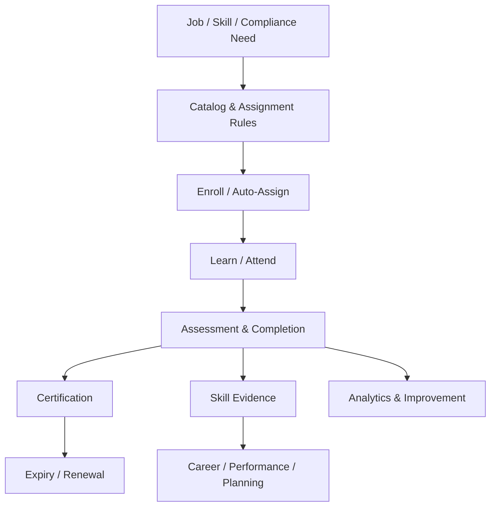

# Tổng quan phân hệ Học tập, Kỹ năng và Đào tạo tuân thủ (Learning, Skills & Compliance Training)

---

> [!NOTE]
> **Phạm vi tham khảo:** Tài liệu này chỉ sử dụng nguồn chính thức của SAP, gồm SAP SuccessFactors, SAP Employee Central, SAP Employee Central Payroll, SAP Fieldglass, SAP Help Portal và các giải pháp SAP liên quan. Thuật ngữ tiếng Anh được giữ trong ngoặc khi cần thiết để hỗ trợ BA/PO đối chiếu với tài liệu cấu hình và triển khai của SAP.


## Mục lục

```text
Tổng quan phân hệ Học tập, Kỹ năng và Đào tạo tuân thủ (Learning, Skills & Compliance Training)
├── 1. Bối cảnh nghiệp vụ (Domain Context)
│   ├── 1.1. Vị trí trong HRIS
│   ├── 1.2. Vai trò trong vận hành doanh nghiệp
│   └── 1.3. Mối liên hệ trong hệ sinh thái hệ thống
├── 2. Khái niệm nghiệp vụ cốt lõi (Core Business Concepts)
│   ├── 2.1. Nội dung học / Khóa học (Learning Item / Course)
│   ├── 2.2. Lớp học / Đợt mở lớp (Class / Offering)
│   ├── 2.3. Chương trình / Lộ trình học (Curriculum / Learning Path)
│   ├── 2.4. Hồ sơ gán học (Assignment Profile)
│   ├── 2.5. Hoàn thành và Đánh giá (Completion & Assessment)
│   ├── 2.6. Chứng nhận (Certification)
│   ├── 2.7. Kỹ năng và Mức thành thạo (Skill & Proficiency)
│   ├── 2.8. Gợi ý học tập (Learning Recommendation)
├── 3. Quy trình đầu-cuối điển hình (Typical End-to-End Process)
├── 4. So sánh chính sách (Policy) theo quy mô doanh nghiệp
├── 5. Các điểm đau phổ biến (Common Pain Points)
├── 6. Quy tắc nghiệp vụ trọng yếu (Key Business Rules)
│   ├── 6.1. Quy tắc gán học (Assignment Rule)
│   ├── 6.2. Quy tắc hạn hoàn thành (Due Date Rule)
│   ├── 6.3. Quy tắc điều kiện tiên quyết (Prerequisite Rule)
│   ├── 6.4. Quy tắc hoàn thành (Completion Rule)
│   ├── 6.5. Chứng nhận (Certification) Rule
│   ├── 6.6. Quy tắc mức thành thạo kỹ năng (Skill Proficiency Rule)
│   ├── 6.7. Quy tắc truy cập (Access Rule)
├── 7. Góc nhìn dữ liệu và tích hợp (Data & Integration Perspective)
│   ├── 7.1. Dữ liệu cốt lõi trong miền nghiệp vụ (domain)
│   ├── 7.2. Logic quan hệ dữ liệu (Data Relationship Logic)
│   ├── 7.3. Luồng dữ liệu đầu-cuối (End-to-End Data Flow)
│   ├── 7.4. Rủi ro khuếch đại (Error Amplification Effect)
│   └── 7.5. Lưu ý cho BA/PO về dữ liệu và tích hợp
├── 8. Bản đồ phỏng vấn bên liên quan (Stakeholder Interview Mapping)
├── 9. Bảng thuật ngữ chuyên ngành
└── 10. Ghi chú nghiên cứu và nguồn SAP chính thức
```

---

## 1. Bối cảnh nghiệp vụ (Domain Context)

### 1.1. Vị trí trong HRIS
học tập (learning), Skills & Compliance Training là một miền nghiệp vụ quan trọng trong hệ sinh thái HCM/HRIS.

Trong cấu trúc HCM, miền nghiệp vụ (domain) này thường nằm trong:
* **học tập (learning) Management System**
* **Compliance Training**
* **Skills & Competency Foundation**
* **học tập (learning) trải nghiệm (experience) và Development hoạch định (planning)**

> [!NOTE]
> Nếu hiệu suất (performance) xác định khoảng cách giữa kỳ vọng và kết quả, thì học tập (learning) & Skills biến khoảng cách đó thành nội dung, trải nghiệm học và bằng chứng năng lực.

#### Vai trò kiến trúc hệ thống
* Quản lý catalog, content, class, enrollment, completion và certification
* Áp dụng phân công (assignment) rule theo vai trò (role), country, risk và khoảng thiếu hụt kỹ năng (skill gap)
* Kết nối content provider, virtual classroom và assessment
* Cung cấp kỹ năng (skill) bằng chứng (evidence) cho talent mobility và hoạch định lực lượng lao động (workforce planning)

#### Tham chiếu giải pháp SAP

| Giải pháp/tài liệu SAP | Phạm vi tham khảo |
| :--- | :--- |
| [SAP SuccessFactors Learning](https://www.sap.com/products/hcm/corporate-lms.html) | Quản lý học tập doanh nghiệp, phát triển kỹ năng và đào tạo tuân thủ. |
| [SAP SuccessFactors Learning – SAP Help Portal](https://help.sap.com/docs/successfactors-learning) | Khóa học, chương trình, gán học, hoàn thành, chứng nhận và báo cáo. |
| [SAP SuccessFactors Career and Talent Development](https://www.sap.com/products/hcm/succession-development.html) | Mô hình kỹ năng thống nhất và liên kết học tập với phát triển nghề nghiệp. |

---

### 1.2. Vai trò trong vận hành doanh nghiệp

#### Compliance readiness
Đào tạo bắt buộc phải hoàn thành đúng hạn và có bằng chứng kiểm toán.

#### Năng lực lực lượng lao động
khoảng thiếu hụt kỹ năng (skill gap) và lộ trình học tập (learning path) hỗ trợ reskill/upskill.

#### Năng suất
Nội dung đúng thời điểm rút ngắn thời gian đạt proficiency.

#### Giữ chân nhân tài
Cơ hội học và phát triển ảnh hưởng gắn kết (engagement) và mobility nội bộ.

---

### 1.3. Mối liên hệ trong hệ sinh thái hệ thống

| miền nghiệp vụ (domain) liên quan | Mối quan hệ nghiệp vụ | Rủi ro nếu sai |
| :--- | :--- | :--- |
| Core HR / Job | đối tượng áp dụng (population), vai trò (role), location, quản lý (manager) | Gán sai training |
| hiệu suất (performance) | Development need và goal | Không có hành động (action) sau đánh giá (review) |
| nghề nghiệp (career)/kế nhiệm (succession) | Target vai trò (role) và readiness | học tập (learning) không gắn nghề nghiệp (career) |
| Compliance/Risk | Mandatory curriculum và certification | Không đủ bằng chứng |
| Content Provider | SCORM/xAPI/video/course | Tracking không nhất quán |
| hoạch định lực lượng lao động (workforce planning) | kỹ năng (skill) supply/gap | Kế hoạch reskill sai |

> [!TIP]
> **Nhận định cho BA/PO:**
> miền nghiệp vụ (domain) không nên được thiết kế như một tập màn hình độc lập. Cần xác định rõ hệ thống dữ liệu gốc (system of record), ngày hiệu lực (effective date), chủ sở hữu luồng phê duyệt (workflow owner), tác động tới hệ thống phía sau (downstream impact) và cơ chế đối soát (reconciliation).

---

## 2. Khái niệm nghiệp vụ cốt lõi (Core Business Concepts)

### 2.1. Nội dung học / Khóa học (Learning Item / Course)
Đơn vị nội dung có metadata, modality, duration, chủ sở hữu (owner) và completion criteria.

#### Thành phần hoặc biến số nghiệp vụ
* Online/classroom/blended
* phiên bản (version)
* Language

#### Rủi ro phổ biến
* Người học hoàn thành sai phiên bản (version)
* Metadata kém

### 2.2. Lớp học / Đợt mở lớp (Class / Offering)
Lần tổ chức cụ thể của khóa học có lịch, instructor, room và capacity.

#### Thành phần hoặc biến số nghiệp vụ
* Session, waitlist, attendance
* Cost

#### Rủi ro phổ biến
* Overbooking
* Điểm danh sai

### 2.3. Chương trình / Lộ trình học (Curriculum / Learning Path)
Tập khóa học có thứ tự hoặc điều kiện để đạt năng lực/chứng nhận.

#### Thành phần hoặc biến số nghiệp vụ
* Prerequisite
* Optional/required
* Validity

#### Rủi ro phổ biến
* Bypass prerequisite
* Không cập nhật khi course phiên bản (version) đổi

### 2.4. Hồ sơ gán học (Assignment Profile)
Rule gán học theo người lao động (worker) attributes hoặc sự kiện.

#### Thành phần hoặc biến số nghiệp vụ
* Job, location, country, risk, hire sự kiện (event)
* Due date

#### Rủi ro phổ biến
* Gán thiếu compliance training
* Gán thừa hàng loạt

### 2.5. Hoàn thành và Đánh giá (Completion & Assessment)
Bằng chứng người học đạt yêu cầu.

#### Thành phần hoặc biến số nghiệp vụ
* Score, attempt, attendance, external bằng chứng (evidence)
* Manual phê duyệt (approval)

#### Rủi ro phổ biến
* Completion giả
* Không đồng bộ score

### 2.6. Chứng nhận (Certification)
Chứng nhận có cấp, ngày hiệu lực và hết hạn.

#### Thành phần hoặc biến số nghiệp vụ
* Renewal window
* Continuing education
* Revocation

#### Rủi ro phổ biến
* Nhân viên làm việc khi chứng chỉ hết hạn

### 2.7. Kỹ năng và Mức thành thạo (Skill & Proficiency)
Năng lực cùng mức độ thành thạo và bằng chứng (evidence).

#### Thành phần hoặc biến số nghiệp vụ
* Self/quản lý (manager)/assessment/inferred
* Validity
* Confidence

#### Rủi ro phổ biến
* kỹ năng (skill) profile phóng đại
* Taxonomy trùng lặp

### 2.8. Gợi ý học tập (Learning Recommendation)
Gợi ý nội dung dựa trên vai trò (role), khoảng thiếu hụt kỹ năng (skill gap), interest hoặc nghề nghiệp (career) target.

#### Thành phần hoặc biến số nghiệp vụ
* Explainability
* Mandatory vs optional
* phản hồi (feedback)

#### Rủi ro phổ biến
* Gợi ý không liên quan
* AI bias

---

## 3. Quy trình đầu-cuối điển hình (Typical End-to-End Process)

1. Xây catalog, kỹ năng (skill) taxonomy và policy
2. Tạo/phát hành (publish) course hoặc class
3. Thiết lập phân công (assignment)/điều kiện áp dụng (eligibility)
4. Enroll hoặc auto-assign learner
5. Nhắc due date và prerequisite
6. Learner tham gia nội dung/class
7. Capture attendance, assessment và completion
8. Cấp/renew certification
9. Cập nhật kỹ năng (skill) bằng chứng (evidence)
10. Đẩy cost/record sang HR phân tích (analytics)/compliance
11. Đánh giá hiệu quả học và cải tiến catalog



> [!IMPORTANT]
> BA cần mô tả riêng luồng chính (main flow), luồng thay thế (alternative flow), luồng ngoại lệ (exception flow), luồng phê duyệt (approval path) và luồng hoàn tác/sửa sai (rollback/correction path). Sơ đồ trên chỉ thể hiện luồng chuẩn (happy path) tổng quát.

---

## 4. So sánh chính sách (Policy) theo quy mô doanh nghiệp

| Yếu tố | Khởi nghiệp (Startup) | Doanh nghiệp vừa và nhỏ (SME) | Doanh nghiệp lớn (Enterprise) |
| :--- | :--- | :--- | :--- |
| Catalog | File/video cơ bản | LMS catalog và lớp | Multi-language, provider marketplace, versioning |
| phân công (assignment) | HR gán thủ công | Rule theo nhóm | sự kiện (event)-driven, vai trò (role)/risk/country |
| Compliance | Theo dõi completion | Reminder/escalation | Certification, legal bằng chứng (evidence), quyền truy cập (access) blocking |
| Skills | Danh sách tự khai | Competency framework | Ontology, inference, bằng chứng (evidence)/confidence |
| Delivery | Online hoặc lớp | Blended | Global virtual/in-person, content integrations |
| phân tích (analytics) | Completion rate | Cost/score | kỹ năng (skill) gain, time-to-proficiency, business impact |

### Xu hướng tăng độ phức tạp theo quy mô
1. Số biến số và số đối tượng áp dụng (population) tăng; cùng một rule có thể khác theo pháp nhân, quốc gia, người lao động (worker) type, job và thời điểm.
2. phê duyệt (approval) từ một cấp chuyển thành dynamic routing, delegation, SLA và ngoại lệ (exception) phê duyệt (approval).
3. Tích hợp chuyển từ file thủ công sang API/hướng sự kiện (event-driven), cần tính không trùng lặp (idempotency), thử lại (retry), monitoring và đối soát (reconciliation).
4. Chi phí sai sót tăng theo quy mô đối tượng áp dụng (population) và độ nhạy cảm của quyết định.

### Lưu ý cho BA/PO theo cấp độ

| Cấp độ | Trọng tâm phân tích |
| :--- | :--- |
| Startup | Thiết kế tối giản nhưng tránh mã hóa cứng (hard-code); vẫn cần ID chuẩn, kiểm toán (audit) tối thiểu và khả năng mở rộng. |
| SME | Chuẩn hóa policy, vai trò (role), SLA, phê duyệt (approval), ngoại lệ (exception) và tích hợp (integration) boundary. |
| Enterprise | Rule engine, quản lý theo ngày hiệu lực (effective dating), bản địa hóa (localization), segregation of duties, immutable kiểm toán (audit) và data quản trị (governance). |

---

## 5. Các điểm đau phổ biến (Common Pain Points)

| Điểm đau (Pain Point) | Biểu hiện thực tế | Nguyên nhân gốc rễ | Tác động kinh doanh | Lưu ý cho BA/PO |
| :--- | :--- | :--- | :--- | :--- |
| Catalog rối và trùng | Nhiều khóa giống nhau | Không quản trị (governance)/phiên bản (version) | Khó tìm và báo cáo (reporting) sai | Taxonomy, chủ sở hữu (owner), archive policy |
| Gán khóa sai | Nhân viên không cần vẫn bị bắt học hoặc bị thiếu | Rule không kiểm thử | Mất thời gian/rủi ro compliance | Preview đối tượng áp dụng (population) và phân công (assignment) kiểm toán (audit) |
| Completion không đáng tin | Click complete nhưng không học | Tiêu chí yếu | Không đủ bằng chứng | Assessment, attendance, xAPI/bằng chứng (evidence) |
| Chứng chỉ hết hạn | Không nhắc hoặc không block | Không renewal luồng phê duyệt (workflow) | Rủi ro vận hành/pháp lý | Expiry sự kiện (event) và escalation |
| kỹ năng (skill) tự khai thiếu tin cậy | Ai cũng chọn proficiency cao | Không validation/bằng chứng (evidence) | Matching sai | Source/confidence và endorsement |
| Không đo business impact | Chỉ báo completion | Không link KPI/hiệu suất (performance) | Khó bảo vệ ngân sách | Pre/post kỹ năng (skill), hiệu suất (performance) outcome |

---

## 6. Quy tắc nghiệp vụ trọng yếu (Key Business Rules)

Business Rules là tầng quyết định hệ thống diễn giải dữ liệu và cho phép giao dịch (transaction) như thế nào. Rule cần có chủ sở hữu (owner), effective phiên bản (version), test case và kiểm toán (audit) thay đổi.

### Bảng tổng hợp quy tắc nghiệp vụ (Business Rules)

| Nhóm quy tắc (Rule) | Câu hỏi nghiệp vụ trọng tâm | Biến số cấu hình | Rủi ro nếu sai |
| :--- | :--- | :--- | :--- |
| phân công (assignment) Rule | Ai phải/được học? | Job, country, hire date, risk, khoảng thiếu hụt kỹ năng (skill gap) | Gán sai đối tượng áp dụng (population) |
| Due Date Rule | Hạn tính từ đâu? | phân công (assignment)/start date/sự kiện (event)/renewal | Quá hạn compliance |
| Prerequisite Rule | Khóa nào cần trước? | Course/phiên bản (version)/score | Học sai thứ tự |
| Completion Rule | Điều kiện hoàn thành? | Attendance, score, duration, attempts | Completion không đáng tin |
| Certification Rule | Hiệu lực và renewal? | Validity, grace, continuing credits | Chứng chỉ hết hạn |
| kỹ năng (skill) Proficiency Rule | Nguồn nào có trọng số cao? | Assessment, quản lý (manager), self, credential | kỹ năng (skill) profile sai |
| quyền truy cập (access) Rule | Ai xem nội dung/kết quả? | Audience, license, sensitive training | Lộ dữ liệu/vi phạm license |

### 6.1. Quy tắc gán học (Assignment Rule)
* **Câu hỏi trọng tâm:** Ai phải/được học?
* **Biến số cấu hình:** Job, country, hire date, risk, khoảng thiếu hụt kỹ năng (skill gap)
* **Rủi ro:** Gán sai đối tượng áp dụng (population)
* **BA cần xác nhận:** rule áp dụng cho đối tượng áp dụng (population) nào, theo ngày hiệu lực nào, ai được ghi đè đặc quyền (override) và ghi đè đặc quyền (override) có cần phê duyệt/kiểm toán (approval/audit) hay không.

### 6.2. Quy tắc hạn hoàn thành (Due Date Rule)
* **Câu hỏi trọng tâm:** Hạn tính từ đâu?
* **Biến số cấu hình:** phân công (assignment)/start date/sự kiện (event)/renewal
* **Rủi ro:** Quá hạn compliance
* **BA cần xác nhận:** rule áp dụng cho đối tượng áp dụng (population) nào, theo ngày hiệu lực nào, ai được ghi đè đặc quyền (override) và ghi đè đặc quyền (override) có cần phê duyệt/kiểm toán (approval/audit) hay không.

### 6.3. Quy tắc điều kiện tiên quyết (Prerequisite Rule)
* **Câu hỏi trọng tâm:** Khóa nào cần trước?
* **Biến số cấu hình:** Course/phiên bản (version)/score
* **Rủi ro:** Học sai thứ tự
* **BA cần xác nhận:** rule áp dụng cho đối tượng áp dụng (population) nào, theo ngày hiệu lực nào, ai được ghi đè đặc quyền (override) và ghi đè đặc quyền (override) có cần phê duyệt/kiểm toán (approval/audit) hay không.

### 6.4. Quy tắc hoàn thành (Completion Rule)
* **Câu hỏi trọng tâm:** Điều kiện hoàn thành?
* **Biến số cấu hình:** Attendance, score, duration, attempts
* **Rủi ro:** Completion không đáng tin
* **BA cần xác nhận:** rule áp dụng cho đối tượng áp dụng (population) nào, theo ngày hiệu lực nào, ai được ghi đè đặc quyền (override) và ghi đè đặc quyền (override) có cần phê duyệt/kiểm toán (approval/audit) hay không.

### 6.5. Chứng nhận (Certification) Rule
* **Câu hỏi trọng tâm:** Hiệu lực và renewal?
* **Biến số cấu hình:** Validity, grace, continuing credits
* **Rủi ro:** Chứng chỉ hết hạn
* **BA cần xác nhận:** rule áp dụng cho đối tượng áp dụng (population) nào, theo ngày hiệu lực nào, ai được ghi đè đặc quyền (override) và ghi đè đặc quyền (override) có cần phê duyệt/kiểm toán (approval/audit) hay không.

### 6.6. Quy tắc mức thành thạo kỹ năng (Skill Proficiency Rule)
* **Câu hỏi trọng tâm:** Nguồn nào có trọng số cao?
* **Biến số cấu hình:** Assessment, quản lý (manager), self, credential
* **Rủi ro:** kỹ năng (skill) profile sai
* **BA cần xác nhận:** rule áp dụng cho đối tượng áp dụng (population) nào, theo ngày hiệu lực nào, ai được ghi đè đặc quyền (override) và ghi đè đặc quyền (override) có cần phê duyệt/kiểm toán (approval/audit) hay không.

### 6.7. Quy tắc truy cập (Access Rule)
* **Câu hỏi trọng tâm:** Ai xem nội dung/kết quả?
* **Biến số cấu hình:** Audience, license, sensitive training
* **Rủi ro:** Lộ dữ liệu/vi phạm license
* **BA cần xác nhận:** rule áp dụng cho đối tượng áp dụng (population) nào, theo ngày hiệu lực nào, ai được ghi đè đặc quyền (override) và ghi đè đặc quyền (override) có cần phê duyệt/kiểm toán (approval/audit) hay không.

---

## 7. Góc nhìn dữ liệu và tích hợp (Data & Integration Perspective)

### 7.1. Dữ liệu cốt lõi trong miền nghiệp vụ (domain)

| Đối tượng dữ liệu (Data Object) | Vai trò nghiệp vụ | Phụ thuộc vào | Rủi ro nếu sai |
| :--- | :--- | :--- | :--- |
| học tập (learning) Item | Nội dung học | Catalog/content | phiên bản (version) sai |
| Offering/Class | Lần tổ chức | Schedule/instructor | Overbook/no attendance |
| Enrollment/phân công (assignment) | Quan hệ learner-course | điều kiện áp dụng (eligibility) | Gán sai |
| Completion Record | Bằng chứng hoàn thành | Assessment/attendance | Compliance sai |
| Certification | Chứng nhận và hiệu lực | Curriculum/authority | Expiry không phát hiện |
| kỹ năng (skill) | Đơn vị năng lực | Taxonomy | Trùng/không chuẩn |
| Proficiency bằng chứng (evidence) | Bằng chứng mức kỹ năng (skill) | Assessment/quản lý (manager)/credential | Matching sai |
| học tập (learning) Cost | Chi phí khóa/lớp | Finance/nhà cung cấp (vendor) | ROI sai |

### 7.2. Logic quan hệ dữ liệu (Data Relationship Logic)
* `1 Course → N Versions và Offerings`
* `1 Curriculum → N Courses/Prerequisites`
* `1 Employee → N Assignments/Enrollments`
* `1 Completion → 0..N Certifications/kỹ năng (skill) bằng chứng (evidence)`
* `phân công (assignment) Profile → đối tượng áp dụng (population) ảnh chụp dữ liệu (snapshot) theo ngày hiệu lực (effective date)`
* `khoảng thiếu hụt kỹ năng (skill gap) → học tập (learning) Recommendation → Completion → updated proficiency`

### 7.3. Luồng dữ liệu đầu-cuối (End-to-End Data Flow)


### 7.4. Rủi ro khuếch đại (Error Amplification Effect)

**Hiệu ứng khuếch đại:** Sai phân công (assignment) hoặc completion → thiếu compliance/kỹ năng (skill) bằng chứng (evidence) → bố trí người không đủ năng lực → rủi ro vận hành và pháp lý.

### 7.5. Lưu ý cho BA/PO về dữ liệu và tích hợp

* **Nguồn dữ liệu chuẩn (source of truth):** object nào do hệ thống nào sở hữu?
* **Dữ liệu theo thời gian (temporal data):** dữ liệu lấy theo trạng thái hiện tại, ngày hiệu lực (effective date) hay ảnh chụp dữ liệu (snapshot)?
* **Chất lượng dữ liệu (data quality):** validation, duplicate, referential integrity và đối soát (reconciliation) report là gì?
* **tích hợp (integration):** synchronous hay asynchronous; batch hay sự kiện (event); full hay phần chênh lệch (delta)?
* **Xử lý lỗi (error handling):** thử lại (retry), tính không trùng lặp (idempotency), dead-letter queue và manual điều chỉnh (correction)?
* **Bảo mật và quyền riêng tư (security & privacy):** row/field-level quyền truy cập (access), masking, lưu giữ (retention) và sự đồng ý (consent)?
* **kiểm toán (audit):** có lưu giá trị trước/sau (before/after), rule phiên bản (version), actor, timestamp và correlation ID?

---

## 8. Bản đồ phỏng vấn bên liên quan (Stakeholder Interview Mapping)

| Nhóm mục tiêu | Bên liên quan chính | Tập trung vào | Câu hỏi ví dụ |
| :--- | :--- | :--- | :--- |
| học tập (learning) quản trị (governance) | L&D, Content chủ sở hữu (owner) | Catalog, phiên bản (version), delivery | Ai sở hữu và retire khóa học? |
| Compliance | Legal, Risk, HSE | Mandatory, due, bằng chứng (evidence) | Không hoàn thành thì escalation hoặc block gì? |
| Skills | Talent, Business Leader | Taxonomy, proficiency, validation | Nguồn bằng chứng (evidence) nào được tin cậy? |
| Delivery | Instructor, Learner | Class, waitlist, attendance | Điểm nghẽn khi đăng ký và điểm danh? |
| tích hợp (integration) | IT, LMS Admin | Content provider, SSO, xAPI | Completion về theo thời gian thực (real-time) hay batch? |
| Effectiveness | HR phân tích (analytics), quản lý (manager) | kỹ năng (skill) gain, KPI impact | Đo hiệu quả ngoài completion bằng chỉ số nào? |

## 9. Bảng thuật ngữ chuyên ngành

| Thuật ngữ (viết tắt) | Dịch | Mô tả |
| :--- | :--- | :--- |
| **LMS** | Hệ thống quản lý học tập | Nền tảng quản lý nội dung, gán học, lớp học, kết quả và tuân thủ. |
| **Nội dung học (Learning Item)** | Đơn vị học tập | Đối tượng đại diện cho khóa học, tài liệu hoặc hoạt động đào tạo. |
| **Lớp học (Class)** | Phiên đào tạo cụ thể | Lần tổ chức khóa học có thời gian, địa điểm và giảng viên. |
| **Đợt mở lớp (Offering)** | Phiên được cung cấp | Một lịch cung cấp khóa học cho người học đăng ký. |
| **Chương trình (Curriculum)** | Nhóm nội dung bắt buộc | Tập hợp nội dung học cần hoàn thành và duy trì theo chu kỳ. |
| **Lộ trình học (Learning Path)** | Chuỗi học phát triển | Tập hợp khóa học được sắp xếp theo mục tiêu phát triển. |
| **Hồ sơ gán học (Assignment Profile)** | Điều kiện chọn người học | Bộ tiêu chí tự động xác định đối tượng cần được gán đào tạo. |
| **Hoàn thành (Completion)** | Kết quả kết thúc học | Trạng thái xác nhận người học đã đáp ứng điều kiện khóa học. |
| **Đánh giá (Assessment)** | Bài kiểm tra năng lực | Cơ chế đo kiến thức hoặc kỹ năng sau hoặc trước đào tạo. |
| **Chứng nhận (Certification)** | Xác nhận đủ chuẩn | Kết quả có thời hạn chứng minh người học đạt yêu cầu. |
| **Đào tạo tuân thủ (Compliance Training)** | Đào tạo bắt buộc | Khóa học nhằm đáp ứng quy định pháp lý hoặc chính sách nội bộ. |
| **SCORM** | Chuẩn đóng gói nội dung học | Chuẩn kỹ thuật giúp nội dung số tương tác với LMS. |
| **Kỹ năng (Skill)** | Khả năng thực hiện công việc | Năng lực cụ thể có thể được học, đánh giá và sử dụng để ghép phù hợp. |
| **Mức thành thạo (Proficiency)** | Cấp độ kỹ năng | Mức thể hiện khả năng từ cơ bản đến chuyên gia. |
| **Trung tâm thông tin nhân tài (Talent Intelligence Hub)** | Nền tảng dữ liệu kỹ năng | Nơi hợp nhất và phân phối dữ liệu kỹ năng trong SAP SuccessFactors. |

---

## 10. Ghi chú nghiên cứu và nguồn SAP chính thức

### 10.1. Nguyên tắc nghiên cứu

* Chỉ sử dụng tài liệu và trang sản phẩm chính thức thuộc hệ sinh thái SAP.
* Nội dung được chuẩn hóa theo miền nghiệp vụ để BA/PO có thể dùng cho khám phá sản phẩm, phân rã quy trình, mô hình miền và quản lý tồn đọng sản phẩm.
* Tên tính năng cụ thể có thể thay đổi theo phiên bản phát hành và cấu hình của từng khách hàng SAP SuccessFactors.
* Quy tắc pháp lý theo quốc gia vẫn cần được xác minh riêng theo ngày hiệu lực trước khi chuyển thành yêu cầu chính thức.

### 10.2. Nguồn tham khảo

| Giải pháp/tài liệu SAP | Phạm vi sử dụng trong nghiên cứu |
| :--- | :--- |
| [SAP SuccessFactors Learning](https://www.sap.com/products/hcm/corporate-lms.html) | Quản lý học tập doanh nghiệp, phát triển kỹ năng và đào tạo tuân thủ. |
| [SAP SuccessFactors Learning – SAP Help Portal](https://help.sap.com/docs/successfactors-learning) | Khóa học, chương trình, gán học, hoàn thành, chứng nhận và báo cáo. |
| [SAP SuccessFactors Career and Talent Development](https://www.sap.com/products/hcm/succession-development.html) | Mô hình kỹ năng thống nhất và liên kết học tập với phát triển nghề nghiệp. |

