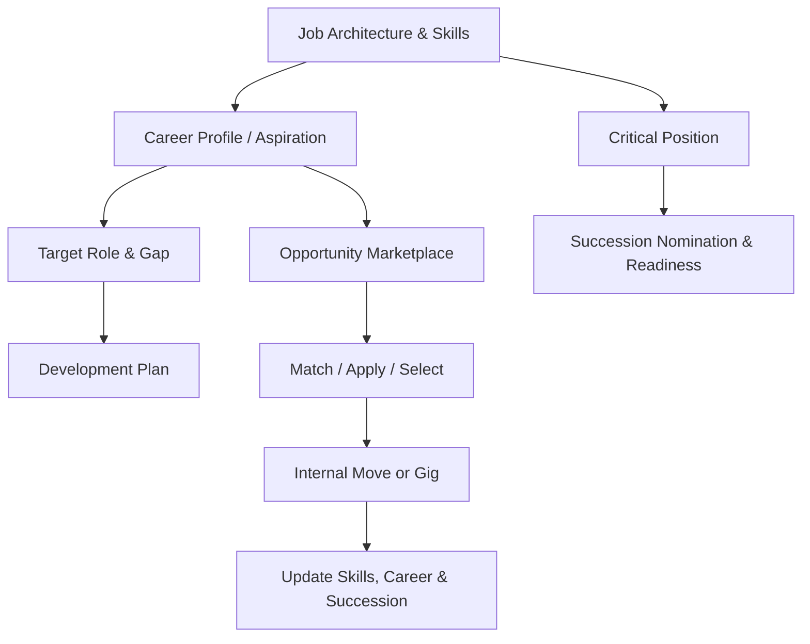

# Tổng quan phân hệ Phát triển nghề nghiệp, Kế nhiệm và Cơ hội nội bộ (Career, Succession & Internal Mobility)

---

> [!NOTE]
> **Phạm vi tham khảo:** Tài liệu này chỉ sử dụng nguồn chính thức của SAP, gồm SAP SuccessFactors, SAP Employee Central, SAP Employee Central Payroll, SAP Fieldglass, SAP Help Portal và các giải pháp SAP liên quan. Thuật ngữ tiếng Anh được giữ trong ngoặc khi cần thiết để hỗ trợ BA/PO đối chiếu với tài liệu cấu hình và triển khai của SAP.


## Mục lục

```text
Tổng quan phân hệ Phát triển nghề nghiệp, Kế nhiệm và Cơ hội nội bộ (Career, Succession & Internal Mobility)
├── 1. Bối cảnh nghiệp vụ (Domain Context)
│   ├── 1.1. Vị trí trong HRIS
│   ├── 1.2. Vai trò trong vận hành doanh nghiệp
│   └── 1.3. Mối liên hệ trong hệ sinh thái hệ thống
├── 2. Khái niệm nghiệp vụ cốt lõi (Core Business Concepts)
│   ├── 2.1. Hồ sơ nghề nghiệp và Nguyện vọng (Career Profile & Aspiration)
│   ├── 2.2. Lộ trình nghề nghiệp (Career Path)
│   ├── 2.3. Tiềm năng (Potential)
│   ├── 2.4. Rà soát nhân tài / Ma trận 9 ô (Talent Review / 9-Box)
│   ├── 2.5. Vị trí trọng yếu và Kế hoạch kế nhiệm (Critical Position & Succession Plan)
│   ├── 2.6. Thị trường cơ hội nội bộ (Opportunity Marketplace)
│   ├── 2.7. Kế hoạch phát triển (Development Plan)
├── 3. Quy trình đầu-cuối điển hình (Typical End-to-End Process)
├── 4. So sánh chính sách (Policy) theo quy mô doanh nghiệp
├── 5. Các điểm đau phổ biến (Common Pain Points)
├── 6. Quy tắc nghiệp vụ trọng yếu (Key Business Rules)
│   ├── 6.1. Quy tắc vị trí trọng yếu (Critical Position Rule)
│   ├── 6.2. Quy tắc đủ điều kiện kế nhiệm (Successor Eligibility Rule)
│   ├── 6.3. Quy tắc mức sẵn sàng (Readiness Rule)
│   ├── 6.4. Quy tắc đủ điều kiện tham gia thị trường cơ hội (Marketplace Eligibility Rule)
│   ├── 6.5. Quy tắc ghép phù hợp (Matching Rule)
│   ├── 6.6. Quy tắc quản lý phê duyệt (Manager Approval Rule)
│   ├── 6.7. Quy tắc bảo mật (Confidentiality Rule)
├── 7. Góc nhìn dữ liệu và tích hợp (Data & Integration Perspective)
│   ├── 7.1. Dữ liệu cốt lõi trong miền nghiệp vụ (domain)
│   ├── 7.2. Logic quan hệ dữ liệu (Data Relationship Logic)
│   ├── 7.3. Luồng dữ liệu đầu-cuối (End-to-End Data Flow)
│   ├── 7.4. Rủi ro khuếch đại (Error Amplification Effect)
│   └── 7.5. Lưu ý cho BA/PO về dữ liệu và tích hợp
├── 8. Bản đồ phỏng vấn bên liên quan (Stakeholder Interview Mapping)
├── 9. Bảng thuật ngữ chuyên ngành
└── 10. Ghi chú nghiên cứu và nguồn SAP chính thức
```

---

## 1. Bối cảnh nghiệp vụ (Domain Context)

### 1.1. Vị trí trong HRIS
nghề nghiệp (career), kế nhiệm (succession) & Internal Mobility là một miền nghiệp vụ quan trọng trong hệ sinh thái HCM/HRIS.

Trong cấu trúc HCM, miền nghiệp vụ (domain) này thường nằm trong:
* **nghề nghiệp (career) Development**
* **Talent đánh giá (review) & kế nhiệm (succession) hoạch định (planning)**
* **Internal Mobility / Talent Marketplace**
* **Mentoring, kế hoạch phát triển (development plan) và Critical vai trò (role) Risk**

> [!NOTE]
> Nếu học tập (learning) giúp phát triển năng lực, thì nghề nghiệp (career) & kế nhiệm (succession) xác định năng lực đó có thể được sử dụng ở cơ hội nào và tổ chức có đủ người kế nhiệm cho vai trò trọng yếu hay không.

#### Vai trò kiến trúc hệ thống
* Kết nối person, skills, hiệu suất (performance), potential và job architecture
* Tạo lộ trình nghề nghiệp (career path), target vai trò (role), readiness và kế nhiệm (succession) slate
* Matching nhân viên với job/project/gig/mentor
* Hỗ trợ talent decision có kiểm soát và privacy

#### Tham chiếu giải pháp SAP

| Giải pháp/tài liệu SAP | Phạm vi tham khảo |
| :--- | :--- |
| [SAP SuccessFactors Career and Talent Development](https://www.sap.com/products/hcm/succession-development.html) | Phát triển dựa trên kỹ năng, di chuyển nội bộ và hoạch định nhân tài. |
| [SAP SuccessFactors Succession and Development – SAP Help Portal](https://help.sap.com/docs/SAP_SUCCESSFACTORS_SUCCESSION_AND_DEVELOPMENT?locale=en-US) | Kế hoạch nghề nghiệp, kế nhiệm, nhóm nhân tài và phát triển. |
| [Career and Talent Development Features](https://www.sap.com/products/hcm/career-talent-development/features.html) | Mô hình kỹ năng, khuyến nghị cơ hội và trải nghiệm phát triển có hướng dẫn. |

---

### 1.2. Vai trò trong vận hành doanh nghiệp

#### lưu giữ (retention)
Cơ hội phát triển nội bộ giảm nhu cầu tìm việc bên ngoài.

#### Business continuity
kế nhiệm (succession) coverage giảm rủi ro khi vị trí trọng yếu trống.

#### Agility
Talent marketplace giúp huy động skills nhanh cho project hoặc gig.

#### Công bằng cơ hội
Marketplace và criteria minh bạch giảm phụ thuộc networking kín.

---

### 1.3. Mối liên hệ trong hệ sinh thái hệ thống

| miền nghiệp vụ (domain) liên quan | Mối quan hệ nghiệp vụ | Rủi ro nếu sai |
| :--- | :--- | :--- |
| Job & Position | lộ trình nghề nghiệp (career path), target vai trò (role), vacancy | Gợi ý vai trò (role) sai |
| Skills & học tập (learning) | kỹ năng (skill) profile, gap, development | Readiness sai |
| hiệu suất (performance) | Rating, potential, phản hồi (feedback) | Talent decision lệch |
| Recruitment | Internal ứng viên (candidate) và posting | Ứng viên nội bộ không được ưu tiên đúng |
| hoạch định lực lượng lao động (workforce planning) | Critical vai trò (role) và future kỹ năng (skill) | Pipeline không phù hợp chiến lược |
| Compensation | Promotion/pay implication | Chuyển nội bộ không đồng bộ reward |

> [!TIP]
> **Nhận định cho BA/PO:**
> miền nghiệp vụ (domain) không nên được thiết kế như một tập màn hình độc lập. Cần xác định rõ hệ thống dữ liệu gốc (system of record), ngày hiệu lực (effective date), chủ sở hữu luồng phê duyệt (workflow owner), tác động tới hệ thống phía sau (downstream impact) và cơ chế đối soát (reconciliation).

---

## 2. Khái niệm nghiệp vụ cốt lõi (Core Business Concepts)

### 2.1. Hồ sơ nghề nghiệp và Nguyện vọng (Career Profile & Aspiration)
Thông tin kỹ năng, kinh nghiệm, sở thích, mobility preference và vai trò mong muốn.

#### Thành phần hoặc biến số nghiệp vụ
* Employee-controlled fields
* Privacy/visibility
* nghề nghiệp (career) target

#### Rủi ro phổ biến
* Dữ liệu lỗi thời
* Lộ mong muốn nghề nghiệp

### 2.2. Lộ trình nghề nghiệp (Career Path)
Chuỗi vai trò khả thi dựa trên job architecture và kỹ năng (skill) adjacency.

#### Thành phần hoặc biến số nghiệp vụ
* Vertical/lateral
* Prerequisite
* Typical transition

#### Rủi ro phổ biến
* Đường nghề nghiệp cứng/không thực tế

### 2.3. Tiềm năng (Potential)
Đánh giá khả năng đảm nhiệm phạm vi lớn hơn trong tương lai, khác với hiệu suất (performance) hiện tại.

#### Thành phần hoặc biến số nghiệp vụ
* Scale/criteria
* hiệu chỉnh (calibration)
* Confidentiality

#### Rủi ro phổ biến
* Đồng nhất potential với hiệu suất (performance)
* Bias

### 2.4. Rà soát nhân tài / Ma trận 9 ô (Talent Review / 9-Box)
Phiên đánh giá hiệu suất (performance)–potential và hành động (action) cho đối tượng áp dụng (population).

#### Thành phần hoặc biến số nghiệp vụ
* Session, facilitator, grid
* Flight risk/loss impact

#### Rủi ro phổ biến
* Label nhân viên vĩnh viễn
* Không kiểm toán (audit)

### 2.5. Vị trí trọng yếu và Kế hoạch kế nhiệm (Critical Position & Succession Plan)
Vị trí quan trọng cùng danh sách successor, readiness và development hành động (action).

#### Thành phần hoặc biến số nghiệp vụ
* khẩn cấp (emergency)/ready now/ready later
* Bench strength
* Coverage

#### Rủi ro phổ biến
* Không có người kế nhiệm
* Nomination cảm tính

### 2.6. Thị trường cơ hội nội bộ (Opportunity Marketplace)
Không gian matching job, project, gig, mentor hoặc học tập (learning) opportunity.

#### Thành phần hoặc biến số nghiệp vụ
* điều kiện áp dụng (eligibility), application/nomination
* quản lý (manager) phê duyệt (approval)
* Capacity

#### Rủi ro phổ biến
* Gig xung đột công việc chính
* Cơ hội không công bằng

### 2.7. Kế hoạch phát triển (Development Plan)
Tập hành động (action) để đóng gap cho target vai trò (role) hoặc kế nhiệm (succession).

#### Thành phần hoặc biến số nghiệp vụ
* học tập (learning), phân công (assignment), mentor, milestone
* chủ sở hữu (owner)

#### Rủi ro phổ biến
* Không follow-up

---

## 3. Quy trình đầu-cuối điển hình (Typical End-to-End Process)

1. Chuẩn hóa job/kỹ năng (skill)/nghề nghiệp (career) architecture
2. Nhân viên cập nhật profile và aspiration
3. Hệ thống hoặc quản lý (manager) xác định target/gap
4. Tạo kế hoạch phát triển (development plan)
5. Talent đánh giá (review) và hiệu chỉnh (calibration)
6. Xác định critical positions
7. Nominate và đánh giá successor readiness
8. phát hành (publish)/match internal opportunities
9. Apply/nominate/approve mobility
10. Execute transfer/project/gig
11. Cập nhật kỹ năng (skill)/readiness và theo dõi pipeline



> [!IMPORTANT]
> BA cần mô tả riêng luồng chính (main flow), luồng thay thế (alternative flow), luồng ngoại lệ (exception flow), luồng phê duyệt (approval path) và luồng hoàn tác/sửa sai (rollback/correction path). Sơ đồ trên chỉ thể hiện luồng chuẩn (happy path) tổng quát.

---

## 4. So sánh chính sách (Policy) theo quy mô doanh nghiệp

| Yếu tố | Khởi nghiệp (Startup) | Doanh nghiệp vừa và nhỏ (SME) | Doanh nghiệp lớn (Enterprise) |
| :--- | :--- | :--- | :--- |
| lộ trình nghề nghiệp (career path) | Trao đổi thủ công | Framework theo job family | kỹ năng (skill)-based dynamic path |
| kế nhiệm (succession) | Danh sách key people | Critical vai trò (role) + 9-box | Enterprise slate, multiple readiness, risk phân tích (analytics) |
| Mobility | Internal tin đăng tuyển (job posting) | nghề nghiệp (career) portal | Talent marketplace, gigs, projects, mentors |
| Data | quản lý (manager) judgment | hiệu suất (performance) + kỹ năng (skill) | Multi-source bằng chứng (evidence), AI matching |
| quản trị (governance) | HR quản lý | HRBP + quản lý (manager) | Talent committee, privacy, fairness kiểm toán (audit) |
| phân tích (analytics) | Promotion/turnover | Coverage/readiness | Bench strength, mobility flow, kỹ năng (skill) adjacency |

### Xu hướng tăng độ phức tạp theo quy mô
1. Số biến số và số đối tượng áp dụng (population) tăng; cùng một rule có thể khác theo pháp nhân, quốc gia, người lao động (worker) type, job và thời điểm.
2. phê duyệt (approval) từ một cấp chuyển thành dynamic routing, delegation, SLA và ngoại lệ (exception) phê duyệt (approval).
3. Tích hợp chuyển từ file thủ công sang API/hướng sự kiện (event-driven), cần tính không trùng lặp (idempotency), thử lại (retry), monitoring và đối soát (reconciliation).
4. Chi phí sai sót tăng theo quy mô đối tượng áp dụng (population) và độ nhạy cảm của quyết định.

### Lưu ý cho BA/PO theo cấp độ

| Cấp độ | Trọng tâm phân tích |
| :--- | :--- |
| Startup | Thiết kế tối giản nhưng tránh mã hóa cứng (hard-code); vẫn cần ID chuẩn, kiểm toán (audit) tối thiểu và khả năng mở rộng. |
| SME | Chuẩn hóa policy, vai trò (role), SLA, phê duyệt (approval), ngoại lệ (exception) và tích hợp (integration) boundary. |
| Enterprise | Rule engine, quản lý theo ngày hiệu lực (effective dating), bản địa hóa (localization), segregation of duties, immutable kiểm toán (audit) và data quản trị (governance). |

---

## 5. Các điểm đau phổ biến (Common Pain Points)

| Điểm đau (Pain Point) | Biểu hiện thực tế | Nguyên nhân gốc rễ | Tác động kinh doanh | Lưu ý cho BA/PO |
| :--- | :--- | :--- | :--- | :--- |
| kế nhiệm (succession) dựa vào danh sách cá nhân | File kín và lỗi thời | Không nối position/kỹ năng (skill) | Rủi ro continuity | Position-based kế hoạch (plan) và đánh giá (review) cycle |
| hiệu suất (performance) = potential | Top performer mặc định thành successor | Không có criteria riêng | Promote sai người | Potential framework và bằng chứng (evidence) |
| lộ trình nghề nghiệp (career path) không thực tế | Chỉ có thăng chức dọc | Job architecture nghèo | Nhân viên không thấy cơ hội | Lateral path và kỹ năng (skill) adjacency |
| Cơ hội nội bộ không minh bạch | Phụ thuộc quản lý (manager)/network | Không marketplace | lưu giữ (retention) và fairness thấp | phát hành (publish) điều kiện áp dụng (eligibility) và matching logic |
| quản lý (manager) giữ người | Không cho nhân viên ứng tuyển/gig | Incentive xung đột | Mobility bị chặn | Policy, SLA và leadership KPI |
| Talent label thiếu privacy | Nhân viên thấy hoặc bị sử dụng sai | Visibility rule không rõ | Mất niềm tin | Field-level bảo mật (security) và lưu giữ (retention) |

---

## 6. Quy tắc nghiệp vụ trọng yếu (Key Business Rules)

Business Rules là tầng quyết định hệ thống diễn giải dữ liệu và cho phép giao dịch (transaction) như thế nào. Rule cần có chủ sở hữu (owner), effective phiên bản (version), test case và kiểm toán (audit) thay đổi.

### Bảng tổng hợp quy tắc nghiệp vụ (Business Rules)

| Nhóm quy tắc (Rule) | Câu hỏi nghiệp vụ trọng tâm | Biến số cấu hình | Rủi ro nếu sai |
| :--- | :--- | :--- | :--- |
| Critical Position Rule | Vị trí nào được coi trọng yếu? | Business impact, scarcity, vacancy risk | Bỏ sót vai trò (role) quan trọng |
| Successor điều kiện áp dụng (eligibility) Rule | Ai được nominate? | hiệu suất (performance), potential, kỹ năng (skill), mobility, tenure | Nomination cảm tính |
| Readiness Rule | Ready now/later tính thế nào? | Gap, trải nghiệm (experience), timeline, bằng chứng (evidence) | Coverage ảo |
| Marketplace điều kiện áp dụng (eligibility) Rule | Ai được xem/apply cơ hội? | Tenure, hiệu suất (performance), quản lý (manager) status, geography | Không công bằng hoặc xung đột |
| Matching Rule | Trọng số kỹ năng (skill)/interest/location? | Required vs preferred, confidence | Gợi ý sai/bias |
| quản lý (manager) phê duyệt (approval) Rule | Cần duyệt ở bước nào? | Apply, select, release date | quản lý (manager) block mobility |
| Confidentiality Rule | Ai xem potential/kế nhiệm (succession)? | vai trò (role), committee, employee visibility | Rò rỉ dữ liệu nhạy cảm |

### 6.1. Quy tắc vị trí trọng yếu (Critical Position Rule)
* **Câu hỏi trọng tâm:** Vị trí nào được coi trọng yếu?
* **Biến số cấu hình:** Business impact, scarcity, vacancy risk
* **Rủi ro:** Bỏ sót vai trò (role) quan trọng
* **BA cần xác nhận:** rule áp dụng cho đối tượng áp dụng (population) nào, theo ngày hiệu lực nào, ai được ghi đè đặc quyền (override) và ghi đè đặc quyền (override) có cần phê duyệt/kiểm toán (approval/audit) hay không.

### 6.2. Quy tắc đủ điều kiện kế nhiệm (Successor Eligibility Rule)
* **Câu hỏi trọng tâm:** Ai được nominate?
* **Biến số cấu hình:** hiệu suất (performance), potential, kỹ năng (skill), mobility, tenure
* **Rủi ro:** Nomination cảm tính
* **BA cần xác nhận:** rule áp dụng cho đối tượng áp dụng (population) nào, theo ngày hiệu lực nào, ai được ghi đè đặc quyền (override) và ghi đè đặc quyền (override) có cần phê duyệt/kiểm toán (approval/audit) hay không.

### 6.3. Quy tắc mức sẵn sàng (Readiness Rule)
* **Câu hỏi trọng tâm:** Ready now/later tính thế nào?
* **Biến số cấu hình:** Gap, trải nghiệm (experience), timeline, bằng chứng (evidence)
* **Rủi ro:** Coverage ảo
* **BA cần xác nhận:** rule áp dụng cho đối tượng áp dụng (population) nào, theo ngày hiệu lực nào, ai được ghi đè đặc quyền (override) và ghi đè đặc quyền (override) có cần phê duyệt/kiểm toán (approval/audit) hay không.

### 6.4. Quy tắc đủ điều kiện tham gia thị trường cơ hội (Marketplace Eligibility Rule)
* **Câu hỏi trọng tâm:** Ai được xem/apply cơ hội?
* **Biến số cấu hình:** Tenure, hiệu suất (performance), quản lý (manager) status, geography
* **Rủi ro:** Không công bằng hoặc xung đột
* **BA cần xác nhận:** rule áp dụng cho đối tượng áp dụng (population) nào, theo ngày hiệu lực nào, ai được ghi đè đặc quyền (override) và ghi đè đặc quyền (override) có cần phê duyệt/kiểm toán (approval/audit) hay không.

### 6.5. Quy tắc ghép phù hợp (Matching Rule)
* **Câu hỏi trọng tâm:** Trọng số kỹ năng (skill)/interest/location?
* **Biến số cấu hình:** Required vs preferred, confidence
* **Rủi ro:** Gợi ý sai/bias
* **BA cần xác nhận:** rule áp dụng cho đối tượng áp dụng (population) nào, theo ngày hiệu lực nào, ai được ghi đè đặc quyền (override) và ghi đè đặc quyền (override) có cần phê duyệt/kiểm toán (approval/audit) hay không.

### 6.6. Quy tắc quản lý phê duyệt (Manager Approval Rule)
* **Câu hỏi trọng tâm:** Cần duyệt ở bước nào?
* **Biến số cấu hình:** Apply, select, release date
* **Rủi ro:** quản lý (manager) block mobility
* **BA cần xác nhận:** rule áp dụng cho đối tượng áp dụng (population) nào, theo ngày hiệu lực nào, ai được ghi đè đặc quyền (override) và ghi đè đặc quyền (override) có cần phê duyệt/kiểm toán (approval/audit) hay không.

### 6.7. Quy tắc bảo mật (Confidentiality Rule)
* **Câu hỏi trọng tâm:** Ai xem potential/kế nhiệm (succession)?
* **Biến số cấu hình:** vai trò (role), committee, employee visibility
* **Rủi ro:** Rò rỉ dữ liệu nhạy cảm
* **BA cần xác nhận:** rule áp dụng cho đối tượng áp dụng (population) nào, theo ngày hiệu lực nào, ai được ghi đè đặc quyền (override) và ghi đè đặc quyền (override) có cần phê duyệt/kiểm toán (approval/audit) hay không.

---

## 7. Góc nhìn dữ liệu và tích hợp (Data & Integration Perspective)

### 7.1. Dữ liệu cốt lõi trong miền nghiệp vụ (domain)

| Đối tượng dữ liệu (Data Object) | Vai trò nghiệp vụ | Phụ thuộc vào | Rủi ro nếu sai |
| :--- | :--- | :--- | :--- |
| nghề nghiệp (career) Profile | Aspiration và mobility | Employee/skills | Lỗi thời/privacy |
| Target vai trò (role) | Vai trò hướng tới | Job architecture | Gap sai |
| Potential Rating | Khả năng phát triển | Talent đánh giá (review) | Bias |
| Critical Position | vai trò (role) cần continuity | lực lượng lao động (workforce) strategy | Coverage sai |
| Successor Nomination | Quan hệ người–position | quản lý (manager)/committee | Danh sách lỗi thời |
| Readiness | Thời gian/mức sẵn sàng | Gap/bằng chứng (evidence) | Pipeline ảo |
| Opportunity | Job/project/gig/mentor | Business demand | Không rõ capacity |
| Match/Application | Quan hệ person–opportunity | điều kiện áp dụng (eligibility)/matching | Fairness/báo cáo (reporting) sai |

### 7.2. Logic quan hệ dữ liệu (Data Relationship Logic)
* `1 Job → N nghề nghiệp (career) Paths/Adjacent Jobs`
* `1 Employee → N Target Roles và Development Actions`
* `1 Critical Position → N Successor Nominations`
* `1 Successor → readiness + gap + hành động (action) kế hoạch (plan)`
* `1 Opportunity → N Matches/Applications`
* `Mobility outcome → Core HR personnel sự kiện (event) + updated nghề nghiệp (career)/kỹ năng (skill) data`

### 7.3. Luồng dữ liệu đầu-cuối (End-to-End Data Flow)


### 7.4. Rủi ro khuếch đại (Error Amplification Effect)

**Hiệu ứng khuếch đại:** Job/kỹ năng (skill)/potential data sai → successor/match sai → mobility/promote sai → mất người giỏi hoặc gián đoạn vị trí trọng yếu.

### 7.5. Lưu ý cho BA/PO về dữ liệu và tích hợp

* **Nguồn dữ liệu chuẩn (source of truth):** object nào do hệ thống nào sở hữu?
* **Dữ liệu theo thời gian (temporal data):** dữ liệu lấy theo trạng thái hiện tại, ngày hiệu lực (effective date) hay ảnh chụp dữ liệu (snapshot)?
* **Chất lượng dữ liệu (data quality):** validation, duplicate, referential integrity và đối soát (reconciliation) report là gì?
* **tích hợp (integration):** synchronous hay asynchronous; batch hay sự kiện (event); full hay phần chênh lệch (delta)?
* **Xử lý lỗi (error handling):** thử lại (retry), tính không trùng lặp (idempotency), dead-letter queue và manual điều chỉnh (correction)?
* **Bảo mật và quyền riêng tư (security & privacy):** row/field-level quyền truy cập (access), masking, lưu giữ (retention) và sự đồng ý (consent)?
* **kiểm toán (audit):** có lưu giá trị trước/sau (before/after), rule phiên bản (version), actor, timestamp và correlation ID?

---

## 8. Bản đồ phỏng vấn bên liên quan (Stakeholder Interview Mapping)

| Nhóm mục tiêu | Bên liên quan chính | Tập trung vào | Câu hỏi ví dụ |
| :--- | :--- | :--- | :--- |
| Talent philosophy | CHRO, Talent Leader | Potential, 9-box, critical vai trò (role) | Potential khác hiệu suất (performance) như thế nào? |
| kế nhiệm (succession) | Leadership, HRBP | Nomination, readiness, coverage | Ai có quyền nominate và thay readiness? |
| nghề nghiệp (career) trải nghiệm (experience) | Employee, quản lý (manager) | Aspiration, path, development | Nhân viên muốn thấy thông tin nào về target vai trò (role)? |
| Marketplace | Business Leader, Project chủ sở hữu (owner) | Opportunity, capacity, phê duyệt (approval) | Gig có ảnh hưởng workload và phân bổ chi phí (cost allocation) không? |
| Fairness/privacy | Legal, DEI, Data Privacy | Talent labels, matching | Potential và kế nhiệm (succession) được lưu/xem bao lâu? |
| tích hợp (integration) | HRIS, Recruiting, học tập (learning) | Move, posting, kỹ năng (skill) update | Kết quả mobility kích hoạt personnel sự kiện (event) nào? |

## 9. Bảng thuật ngữ chuyên ngành

| Thuật ngữ (viết tắt) | Dịch | Mô tả |
| :--- | :--- | :--- |
| **Phát triển nghề nghiệp (Career Development)** | Phát triển con đường nghề nghiệp | Quá trình xác định mục tiêu và hoạt động giúp nhân viên tiến tới vai trò mong muốn. |
| **Nguyện vọng (Aspiration)** | Mong muốn nghề nghiệp | Vai trò, kỹ năng hoặc hướng phát triển mà nhân viên quan tâm. |
| **Lộ trình nghề nghiệp (Career Path)** | Chuỗi vai trò phát triển | Các bước nghề nghiệp có thể đi từ vị trí hiện tại tới vị trí mục tiêu. |
| **Tiềm năng (Potential)** | Khả năng phát triển tương lai | Đánh giá khả năng đảm nhận vai trò lớn hơn hoặc phức tạp hơn. |
| **Rà soát nhân tài (Talent Review)** | Phiên đánh giá nhân tài | Quá trình quản lý cùng xem xét hiệu suất, tiềm năng và rủi ro nhân sự. |
| **Ma trận 9 ô (9-Box)** | Ma trận hiệu suất–tiềm năng | Công cụ phân nhóm nhân viên theo hai chiều hiệu suất và tiềm năng. |
| **Vị trí trọng yếu (Critical Position)** | Vai trò ảnh hưởng cao | Vị trí có tác động lớn tới vận hành, chiến lược hoặc tính liên tục kinh doanh. |
| **Kế hoạch kế nhiệm (Succession Plan)** | Kế hoạch người thay thế | Danh sách và kế hoạch phát triển ứng viên cho vai trò trọng yếu. |
| **Người kế nhiệm (Successor)** | Ứng viên thay thế | Cá nhân được xem xét cho một vị trí hoặc vai trò trong tương lai. |
| **Mức sẵn sàng (Readiness)** | Thời gian sẵn sàng đảm nhiệm | Đánh giá ứng viên có thể đảm nhiệm ngay, trong ngắn hạn hoặc dài hạn. |
| **Độ dày nguồn kế nhiệm (Bench Strength)** | Mức đủ người kế nhiệm | Số lượng và chất lượng ứng viên sẵn sàng cho vai trò trọng yếu. |
| **Nguy cơ mất người (Risk of Loss)** | Khả năng nghỉ việc | Đánh giá xác suất nhân viên rời tổ chức. |
| **Ảnh hưởng khi mất người (Impact of Loss)** | Mức tác động khi nghỉ | Đánh giá hậu quả nếu nhân viên rời tổ chức. |
| **Thị trường cơ hội nội bộ (Opportunity Marketplace)** | Nền tảng cơ hội phát triển | Nơi gợi ý việc làm, dự án, cố vấn và hoạt động phát triển nội bộ. |
| **Kế hoạch phát triển (Development Plan)** | Danh sách mục tiêu phát triển | Tập hợp mục tiêu, hành động và thời hạn nâng cao năng lực. |
| **Cố vấn (Mentoring)** | Quan hệ hướng dẫn phát triển | Kết nối người có kinh nghiệm với người cần phát triển. |

---

## 10. Ghi chú nghiên cứu và nguồn SAP chính thức

### 10.1. Nguyên tắc nghiên cứu

* Chỉ sử dụng tài liệu và trang sản phẩm chính thức thuộc hệ sinh thái SAP.
* Nội dung được chuẩn hóa theo miền nghiệp vụ để BA/PO có thể dùng cho khám phá sản phẩm, phân rã quy trình, mô hình miền và quản lý tồn đọng sản phẩm.
* Tên tính năng cụ thể có thể thay đổi theo phiên bản phát hành và cấu hình của từng khách hàng SAP SuccessFactors.
* Quy tắc pháp lý theo quốc gia vẫn cần được xác minh riêng theo ngày hiệu lực trước khi chuyển thành yêu cầu chính thức.

### 10.2. Nguồn tham khảo

| Giải pháp/tài liệu SAP | Phạm vi sử dụng trong nghiên cứu |
| :--- | :--- |
| [SAP SuccessFactors Career and Talent Development](https://www.sap.com/products/hcm/succession-development.html) | Phát triển dựa trên kỹ năng, di chuyển nội bộ và hoạch định nhân tài. |
| [SAP SuccessFactors Succession and Development – SAP Help Portal](https://help.sap.com/docs/SAP_SUCCESSFACTORS_SUCCESSION_AND_DEVELOPMENT?locale=en-US) | Kế hoạch nghề nghiệp, kế nhiệm, nhóm nhân tài và phát triển. |
| [Career and Talent Development Features](https://www.sap.com/products/hcm/career-talent-development/features.html) | Mô hình kỹ năng, khuyến nghị cơ hội và trải nghiệm phát triển có hướng dẫn. |

