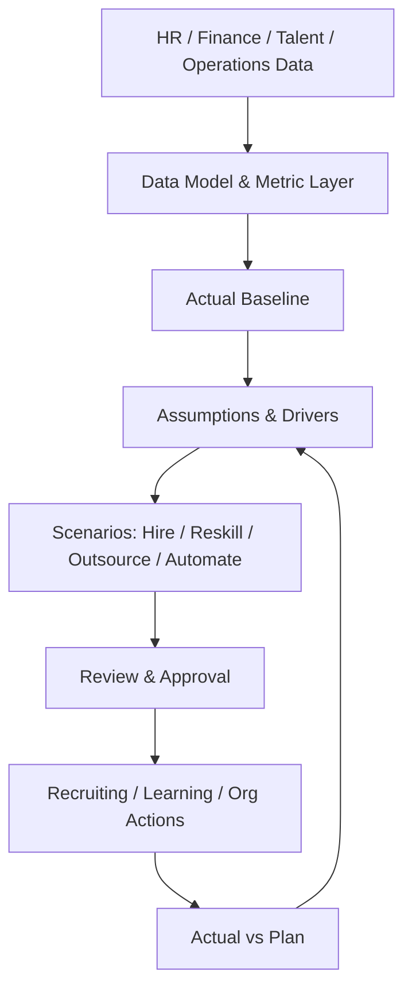

# Tổng quan phân hệ Hoạch định lực lượng lao động và Phân tích nhân sự (Workforce Planning & People Analytics)

---

> [!NOTE]
> **Phạm vi tham khảo:** Tài liệu này chỉ sử dụng nguồn chính thức của SAP, gồm SAP SuccessFactors, SAP Employee Central, SAP Employee Central Payroll, SAP Fieldglass, SAP Help Portal và các giải pháp SAP liên quan. Thuật ngữ tiếng Anh được giữ trong ngoặc khi cần thiết để hỗ trợ BA/PO đối chiếu với tài liệu cấu hình và triển khai của SAP.


## Mục lục

```text
Tổng quan phân hệ Hoạch định lực lượng lao động và Phân tích nhân sự (Workforce Planning & People Analytics)
├── 1. Bối cảnh nghiệp vụ (Domain Context)
│   ├── 1.1. Vị trí trong HRIS
│   ├── 1.2. Vai trò trong vận hành doanh nghiệp
│   └── 1.3. Mối liên hệ trong hệ sinh thái hệ thống
├── 2. Khái niệm nghiệp vụ cốt lõi (Core Business Concepts)
│   ├── 2.1. Chỉ số và Chiều phân tích (Metric & Dimension)
│   ├── 2.2. Kế hoạch biên chế và FTE (Headcount & FTE Plan)
│   ├── 2.3. Kế hoạch chi phí lao động (Workforce Cost Plan)
│   ├── 2.4. Nhu cầu và Nguồn cung (Demand & Supply)
│   ├── 2.5. Kịch bản (Scenario)
│   ├── 2.6. Tập dữ liệu phân tích nhân sự (People Analytics Dataset)
│   ├── 2.7. Thông tin chuyên sâu và Hành động (Insight & Action)
├── 3. Quy trình đầu-cuối điển hình (Typical End-to-End Process)
├── 4. So sánh chính sách (Policy) theo quy mô doanh nghiệp
├── 5. Các điểm đau phổ biến (Common Pain Points)
├── 6. Quy tắc nghiệp vụ trọng yếu (Key Business Rules)
│   ├── 6.1. Quy tắc tính biên chế (Headcount Inclusion Rule)
│   ├── 6.2. Quy tắc ảnh chụp dữ liệu (Snapshot Rule)
│   ├── 6.3. Quy tắc dự phóng chi phí (Cost Projection Rule)
│   ├── 6.4. Quy tắc vị trí trống và tuyển dụng (Vacancy & Hiring Rule)
│   ├── 6.5. Quy tắc giả định nghỉ việc (Attrition Assumption Rule)
│   ├── 6.6. Kịch bản (Scenario) phiên bản (version) Rule
│   ├── 6.7. Quy tắc bảo mật phân tích (Analytics Security Rule)
├── 7. Góc nhìn dữ liệu và tích hợp (Data & Integration Perspective)
│   ├── 7.1. Dữ liệu cốt lõi trong miền nghiệp vụ (domain)
│   ├── 7.2. Logic quan hệ dữ liệu (Data Relationship Logic)
│   ├── 7.3. Luồng dữ liệu đầu-cuối (End-to-End Data Flow)
│   ├── 7.4. Rủi ro khuếch đại (Error Amplification Effect)
│   └── 7.5. Lưu ý cho BA/PO về dữ liệu và tích hợp
├── 8. Bản đồ phỏng vấn bên liên quan (Stakeholder Interview Mapping)
├── 9. Bảng thuật ngữ chuyên ngành
└── 10. Ghi chú nghiên cứu và nguồn SAP chính thức
```

---

## 1. Bối cảnh nghiệp vụ (Domain Context)

### 1.1. Vị trí trong HRIS
hoạch định lực lượng lao động (workforce planning) & phân tích nhân sự (people analytics) là một miền nghiệp vụ quan trọng trong hệ sinh thái HCM/HRIS.

Trong cấu trúc HCM, miền nghiệp vụ (domain) này thường nằm trong:
* **Operational HR báo cáo (reporting)**
* **phân tích nhân sự (people analytics)**
* **số lượng nhân sự (headcount) & Cost hoạch định (planning)**
* **Strategic hoạch định lực lượng lao động (workforce planning) và Scenario Modeling**

> [!NOTE]
> Nếu Core HR mô tả lực lượng lao động (workforce) hiện tại, thì hoạch định (planning) & phân tích (analytics) chuyển dữ liệu hiện tại thành insight, forecast và quyết định về số lượng, chi phí, kỹ năng và cấu trúc tương lai.

#### Vai trò kiến trúc hệ thống
* Hợp nhất HR, finance, talent và operational data
* Chuẩn hóa metric, dimension và bảo mật (security)
* Hỗ trợ actual–kế hoạch (plan)–forecast và what-if scenario
* Đưa insight vào luồng phê duyệt (workflow) quyết định thay vì chỉ dashboard

#### Tham chiếu giải pháp SAP

| Giải pháp/tài liệu SAP | Phạm vi tham khảo |
| :--- | :--- |
| [SAP SuccessFactors Workforce Analytics](https://help.sap.com/docs/sap-successfactors-workforce-analytics) | Phân tích lực lượng lao động, chỉ số, báo cáo và công cụ hoạch định. |
| [SAP SuccessFactors Workforce Planning Best Practices](https://help.sap.com/docs/sap-successfactors-workforce-analytics/sap-best-practices-for-sap-successfactors-workforce-planning/workforce-planning-best-practices) | Hoạch định chiến lược, kế hoạch biên chế vận hành và mô hình hóa chi phí. |
| [People Intelligence](https://www.sap.com/products/hcm/workforce-analytics.html) | Kết nối dữ liệu nhân sự, thông tin chuyên sâu và hành động dựa trên dữ liệu. |

---

### 1.2. Vai trò trong vận hành doanh nghiệp

#### Quyết định dựa trên dữ liệu
Lãnh đạo nhìn thấy số lượng nhân sự (headcount), cost, turnover, skills và capacity.

#### Liên kết HR–Finance
số lượng nhân sự (headcount) kế hoạch (plan) phải nối với ngân sách và forecast tài chính.

#### Khả năng thích nghi
Scenario giúp đánh giá hire, reskill, outsource hoặc automate.

#### Data quản trị (governance)
Metric không thống nhất sẽ tạo nhiều “sự thật” khác nhau.

---

### 1.3. Mối liên hệ trong hệ sinh thái hệ thống

| miền nghiệp vụ (domain) liên quan | Mối quan hệ nghiệp vụ | Rủi ro nếu sai |
| :--- | :--- | :--- |
| Core HR | số lượng nhân sự (headcount), org, job, người lao động (worker) sự kiện (event) | Actual sai |
| Finance/hoạch định (planning) | Budget, trung tâm chi phí (cost center), revenue | kế hoạch (plan) không khả thi |
| Recruitment | Open yêu cầu tuyển dụng (requisition), hiring pipeline | Forecast hire sai |
| Payroll/Compensation | Labor cost, lương (salary) forecast | Cost kế hoạch (plan) sai |
| Skills/Talent | kỹ năng (skill) supply, readiness, attrition risk | Không nhìn được capability gap |
| External Data | Market, benchmark, labor supply | Scenario thiếu context |

> [!TIP]
> **Nhận định cho BA/PO:**
> miền nghiệp vụ (domain) không nên được thiết kế như một tập màn hình độc lập. Cần xác định rõ hệ thống dữ liệu gốc (system of record), ngày hiệu lực (effective date), chủ sở hữu luồng phê duyệt (workflow owner), tác động tới hệ thống phía sau (downstream impact) và cơ chế đối soát (reconciliation).

---

## 2. Khái niệm nghiệp vụ cốt lõi (Core Business Concepts)

### 2.1. Chỉ số và Chiều phân tích (Metric & Dimension)
Định nghĩa đo lường và chiều phân tích chuẩn.

#### Thành phần hoặc biến số nghiệp vụ
* số lượng nhân sự (headcount) vs FTE
* ảnh chụp dữ liệu (snapshot) vs flow
* Organization/time/country

#### Rủi ro phổ biến
* Cùng tên khác công thức
* Double count

### 2.2. Kế hoạch biên chế và FTE (Headcount & FTE Plan)
Kế hoạch số người và năng lực lao động theo org/job/time.

#### Thành phần hoặc biến số nghiệp vụ
* Position-based/employee-based
* Start date, vacancy
* Attrition/hiring

#### Rủi ro phổ biến
* kế hoạch (plan) không nối actual

### 2.3. Kế hoạch chi phí lao động (Workforce Cost Plan)
Dự báo base pay, tax, benefits, thưởng (bonus) và contractor cost.

#### Thành phần hoặc biến số nghiệp vụ
* Rate, escalation, currency
* Scenario

#### Rủi ro phổ biến
* Underbudget/overbudget

### 2.4. Nhu cầu và Nguồn cung (Demand & Supply)
Nhu cầu năng lực công việc so với nguồn lực/skills hiện có.

#### Thành phần hoặc biến số nghiệp vụ
* Volume/productivity driver
* kỹ năng (skill) capacity
* Gap

#### Rủi ro phổ biến
* Chỉ kế hoạch (plan) số người, bỏ kỹ năng (skill)

### 2.5. Kịch bản (Scenario)
Phiên bản giả định để so sánh các chiến lược.

#### Thành phần hoặc biến số nghiệp vụ
* Baseline, assumptions, probability
* Hire/reskill/outsource/automate

#### Rủi ro phổ biến
* So sánh sai do assumption không phiên bản (version)

### 2.6. Tập dữ liệu phân tích nhân sự (People Analytics Dataset)
Data mart/semantic layer phục vụ báo cáo và phân tích.

#### Thành phần hoặc biến số nghiệp vụ
* Source lineage
* Refresh
* Row-level bảo mật (security)

#### Rủi ro phổ biến
* Dữ liệu stale hoặc lộ dữ liệu

### 2.7. Thông tin chuyên sâu và Hành động (Insight & Action)
Phát hiện được diễn giải, gắn chủ sở hữu (owner) và hành động.

#### Thành phần hoặc biến số nghiệp vụ
* Threshold, alert, luồng phê duyệt (workflow)
* Outcome tracking

#### Rủi ro phổ biến
* Dashboard không dẫn đến quyết định

---

## 3. Quy trình đầu-cuối điển hình (Typical End-to-End Process)

1. Xác định business question và metric dictionary
2. Kết nối và chuẩn hóa source data
3. Tạo actual baseline
4. Thu thập assumption và hoạch định (planning) driver
5. Xây demand, supply, cost và scenario
6. đánh giá (review)/challenge giữa HR, Finance, Business
7. Approve kế hoạch (plan) và phát hành (publish) target
8. Kích hoạt recruiting/reskill/restructure hành động (action)
9. Theo dõi actual vs kế hoạch (plan)/forecast
10. Refresh forecast và đo outcome



> [!IMPORTANT]
> BA cần mô tả riêng luồng chính (main flow), luồng thay thế (alternative flow), luồng ngoại lệ (exception flow), luồng phê duyệt (approval path) và luồng hoàn tác/sửa sai (rollback/correction path). Sơ đồ trên chỉ thể hiện luồng chuẩn (happy path) tổng quát.

---

## 4. So sánh chính sách (Policy) theo quy mô doanh nghiệp

| Yếu tố | Khởi nghiệp (Startup) | Doanh nghiệp vừa và nhỏ (SME) | Doanh nghiệp lớn (Enterprise) |
| :--- | :--- | :--- | :--- |
| báo cáo (reporting) | Excel ảnh chụp dữ liệu (snapshot) | Dashboard định kỳ | Semantic layer, self-service, embedded phân tích (analytics) |
| hoạch định (planning) | số lượng nhân sự (headcount) list | Department kế hoạch (plan) | Driver-based, skills, scenario, continuous |
| Data | Core HR | HR + payroll/recruiting | HR + finance + operational + external |
| Refresh | Tháng/quý | Ngày/tuần | Near thời gian thực (real-time)/sự kiện (event) |
| quản trị (governance) | HR sở hữu | HR + Finance | Data council, metric chủ sở hữu (owner), model quản trị (governance) |
| phân tích (analytics) | Descriptive | Diagnostic/forecast | Predictive/optimization with human oversight |

### Xu hướng tăng độ phức tạp theo quy mô
1. Số biến số và số đối tượng áp dụng (population) tăng; cùng một rule có thể khác theo pháp nhân, quốc gia, người lao động (worker) type, job và thời điểm.
2. phê duyệt (approval) từ một cấp chuyển thành dynamic routing, delegation, SLA và ngoại lệ (exception) phê duyệt (approval).
3. Tích hợp chuyển từ file thủ công sang API/hướng sự kiện (event-driven), cần tính không trùng lặp (idempotency), thử lại (retry), monitoring và đối soát (reconciliation).
4. Chi phí sai sót tăng theo quy mô đối tượng áp dụng (population) và độ nhạy cảm của quyết định.

### Lưu ý cho BA/PO theo cấp độ

| Cấp độ | Trọng tâm phân tích |
| :--- | :--- |
| Startup | Thiết kế tối giản nhưng tránh mã hóa cứng (hard-code); vẫn cần ID chuẩn, kiểm toán (audit) tối thiểu và khả năng mở rộng. |
| SME | Chuẩn hóa policy, vai trò (role), SLA, phê duyệt (approval), ngoại lệ (exception) và tích hợp (integration) boundary. |
| Enterprise | Rule engine, quản lý theo ngày hiệu lực (effective dating), bản địa hóa (localization), segregation of duties, immutable kiểm toán (audit) và data quản trị (governance). |

---

## 5. Các điểm đau phổ biến (Common Pain Points)

| Điểm đau (Pain Point) | Biểu hiện thực tế | Nguyên nhân gốc rễ | Tác động kinh doanh | Lưu ý cho BA/PO |
| :--- | :--- | :--- | :--- | :--- |
| Nhiều định nghĩa số lượng nhân sự (headcount) | Dashboard chênh nhau | Metric không chuẩn | Mất niềm tin | Metric dictionary và certified dataset |
| kế hoạch (plan) tách khỏi actual | Kế hoạch Excel nhanh lỗi thời | Không tích hợp HCM/Finance | Không theo dõi execution | Continuous actual-kế hoạch (plan) sync |
| Chỉ kế hoạch (plan) số người | Không biết kỹ năng (skill)/capacity | Thiếu job/kỹ năng (skill) data | Hire sai profile | Demand theo kỹ năng (skill) và productivity driver |
| Dữ liệu lịch sử bị ghi đè | Không phân tích trend tại thời điểm | Không ảnh chụp dữ liệu (snapshot)/quản lý theo ngày hiệu lực (effective dating) | Attrition/số lượng nhân sự (headcount) trend sai | Temporal model và monthly ảnh chụp dữ liệu (snapshot) |
| Dashboard không có hành động (action) | Người xem biết nhưng không ai xử lý | Không chủ sở hữu (owner)/threshold | Không tạo giá trị | Insight-to-hành động (action) luồng phê duyệt (workflow) |
| Predictive model khó tin | Risk score không giải thích | Thiếu quản trị (governance) | Không adoption/bias | Explainability, monitoring, human đánh giá (review) |

---

## 6. Quy tắc nghiệp vụ trọng yếu (Key Business Rules)

Business Rules là tầng quyết định hệ thống diễn giải dữ liệu và cho phép giao dịch (transaction) như thế nào. Rule cần có chủ sở hữu (owner), effective phiên bản (version), test case và kiểm toán (audit) thay đổi.

### Bảng tổng hợp quy tắc nghiệp vụ (Business Rules)

| Nhóm quy tắc (Rule) | Câu hỏi nghiệp vụ trọng tâm | Biến số cấu hình | Rủi ro nếu sai |
| :--- | :--- | :--- | :--- |
| số lượng nhân sự (headcount) Inclusion Rule | Ai được tính vào số lượng nhân sự (headcount)/FTE? | Status, người lao động (worker) type, leave, multiple jobs | Double count/thiếu count |
| ảnh chụp dữ liệu (snapshot) Rule | Metric lấy tại ngày hay bình quân kỳ? | As-of date, timezone, period | Trend sai |
| Cost Projection Rule | Chi phí nào được forecast? | lương (salary), burden, thưởng (bonus), FX, vacancy lag | Budget sai |
| Vacancy & Hiring Rule | Open position vào kế hoạch (plan) thế nào? | Probability, start date, time-to-fill | Forecast lệch |
| Attrition Assumption Rule | Tỷ lệ nghỉ dựa trên gì? | Historical, segment, scenario | Supply sai |
| Scenario phiên bản (version) Rule | Ai tạo/approve/phát hành (publish) scenario? | chủ sở hữu (owner), status, assumptions | Dùng nhầm phiên bản (version) |
| phân tích (analytics) bảo mật (security) Rule | Ai xem dữ liệu cá nhân/aggregate? | Minimum cohort, row-level, masking | Privacy risk |

### 6.1. Quy tắc tính biên chế (Headcount Inclusion Rule)
* **Câu hỏi trọng tâm:** Ai được tính vào số lượng nhân sự (headcount)/FTE?
* **Biến số cấu hình:** Status, người lao động (worker) type, leave, multiple jobs
* **Rủi ro:** Double count/thiếu count
* **BA cần xác nhận:** rule áp dụng cho đối tượng áp dụng (population) nào, theo ngày hiệu lực nào, ai được ghi đè đặc quyền (override) và ghi đè đặc quyền (override) có cần phê duyệt/kiểm toán (approval/audit) hay không.

### 6.2. Quy tắc ảnh chụp dữ liệu (Snapshot Rule)
* **Câu hỏi trọng tâm:** Metric lấy tại ngày hay bình quân kỳ?
* **Biến số cấu hình:** As-of date, timezone, period
* **Rủi ro:** Trend sai
* **BA cần xác nhận:** rule áp dụng cho đối tượng áp dụng (population) nào, theo ngày hiệu lực nào, ai được ghi đè đặc quyền (override) và ghi đè đặc quyền (override) có cần phê duyệt/kiểm toán (approval/audit) hay không.

### 6.3. Quy tắc dự phóng chi phí (Cost Projection Rule)
* **Câu hỏi trọng tâm:** Chi phí nào được forecast?
* **Biến số cấu hình:** lương (salary), burden, thưởng (bonus), FX, vacancy lag
* **Rủi ro:** Budget sai
* **BA cần xác nhận:** rule áp dụng cho đối tượng áp dụng (population) nào, theo ngày hiệu lực nào, ai được ghi đè đặc quyền (override) và ghi đè đặc quyền (override) có cần phê duyệt/kiểm toán (approval/audit) hay không.

### 6.4. Quy tắc vị trí trống và tuyển dụng (Vacancy & Hiring Rule)
* **Câu hỏi trọng tâm:** Open position vào kế hoạch (plan) thế nào?
* **Biến số cấu hình:** Probability, start date, time-to-fill
* **Rủi ro:** Forecast lệch
* **BA cần xác nhận:** rule áp dụng cho đối tượng áp dụng (population) nào, theo ngày hiệu lực nào, ai được ghi đè đặc quyền (override) và ghi đè đặc quyền (override) có cần phê duyệt/kiểm toán (approval/audit) hay không.

### 6.5. Quy tắc giả định nghỉ việc (Attrition Assumption Rule)
* **Câu hỏi trọng tâm:** Tỷ lệ nghỉ dựa trên gì?
* **Biến số cấu hình:** Historical, segment, scenario
* **Rủi ro:** Supply sai
* **BA cần xác nhận:** rule áp dụng cho đối tượng áp dụng (population) nào, theo ngày hiệu lực nào, ai được ghi đè đặc quyền (override) và ghi đè đặc quyền (override) có cần phê duyệt/kiểm toán (approval/audit) hay không.

### 6.6. Kịch bản (Scenario) phiên bản (version) Rule
* **Câu hỏi trọng tâm:** Ai tạo/approve/phát hành (publish) scenario?
* **Biến số cấu hình:** chủ sở hữu (owner), status, assumptions
* **Rủi ro:** Dùng nhầm phiên bản (version)
* **BA cần xác nhận:** rule áp dụng cho đối tượng áp dụng (population) nào, theo ngày hiệu lực nào, ai được ghi đè đặc quyền (override) và ghi đè đặc quyền (override) có cần phê duyệt/kiểm toán (approval/audit) hay không.

### 6.7. Quy tắc bảo mật phân tích (Analytics Security Rule)
* **Câu hỏi trọng tâm:** Ai xem dữ liệu cá nhân/aggregate?
* **Biến số cấu hình:** Minimum cohort, row-level, masking
* **Rủi ro:** Privacy risk
* **BA cần xác nhận:** rule áp dụng cho đối tượng áp dụng (population) nào, theo ngày hiệu lực nào, ai được ghi đè đặc quyền (override) và ghi đè đặc quyền (override) có cần phê duyệt/kiểm toán (approval/audit) hay không.

---

## 7. Góc nhìn dữ liệu và tích hợp (Data & Integration Perspective)

### 7.1. Dữ liệu cốt lõi trong miền nghiệp vụ (domain)

| Đối tượng dữ liệu (Data Object) | Vai trò nghiệp vụ | Phụ thuộc vào | Rủi ro nếu sai |
| :--- | :--- | :--- | :--- |
| Metric Definition | Công thức chuẩn | Data quản trị (governance) | Dashboard mâu thuẫn |
| lực lượng lao động (workforce) ảnh chụp dữ liệu (snapshot) | Actual theo thời điểm | Core HR | Trend sai |
| Position/số lượng nhân sự (headcount) kế hoạch (plan) | Nhu cầu số lượng | Business/finance | kế hoạch (plan) sai |
| Cost Assumption | Rate và burden | Payroll/finance | Budget sai |
| kỹ năng (skill) Demand/Supply | Năng lực cần/có | Job/skills | Gap sai |
| Scenario phiên bản (version) | Tập assumption | hoạch định (planning) process | Dùng nhầm |
| Forecast | Kết quả dự báo | Model/assumption | Quyết định sai |
| Insight/hành động (action) | Phát hiện và việc cần làm | Threshold/chủ sở hữu (owner) | Không thực thi |

### 7.2. Logic quan hệ dữ liệu (Data Relationship Logic)
* `Core HR events → lực lượng lao động (workforce) ảnh chụp dữ liệu (snapshot)`
* `ảnh chụp dữ liệu (snapshot) + Assumptions → Forecast`
* `Position kế hoạch (plan) + Cost Assumption → lực lượng lao động (workforce) Cost kế hoạch (plan)`
* `Demand – Supply → số lượng nhân sự (headcount)/khoảng thiếu hụt kỹ năng (skill gap)`
* `Scenario → Proposed Actions`
* `Actions → Recruiting/học tập (learning)/Core HR → Actual → chênh lệch (variance)`

### 7.3. Luồng dữ liệu đầu-cuối (End-to-End Data Flow)


### 7.4. Rủi ro khuếch đại (Error Amplification Effect)

**Hiệu ứng khuếch đại:** Metric/source sai → baseline sai → forecast/scenario sai → tuyển hoặc cắt giảm sai → ảnh hưởng chi phí và năng lực kinh doanh.

### 7.5. Lưu ý cho BA/PO về dữ liệu và tích hợp

* **Nguồn dữ liệu chuẩn (source of truth):** object nào do hệ thống nào sở hữu?
* **Dữ liệu theo thời gian (temporal data):** dữ liệu lấy theo trạng thái hiện tại, ngày hiệu lực (effective date) hay ảnh chụp dữ liệu (snapshot)?
* **Chất lượng dữ liệu (data quality):** validation, duplicate, referential integrity và đối soát (reconciliation) report là gì?
* **tích hợp (integration):** synchronous hay asynchronous; batch hay sự kiện (event); full hay phần chênh lệch (delta)?
* **Xử lý lỗi (error handling):** thử lại (retry), tính không trùng lặp (idempotency), dead-letter queue và manual điều chỉnh (correction)?
* **Bảo mật và quyền riêng tư (security & privacy):** row/field-level quyền truy cập (access), masking, lưu giữ (retention) và sự đồng ý (consent)?
* **kiểm toán (audit):** có lưu giá trị trước/sau (before/after), rule phiên bản (version), actor, timestamp và correlation ID?

---

## 8. Bản đồ phỏng vấn bên liên quan (Stakeholder Interview Mapping)

| Nhóm mục tiêu | Bên liên quan chính | Tập trung vào | Câu hỏi ví dụ |
| :--- | :--- | :--- | :--- |
| Business question | Leadership, HRBP | Decision, horizon, scenario | Quyết định nào cần được hỗ trợ và trong bao lâu? |
| Metric quản trị (governance) | HR phân tích (analytics), Finance | Definition, ownership | số lượng nhân sự (headcount)/FTE/turnover đang được tính thế nào? |
| hoạch định (planning) drivers | Business, Finance | Demand, productivity, cost | Nhu cầu người phát sinh từ volume hoặc capacity nào? |
| kỹ năng (skill) hoạch định (planning) | Talent, L&D | Supply, gap, reskill | kỹ năng (skill) nào là critical và đo proficiency ra sao? |
| Data platform | Data/IT | Source, refresh, lineage, bảo mật (security) | Dữ liệu nào authoritative và refresh bao lâu? |
| Model quản trị (governance) | Risk, Legal, phân tích (analytics) | Prediction, explainability | Ai phê duyệt model và theo dõi bias/drift? |

## 9. Bảng thuật ngữ chuyên ngành

| Thuật ngữ (viết tắt) | Dịch | Mô tả |
| :--- | :--- | :--- |
| **WFA** | Phân tích lực lượng lao động | Năng lực phân tích xu hướng, rủi ro và cơ hội của lực lượng lao động. |
| **Phân tích nhân sự (People Analytics)** | Phân tích dữ liệu con người | Sử dụng dữ liệu nhân sự để trả lời câu hỏi và hỗ trợ quyết định. |
| **People Intelligence** | Thông tin nhân sự chuyên sâu | Năng lực SAP kết nối, hài hòa dữ liệu và cung cấp khuyến nghị. |
| **Hoạch định lực lượng lao động (Workforce Planning)** | Lập kế hoạch nhân lực | Dự báo nhu cầu, nguồn cung, khoảng thiếu hụt và chi phí nhân sự. |
| **Biên chế (Headcount)** | Số người | Số lượng người lao động được tính theo quy tắc xác định. |
| **FTE** | Tương đương nhân sự toàn thời gian | Quy đổi khối lượng làm việc về một đơn vị toàn thời gian. |
| **Nhu cầu (Demand)** | Nhu cầu nhân lực tương lai | Số lượng và kỹ năng cần thiết để đạt mục tiêu kinh doanh. |
| **Nguồn cung (Supply)** | Nguồn nhân lực sẵn có | Lực lượng hiện tại và dự kiến có thể đáp ứng nhu cầu. |
| **Khoảng thiếu hụt (Gap)** | Chênh lệch nhu cầu–nguồn cung | Phần thiếu hoặc dư về số lượng, kỹ năng hoặc chi phí. |
| **Kịch bản (Scenario)** | Phương án giả định | Bộ giả định dùng để so sánh các lựa chọn hoạch định. |
| **Ảnh chụp dữ liệu (Snapshot)** | Dữ liệu tại một thời điểm | Bản cố định của dữ liệu dùng cho báo cáo hoặc so sánh. |
| **Chỉ số (Metric/Measure)** | Đại lượng đo lường | Giá trị đếm, tỷ lệ, trung bình hoặc công thức phục vụ phân tích. |
| **Chiều phân tích (Dimension)** | Thuộc tính phân nhóm | Cách cắt dữ liệu theo tổ chức, vị trí, địa điểm, thời gian hoặc nhân khẩu học. |
| **Tỷ lệ nghỉ việc (Attrition)** | Mức rời tổ chức | Chỉ số phản ánh nhân viên rời lực lượng lao động trong kỳ. |
| **Vị trí trống (Vacancy)** | Vị trí chưa có người giữ | Nhu cầu biên chế đã được tạo nhưng chưa được lấp đầy. |
| **SAC** | SAP Analytics Cloud | Nền tảng phân tích và lập kế hoạch đám mây của SAP. |

---

## 10. Ghi chú nghiên cứu và nguồn SAP chính thức

### 10.1. Nguyên tắc nghiên cứu

* Chỉ sử dụng tài liệu và trang sản phẩm chính thức thuộc hệ sinh thái SAP.
* Nội dung được chuẩn hóa theo miền nghiệp vụ để BA/PO có thể dùng cho khám phá sản phẩm, phân rã quy trình, mô hình miền và quản lý tồn đọng sản phẩm.
* Tên tính năng cụ thể có thể thay đổi theo phiên bản phát hành và cấu hình của từng khách hàng SAP SuccessFactors.
* Quy tắc pháp lý theo quốc gia vẫn cần được xác minh riêng theo ngày hiệu lực trước khi chuyển thành yêu cầu chính thức.

### 10.2. Nguồn tham khảo

| Giải pháp/tài liệu SAP | Phạm vi sử dụng trong nghiên cứu |
| :--- | :--- |
| [SAP SuccessFactors Workforce Analytics](https://help.sap.com/docs/sap-successfactors-workforce-analytics) | Phân tích lực lượng lao động, chỉ số, báo cáo và công cụ hoạch định. |
| [SAP SuccessFactors Workforce Planning Best Practices](https://help.sap.com/docs/sap-successfactors-workforce-analytics/sap-best-practices-for-sap-successfactors-workforce-planning/workforce-planning-best-practices) | Hoạch định chiến lược, kế hoạch biên chế vận hành và mô hình hóa chi phí. |
| [People Intelligence](https://www.sap.com/products/hcm/workforce-analytics.html) | Kết nối dữ liệu nhân sự, thông tin chuyên sâu và hành động dựa trên dữ liệu. |

