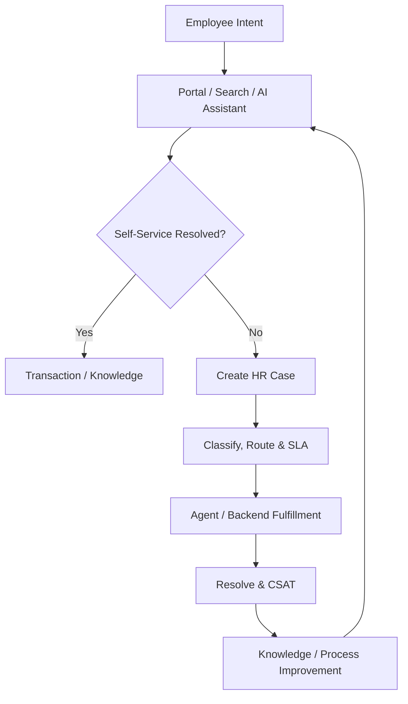

# Tổng quan phân hệ Trải nghiệm nhân viên và Cung cấp dịch vụ nhân sự (Employee Experience & HR Service Delivery)

---

> [!NOTE]
> **Phạm vi tham khảo:** Tài liệu này chỉ sử dụng nguồn chính thức của SAP, gồm SAP SuccessFactors, SAP Employee Central, SAP Employee Central Payroll, SAP Fieldglass, SAP Help Portal và các giải pháp SAP liên quan. Thuật ngữ tiếng Anh được giữ trong ngoặc khi cần thiết để hỗ trợ BA/PO đối chiếu với tài liệu cấu hình và triển khai của SAP.


## Mục lục

```text
Tổng quan phân hệ Trải nghiệm nhân viên và Cung cấp dịch vụ nhân sự (Employee Experience & HR Service Delivery)
├── 1. Bối cảnh nghiệp vụ (Domain Context)
│   ├── 1.1. Vị trí trong HRIS
│   ├── 1.2. Vai trò trong vận hành doanh nghiệp
│   └── 1.3. Mối liên hệ trong hệ sinh thái hệ thống
├── 2. Khái niệm nghiệp vụ cốt lõi (Core Business Concepts)
│   ├── 2.1. Cổng nhân viên / Điểm truy cập số (Employee Portal / Digital Front Door)
│   ├── 2.2. Bài viết tri thức (Knowledge Article)
│   ├── 2.3. Hồ sơ yêu cầu nhân sự (HR Case)
│   ├── 2.4. Danh mục dịch vụ (Service Catalog)
│   ├── 2.5. Phân tuyến và SLA (Routing & SLA)
│   ├── 2.6. Hành trình nhân viên (Employee Journey)
│   ├── 2.7. Lắng nghe nhân viên (Employee Listening)
│   ├── 2.8. Trợ lý AI / Tác nhân xử lý hồ sơ (AI Assistant / Case Agent)
├── 3. Quy trình đầu-cuối điển hình (Typical End-to-End Process)
├── 4. So sánh chính sách (Policy) theo quy mô doanh nghiệp
├── 5. Các điểm đau phổ biến (Common Pain Points)
├── 6. Quy tắc nghiệp vụ trọng yếu (Key Business Rules)
│   ├── 6.1. Quy tắc đối tượng nội dung (Content Audience Rule)
│   ├── 6.2. Quy tắc phân tuyến hồ sơ (Case Routing Rule)
│   ├── 6.3. Quy tắc ưu tiên/SLA (Priority/SLA Rule)
│   ├── 6.4. Quy tắc hồ sơ nhạy cảm (Sensitive Case Rule)
│   ├── 6.5. Quy tắc đóng hồ sơ (Closure Rule)
│   ├── 6.6. Quy tắc ẩn danh khảo sát (Survey Anonymity Rule)
│   ├── 6.7. Quy tắc trả lời của AI (AI Answer Rule)
├── 7. Góc nhìn dữ liệu và tích hợp (Data & Integration Perspective)
│   ├── 7.1. Dữ liệu cốt lõi trong miền nghiệp vụ (domain)
│   ├── 7.2. Logic quan hệ dữ liệu (Data Relationship Logic)
│   ├── 7.3. Luồng dữ liệu đầu-cuối (End-to-End Data Flow)
│   ├── 7.4. Rủi ro khuếch đại (Error Amplification Effect)
│   └── 7.5. Lưu ý cho BA/PO về dữ liệu và tích hợp
├── 8. Bản đồ phỏng vấn bên liên quan (Stakeholder Interview Mapping)
├── 9. Bảng thuật ngữ chuyên ngành
└── 10. Ghi chú nghiên cứu và nguồn SAP chính thức
```

---

## 1. Bối cảnh nghiệp vụ (Domain Context)

### 1.1. Vị trí trong HRIS
trải nghiệm nhân viên (employee experience) & HR cung cấp dịch vụ (service delivery) là một miền nghiệp vụ quan trọng trong hệ sinh thái HCM/HRIS.

Trong cấu trúc HCM, miền nghiệp vụ (domain) này thường nằm trong:
* **Employee Portal & Personalized trải nghiệm (experience)**
* **HR Knowledge Management**
* **Case/Ticket Management**
* **Journeys, Employee Listening và gắn kết (engagement)**

> [!NOTE]
> Nếu các module giao dịch xử lý từng nghiệp vụ, thì trải nghiệm nhân viên (employee experience) & HR cung cấp dịch vụ (service delivery) tạo một cửa truy cập, hướng dẫn và hỗ trợ nhân viên hoàn thành công việc xuyên suốt nhiều hệ thống.

#### Vai trò kiến trúc hệ thống
* Tạo digital front door cho nhiệm vụ (task), knowledge và service
* Cá nhân hóa theo vai trò (role), sự kiện (event), location và context
* Deflect ticket bằng search/chat/self-service nhưng vẫn hỗ trợ human agent
* Kết nối case với dữ liệu người lao động (worker) và backend giao dịch (transaction)

#### Tham chiếu giải pháp SAP

| Giải pháp/tài liệu SAP | Phạm vi tham khảo |
| :--- | :--- |
| [SAP SuccessFactors Enterprise Service Management](https://www.sap.com/mena/products/hcm/enterprise-service-management.html) | Tự phục vụ, quản lý hồ sơ yêu cầu, không gian làm việc của đội HR và AI. |
| [SAP SuccessFactors Work Zone](https://www.sap.com/products/hcm/workzone-hr.html) | Cổng trải nghiệm nhân viên và điểm truy cập thống nhất tới nội dung, tác vụ và ứng dụng. |
| [Integrating SAP SuccessFactors with Qualtrics](https://help.sap.com/docs/successfactors-platform/integrating-sap-successfactors-with-qualtrics/integrating-sap-successfactors-with-qualtrics) | Thu thập phản hồi tại các điểm chạm trong SAP SuccessFactors. |

---

### 1.2. Vai trò trong vận hành doanh nghiệp

#### HR productivity
Self-service và knowledge giảm ticket lặp lại.

#### Employee trust
Câu trả lời nhất quán và case minh bạch giúp tăng niềm tin.

#### trải nghiệm (experience) consistency
Journey và portal giảm fragmentation giữa nhiều module.

#### Continuous improvement
Listening và case phân tích (analytics) chỉ ra pain point quy trình.

---

### 1.3. Mối liên hệ trong hệ sinh thái hệ thống

| miền nghiệp vụ (domain) liên quan | Mối quan hệ nghiệp vụ | Rủi ro nếu sai |
| :--- | :--- | :--- |
| Core HR | Identity, personalization, employee context | Hiển thị sai nội dung |
| All HR Modules | Deep link/hành động (action)/nhiệm vụ (task)/status | Portal chỉ là lớp thông tin tách rời |
| Knowledge/Policy | Article, phiên bản (version), audience | Trả lời sai hoặc lỗi thời |
| quản lý yêu cầu hỗ trợ (case management) | Issue, SLA, phân công (assignment), resolution | Ticket thất lạc |
| Collaboration Channels | Email/chat/mobile/Teams | Conversation phân mảnh |
| Employee Listening | Survey, sentiment, hành động (action) kế hoạch (plan) | Thu thập nhưng không hành động |

> [!TIP]
> **Nhận định cho BA/PO:**
> miền nghiệp vụ (domain) không nên được thiết kế như một tập màn hình độc lập. Cần xác định rõ hệ thống dữ liệu gốc (system of record), ngày hiệu lực (effective date), chủ sở hữu luồng phê duyệt (workflow owner), tác động tới hệ thống phía sau (downstream impact) và cơ chế đối soát (reconciliation).

---

## 2. Khái niệm nghiệp vụ cốt lõi (Core Business Concepts)

### 2.1. Cổng nhân viên / Điểm truy cập số (Employee Portal / Digital Front Door)
Điểm truy cập thống nhất cho nhiệm vụ (task), search, profile, phiếu lương (payslip), leave và support.

#### Thành phần hoặc biến số nghiệp vụ
* Personalization
* Mobile
* Deep links

#### Rủi ro phổ biến
* Thông tin sai đối tượng
* Navigation rối

### 2.2. Bài viết tri thức (Knowledge Article)
Nội dung hướng dẫn có chủ sở hữu (owner), phiên bản (version), audience và phê duyệt (approval).

#### Thành phần hoặc biến số nghiệp vụ
* ngày hiệu lực (effective date)
* bản địa hóa (localization)
* Related service

#### Rủi ro phổ biến
* Policy lỗi thời
* Nhiều bản mâu thuẫn

### 2.3. Hồ sơ yêu cầu nhân sự (HR Case)
Bản ghi yêu cầu/hỏi đáp/sự cố có category, priority, chủ sở hữu (owner), SLA và conversation.

#### Thành phần hoặc biến số nghiệp vụ
* Sensitive case
* Attachment
* Related người lao động (worker)/giao dịch (transaction)

#### Rủi ro phổ biến
* Rò rỉ dữ liệu
* Mất lịch sử

### 2.4. Danh mục dịch vụ (Service Catalog)
Danh mục dịch vụ HR cùng form, fulfillment process và expectation.

#### Thành phần hoặc biến số nghiệp vụ
* điều kiện áp dụng (eligibility)
* SLA
* Backend luồng phê duyệt (workflow)

#### Rủi ro phổ biến
* Ticket category không rõ
* Không đo được demand

### 2.5. Phân tuyến và SLA (Routing & SLA)
Cách phân tuyến và kiểm soát thời gian phản hồi/giải quyết.

#### Thành phần hoặc biến số nghiệp vụ
* Country, topic, language, priority
* Escalation

#### Rủi ro phổ biến
* Case nằm sai queue
* Quá hạn

### 2.6. Hành trình nhân viên (Employee Journey)
Chuỗi nội dung/nhiệm vụ (task) theo moment that matters.

#### Thành phần hoặc biến số nghiệp vụ
* sự kiện (event), audience, timeline
* Cross-system nhiệm vụ (task)

#### Rủi ro phổ biến
* Journey không cá nhân hóa

### 2.7. Lắng nghe nhân viên (Employee Listening)
Survey/pulse/sentiment và hành động (action) kế hoạch (plan).

#### Thành phần hoặc biến số nghiệp vụ
* Anonymity, cohort threshold
* quản lý (manager) hành động (action)

#### Rủi ro phổ biến
* Survey fatigue
* Mất ẩn danh

### 2.8. Trợ lý AI / Tác nhân xử lý hồ sơ (AI Assistant / Case Agent)
Tìm câu trả lời, tóm tắt, gợi ý và hỗ trợ xử lý với kiểm soát nguồn/quyền.

#### Thành phần hoặc biến số nghiệp vụ
* Grounding, confidence, handoff
* kiểm toán (audit)

#### Rủi ro phổ biến
* Hallucination
* Truy cập dữ liệu sai quyền

---

## 3. Quy trình đầu-cuối điển hình (Typical End-to-End Process)

1. Nhân viên truy cập portal/search/chat
2. Hệ thống cá nhân hóa và gợi ý knowledge/hành động (action)
3. Nếu self-service giải quyết được: thực hiện giao dịch (transaction)
4. Nếu chưa: tạo case với context
5. Tự động classify, prioritize và route
6. Agent xử lý, phối hợp backend/nhà cung cấp (vendor)
7. Employee bổ sung thông tin hoặc xác nhận
8. Resolve, close và CSAT
9. Phân tích demand/SLA/knowledge gap
10. Cập nhật article/journey/process
11. Thực hiện survey/hành động (action) kế hoạch (plan)



> [!IMPORTANT]
> BA cần mô tả riêng luồng chính (main flow), luồng thay thế (alternative flow), luồng ngoại lệ (exception flow), luồng phê duyệt (approval path) và luồng hoàn tác/sửa sai (rollback/correction path). Sơ đồ trên chỉ thể hiện luồng chuẩn (happy path) tổng quát.

---

## 4. So sánh chính sách (Policy) theo quy mô doanh nghiệp

| Yếu tố | Khởi nghiệp (Startup) | Doanh nghiệp vừa và nhỏ (SME) | Doanh nghiệp lớn (Enterprise) |
| :--- | :--- | :--- | :--- |
| Portal | Link tập trung | vai trò (role)-based homepage | Personalized cross-system workspace |
| Knowledge | FAQ | phiên bản (version)/phê duyệt (approval) | bản địa hóa (localization), AI search, content phân tích (analytics) |
| Case | Email inbox | Ticket queue/SLA | Omnichannel, sensitive case, shared service |
| Journey | Checklist | sự kiện (event) template | Dynamic multi-system orchestration |
| Listening | Annual survey | Pulse | Lifecycle/continuous listening + hành động (action) |
| AI | Search keyword | Chatbot | Grounded assistant/agent with human handoff |

### Xu hướng tăng độ phức tạp theo quy mô
1. Số biến số và số đối tượng áp dụng (population) tăng; cùng một rule có thể khác theo pháp nhân, quốc gia, người lao động (worker) type, job và thời điểm.
2. phê duyệt (approval) từ một cấp chuyển thành dynamic routing, delegation, SLA và ngoại lệ (exception) phê duyệt (approval).
3. Tích hợp chuyển từ file thủ công sang API/hướng sự kiện (event-driven), cần tính không trùng lặp (idempotency), thử lại (retry), monitoring và đối soát (reconciliation).
4. Chi phí sai sót tăng theo quy mô đối tượng áp dụng (population) và độ nhạy cảm của quyết định.

### Lưu ý cho BA/PO theo cấp độ

| Cấp độ | Trọng tâm phân tích |
| :--- | :--- |
| Startup | Thiết kế tối giản nhưng tránh mã hóa cứng (hard-code); vẫn cần ID chuẩn, kiểm toán (audit) tối thiểu và khả năng mở rộng. |
| SME | Chuẩn hóa policy, vai trò (role), SLA, phê duyệt (approval), ngoại lệ (exception) và tích hợp (integration) boundary. |
| Enterprise | Rule engine, quản lý theo ngày hiệu lực (effective dating), bản địa hóa (localization), segregation of duties, immutable kiểm toán (audit) và data quản trị (governance). |

---

## 5. Các điểm đau phổ biến (Common Pain Points)

| Điểm đau (Pain Point) | Biểu hiện thực tế | Nguyên nhân gốc rễ | Tác động kinh doanh | Lưu ý cho BA/PO |
| :--- | :--- | :--- | :--- | :--- |
| Nhiều kênh hỗ trợ | Email/chat/call không hợp nhất | Không digital front door | Mất case và khó đo SLA | Omnichannel capture và single case ID |
| Knowledge lỗi thời | Nhân viên nhận câu trả lời khác nhau | Không chủ sở hữu (owner)/phiên bản (version) | Mất niềm tin | Content lifecycle và ngày hiệu lực (effective date) |
| Ticket category quá chi tiết | Người dùng chọn sai | Catalog theo cấu trúc nội bộ | Routing sai | Design theo user intent + auto classification |
| Self-service không hoàn tất | Portal chỉ hướng dẫn rồi chuyển hệ thống khác | Không deep hành động (action)/tích hợp (integration) | Drop-off | Embedded giao dịch (transaction) và status |
| Case nhạy cảm lộ dữ liệu | Agent ngoài scope xem được | bảo mật (security) theo queue đơn giản | Privacy/ER risk | Case-level/field-level bảo mật (security) |
| Survey không tạo hành động | Phản hồi lặp lại nhưng không cải thiện | Không chủ sở hữu (owner)/hành động (action) kế hoạch (plan) | Survey fatigue | Close-the-loop luồng phê duyệt (workflow) |

---

## 6. Quy tắc nghiệp vụ trọng yếu (Key Business Rules)

Business Rules là tầng quyết định hệ thống diễn giải dữ liệu và cho phép giao dịch (transaction) như thế nào. Rule cần có chủ sở hữu (owner), effective phiên bản (version), test case và kiểm toán (audit) thay đổi.

### Bảng tổng hợp quy tắc nghiệp vụ (Business Rules)

| Nhóm quy tắc (Rule) | Câu hỏi nghiệp vụ trọng tâm | Biến số cấu hình | Rủi ro nếu sai |
| :--- | :--- | :--- | :--- |
| Content Audience Rule | Ai được xem article/journey? | Country, vai trò (role), người lao động (worker) type, sự kiện (event) | Thông tin sai đối tượng |
| Case Routing Rule | Case vào queue nào? | Category, pháp nhân (legal entity), language, sensitivity | SLA thấp/rò rỉ |
| Priority/SLA Rule | Độ ưu tiên và hạn xử lý? | Impact, urgency, case type | Case quan trọng bị chậm |
| Sensitive Case Rule | Case nào cần hạn chế? | ER, medical, payroll, whistleblowing | Lộ dữ liệu |
| Closure Rule | Khi nào được đóng? | Resolution, employee confirmation, waiting period | Đóng non-resolved |
| Survey Anonymity Rule | Cohort tối thiểu và hiển thị comment? | Threshold, vai trò (role), demographic | Mất ẩn danh |
| AI Answer Rule | Khi nào assistant trả lời hoặc handoff? | Confidence, source, permission, risk topic | Hallucination hoặc advice sai |

### 6.1. Quy tắc đối tượng nội dung (Content Audience Rule)
* **Câu hỏi trọng tâm:** Ai được xem article/journey?
* **Biến số cấu hình:** Country, vai trò (role), người lao động (worker) type, sự kiện (event)
* **Rủi ro:** Thông tin sai đối tượng
* **BA cần xác nhận:** rule áp dụng cho đối tượng áp dụng (population) nào, theo ngày hiệu lực nào, ai được ghi đè đặc quyền (override) và ghi đè đặc quyền (override) có cần phê duyệt/kiểm toán (approval/audit) hay không.

### 6.2. Quy tắc phân tuyến hồ sơ (Case Routing Rule)
* **Câu hỏi trọng tâm:** Case vào queue nào?
* **Biến số cấu hình:** Category, pháp nhân (legal entity), language, sensitivity
* **Rủi ro:** SLA thấp/rò rỉ
* **BA cần xác nhận:** rule áp dụng cho đối tượng áp dụng (population) nào, theo ngày hiệu lực nào, ai được ghi đè đặc quyền (override) và ghi đè đặc quyền (override) có cần phê duyệt/kiểm toán (approval/audit) hay không.

### 6.3. Quy tắc ưu tiên/SLA (Priority/SLA Rule)
* **Câu hỏi trọng tâm:** Độ ưu tiên và hạn xử lý?
* **Biến số cấu hình:** Impact, urgency, case type
* **Rủi ro:** Case quan trọng bị chậm
* **BA cần xác nhận:** rule áp dụng cho đối tượng áp dụng (population) nào, theo ngày hiệu lực nào, ai được ghi đè đặc quyền (override) và ghi đè đặc quyền (override) có cần phê duyệt/kiểm toán (approval/audit) hay không.

### 6.4. Quy tắc hồ sơ nhạy cảm (Sensitive Case Rule)
* **Câu hỏi trọng tâm:** Case nào cần hạn chế?
* **Biến số cấu hình:** ER, medical, payroll, whistleblowing
* **Rủi ro:** Lộ dữ liệu
* **BA cần xác nhận:** rule áp dụng cho đối tượng áp dụng (population) nào, theo ngày hiệu lực nào, ai được ghi đè đặc quyền (override) và ghi đè đặc quyền (override) có cần phê duyệt/kiểm toán (approval/audit) hay không.

### 6.5. Quy tắc đóng hồ sơ (Closure Rule)
* **Câu hỏi trọng tâm:** Khi nào được đóng?
* **Biến số cấu hình:** Resolution, employee confirmation, waiting period
* **Rủi ro:** Đóng non-resolved
* **BA cần xác nhận:** rule áp dụng cho đối tượng áp dụng (population) nào, theo ngày hiệu lực nào, ai được ghi đè đặc quyền (override) và ghi đè đặc quyền (override) có cần phê duyệt/kiểm toán (approval/audit) hay không.

### 6.6. Quy tắc ẩn danh khảo sát (Survey Anonymity Rule)
* **Câu hỏi trọng tâm:** Cohort tối thiểu và hiển thị comment?
* **Biến số cấu hình:** Threshold, vai trò (role), demographic
* **Rủi ro:** Mất ẩn danh
* **BA cần xác nhận:** rule áp dụng cho đối tượng áp dụng (population) nào, theo ngày hiệu lực nào, ai được ghi đè đặc quyền (override) và ghi đè đặc quyền (override) có cần phê duyệt/kiểm toán (approval/audit) hay không.

### 6.7. Quy tắc trả lời của AI (AI Answer Rule)
* **Câu hỏi trọng tâm:** Khi nào assistant trả lời hoặc handoff?
* **Biến số cấu hình:** Confidence, source, permission, risk topic
* **Rủi ro:** Hallucination hoặc advice sai
* **BA cần xác nhận:** rule áp dụng cho đối tượng áp dụng (population) nào, theo ngày hiệu lực nào, ai được ghi đè đặc quyền (override) và ghi đè đặc quyền (override) có cần phê duyệt/kiểm toán (approval/audit) hay không.

---

## 7. Góc nhìn dữ liệu và tích hợp (Data & Integration Perspective)

### 7.1. Dữ liệu cốt lõi trong miền nghiệp vụ (domain)

| Đối tượng dữ liệu (Data Object) | Vai trò nghiệp vụ | Phụ thuộc vào | Rủi ro nếu sai |
| :--- | :--- | :--- | :--- |
| Knowledge Article | Nguồn trả lời | Policy/content chủ sở hữu (owner) | Lỗi thời |
| Service Category | Phân loại nhu cầu | Service catalog | Routing/báo cáo (reporting) sai |
| Case ID | Hồ sơ hỗ trợ | Employee/request | Mất truy vết |
| Case Status/Priority | Tiến trình và mức khẩn | luồng phê duyệt (workflow)/SLA | Quá hạn |
| Conversation/Attachment | Bằng chứng trao đổi | Channel/bảo mật (security) | Rò rỉ |
| Resolution Code | Nguyên nhân/kết quả | Agent taxonomy | Không cải tiến được |
| Survey Response | Phản hồi nhân viên | Campaign/anonymity | Privacy/bias |
| hành động (action) kế hoạch (plan) | Hành động sau insight | quản lý (manager)/chủ sở hữu (owner) | Không close loop |

### 7.2. Logic quan hệ dữ liệu (Data Relationship Logic)
* `1 Service → N Knowledge Articles và Case Categories`
* `1 Employee → N Cases/Journeys/Survey Invitations`
* `1 Case → N Messages/Tasks/Attachments`
* `Case Category → Routing Queue + SLA`
* `Resolved Cases → Knowledge Gap/Process Improvement`
* `Survey Insight → hành động (action) kế hoạch (plan) → Follow-up Measurement`

### 7.3. Luồng dữ liệu đầu-cuối (End-to-End Data Flow)


### 7.4. Rủi ro khuếch đại (Error Amplification Effect)

**Hiệu ứng khuếch đại:** Knowledge/routing/bảo mật (security) sai → nhân viên nhận câu trả lời sai hoặc case bị lộ → giao dịch (transaction) sai/mất niềm tin → ticket tăng và rủi ro pháp lý.

### 7.5. Lưu ý cho BA/PO về dữ liệu và tích hợp

* **Nguồn dữ liệu chuẩn (source of truth):** object nào do hệ thống nào sở hữu?
* **Dữ liệu theo thời gian (temporal data):** dữ liệu lấy theo trạng thái hiện tại, ngày hiệu lực (effective date) hay ảnh chụp dữ liệu (snapshot)?
* **Chất lượng dữ liệu (data quality):** validation, duplicate, referential integrity và đối soát (reconciliation) report là gì?
* **tích hợp (integration):** synchronous hay asynchronous; batch hay sự kiện (event); full hay phần chênh lệch (delta)?
* **Xử lý lỗi (error handling):** thử lại (retry), tính không trùng lặp (idempotency), dead-letter queue và manual điều chỉnh (correction)?
* **Bảo mật và quyền riêng tư (security & privacy):** row/field-level quyền truy cập (access), masking, lưu giữ (retention) và sự đồng ý (consent)?
* **kiểm toán (audit):** có lưu giá trị trước/sau (before/after), rule phiên bản (version), actor, timestamp và correlation ID?

---

## 8. Bản đồ phỏng vấn bên liên quan (Stakeholder Interview Mapping)

| Nhóm mục tiêu | Bên liên quan chính | Tập trung vào | Câu hỏi ví dụ |
| :--- | :--- | :--- | :--- |
| Employee intent | Employee, quản lý (manager) | Top tasks, pain points, channels | Những việc nào khiến người dùng phải hỏi HR nhiều nhất? |
| Service operations | HR Shared Service, Agent | Category, queue, SLA, resolution | Case nào đang xử lý ngoài hệ thống? |
| Knowledge | Policy chủ sở hữu (owner), HR Comms | chủ sở hữu (owner), phê duyệt (approval), bản địa hóa (localization) | Ai chịu trách nhiệm khi policy thay đổi? |
| Sensitive cases | Employee Relations, Legal, Privacy | bảo mật (security), lưu giữ (retention), escalation | Case nào cần queue và quyền đặc biệt? |
| trải nghiệm (experience)/listening | EX Team, Leadership | Survey, journey, hành động (action) | Insight nào cần hành động (action) bắt buộc và ai sở hữu? |
| AI/tích hợp (integration) | IT, bảo mật (security), HRIS | Grounding, backend hành động (action), kiểm toán (audit) | Assistant được phép trả lời và thực hiện tác vụ nào? |

## 9. Bảng thuật ngữ chuyên ngành

| Thuật ngữ (viết tắt) | Dịch | Mô tả |
| :--- | :--- | :--- |
| **EX** | Trải nghiệm nhân viên | Tổng trải nghiệm của nhân viên tại các điểm chạm với tổ chức và hệ thống. |
| **Cung cấp dịch vụ nhân sự (HR Service Delivery)** | Vận hành dịch vụ HR | Mô hình tiếp nhận, xử lý và đo lường yêu cầu nhân sự. |
| **ESM** | Quản lý dịch vụ doanh nghiệp | Giải pháp quản lý yêu cầu và dịch vụ dùng chung trong doanh nghiệp. |
| **Cổng nhân viên (Employee Portal)** | Điểm truy cập dịch vụ | Trang tập trung nội dung, tác vụ, chính sách và yêu cầu hỗ trợ. |
| **Điểm truy cập số (Digital Front Door)** | Cửa vào thống nhất | Kênh số đầu tiên để nhân viên tìm thông tin hoặc thực hiện tác vụ. |
| **Bài viết tri thức (Knowledge Article)** | Nội dung hướng dẫn | Bài giải đáp chính sách, quy trình hoặc câu hỏi thường gặp. |
| **Hồ sơ yêu cầu HR (HR Case)** | Phiếu yêu cầu nhân sự | Bản ghi theo dõi một vấn đề hoặc yêu cầu từ lúc tạo đến đóng. |
| **Quản lý hồ sơ (Case Management)** | Quản lý vòng đời yêu cầu | Phân tuyến, trao đổi, xử lý, giải quyết và lưu lịch sử hồ sơ. |
| **Danh mục dịch vụ (Service Catalog)** | Danh sách dịch vụ HR | Tập hợp loại yêu cầu mà nhân viên có thể chọn. |
| **SLA** | Cam kết mức dịch vụ | Thời hạn phản hồi hoặc giải quyết theo loại và mức ưu tiên. |
| **Phân tuyến (Routing)** | Chuyển tới nhóm xử lý | Cơ chế xác định đội hoặc người chịu trách nhiệm cho hồ sơ. |
| **Leo thang (Escalation)** | Nâng cấp xử lý | Chuyển hoặc cảnh báo khi hồ sơ quá hạn hay có mức độ nghiêm trọng cao. |
| **Tự phục vụ (Self-service)** | Tự tìm và tự thực hiện | Khả năng để nhân viên giải quyết nhu cầu mà không cần HR can thiệp trực tiếp. |
| **Lắng nghe nhân viên (Employee Listening)** | Thu thập phản hồi | Khảo sát và phân tích cảm nhận của nhân viên. |
| **eNPS** | Chỉ số sẵn sàng giới thiệu nơi làm việc | Chỉ số đo mức độ nhân viên sẵn sàng giới thiệu tổ chức. |
| **CSAT** | Mức hài lòng khách hàng nội bộ | Chỉ số hài lòng sau khi sử dụng dịch vụ hoặc xử lý hồ sơ. |
| **Joule** | Trợ lý AI của SAP | Trợ lý hội thoại hỗ trợ tìm thông tin và thực hiện tác vụ trong hệ sinh thái SAP. |

---

## 10. Ghi chú nghiên cứu và nguồn SAP chính thức

### 10.1. Nguyên tắc nghiên cứu

* Chỉ sử dụng tài liệu và trang sản phẩm chính thức thuộc hệ sinh thái SAP.
* Nội dung được chuẩn hóa theo miền nghiệp vụ để BA/PO có thể dùng cho khám phá sản phẩm, phân rã quy trình, mô hình miền và quản lý tồn đọng sản phẩm.
* Tên tính năng cụ thể có thể thay đổi theo phiên bản phát hành và cấu hình của từng khách hàng SAP SuccessFactors.
* Quy tắc pháp lý theo quốc gia vẫn cần được xác minh riêng theo ngày hiệu lực trước khi chuyển thành yêu cầu chính thức.

### 10.2. Nguồn tham khảo

| Giải pháp/tài liệu SAP | Phạm vi sử dụng trong nghiên cứu |
| :--- | :--- |
| [SAP SuccessFactors Enterprise Service Management](https://www.sap.com/mena/products/hcm/enterprise-service-management.html) | Tự phục vụ, quản lý hồ sơ yêu cầu, không gian làm việc của đội HR và AI. |
| [SAP SuccessFactors Work Zone](https://www.sap.com/products/hcm/workzone-hr.html) | Cổng trải nghiệm nhân viên và điểm truy cập thống nhất tới nội dung, tác vụ và ứng dụng. |
| [Integrating SAP SuccessFactors with Qualtrics](https://help.sap.com/docs/successfactors-platform/integrating-sap-successfactors-with-qualtrics/integrating-sap-successfactors-with-qualtrics) | Thu thập phản hồi tại các điểm chạm trong SAP SuccessFactors. |

