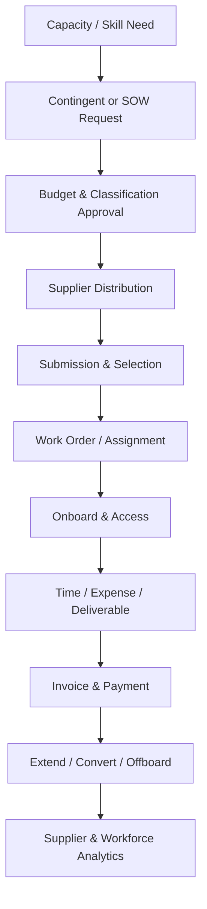

# Tổng quan phân hệ Lao động thuê ngoài và Quản lý nhà cung cấp (Contingent Workforce & Vendor Management)

---

> [!NOTE]
> **Phạm vi tham khảo:** Tài liệu này chỉ sử dụng nguồn chính thức của SAP, gồm SAP SuccessFactors, SAP Employee Central, SAP Employee Central Payroll, SAP Fieldglass, SAP Help Portal và các giải pháp SAP liên quan. Thuật ngữ tiếng Anh được giữ trong ngoặc khi cần thiết để hỗ trợ BA/PO đối chiếu với tài liệu cấu hình và triển khai của SAP.


## Mục lục

```text
Tổng quan phân hệ Lao động thuê ngoài và Quản lý nhà cung cấp (Contingent Workforce & Vendor Management)
├── 1. Bối cảnh nghiệp vụ (Domain Context)
│   ├── 1.1. Vị trí trong HRIS
│   ├── 1.2. Vai trò trong vận hành doanh nghiệp
│   └── 1.3. Mối liên hệ trong hệ sinh thái hệ thống
├── 2. Khái niệm nghiệp vụ cốt lõi (Core Business Concepts)
│   ├── 2.1. Nhà cung cấp / Đơn vị quản lý dịch vụ (Supplier / MSP)
│   ├── 2.2. Yêu cầu lao động thuê ngoài (Contingent Requisition)
│   ├── 2.3. Hồ sơ ứng viên do nhà cung cấp gửi (Candidate Submission)
│   ├── 2.4. Lệnh công việc / Phân công (Work Order / Assignment)
│   ├── 2.5. Bảng đơn giá và Phần cộng thêm (Rate Card & Markup)
│   ├── 2.6. Bảng công, Chi phí và Hóa đơn (Timesheet, Expense & Invoice)
│   ├── 2.7. Phân loại người lao động (Worker Classification)
│   ├── 2.8. Phạm vi công việc / Sản phẩm bàn giao (SOW / Deliverable)
├── 3. Quy trình đầu-cuối điển hình (Typical End-to-End Process)
├── 4. So sánh chính sách (Policy) theo quy mô doanh nghiệp
├── 5. Các điểm đau phổ biến (Common Pain Points)
├── 6. Quy tắc nghiệp vụ trọng yếu (Key Business Rules)
│   ├── 6.1. Quy tắc đủ điều kiện nhà cung cấp (Supplier Eligibility Rule)
│   ├── 6.2. Quy tắc tuân thủ đơn giá (Rate Compliance Rule)
│   ├── 6.3. Phân loại người lao động (Worker Classification) Rule
│   ├── 6.4. Quy tắc thời hạn làm việc (Tenure Rule)
│   ├── 6.5. Quy tắc phê duyệt bảng công (Timesheet Approval Rule)
│   ├── 6.6. Quy tắc đối chiếu hóa đơn (Invoice Match Rule)
│   ├── 6.7. Quy tắc hết hạn quyền truy cập (Access Expiry Rule)
├── 7. Góc nhìn dữ liệu và tích hợp (Data & Integration Perspective)
│   ├── 7.1. Dữ liệu cốt lõi trong miền nghiệp vụ (domain)
│   ├── 7.2. Logic quan hệ dữ liệu (Data Relationship Logic)
│   ├── 7.3. Luồng dữ liệu đầu-cuối (End-to-End Data Flow)
│   ├── 7.4. Rủi ro khuếch đại (Error Amplification Effect)
│   └── 7.5. Lưu ý cho BA/PO về dữ liệu và tích hợp
├── 8. Bản đồ phỏng vấn bên liên quan (Stakeholder Interview Mapping)
├── 9. Bảng thuật ngữ chuyên ngành
└── 10. Ghi chú nghiên cứu và nguồn SAP chính thức
```

---

## 1. Bối cảnh nghiệp vụ (Domain Context)

### 1.1. Vị trí trong HRIS
Contingent lực lượng lao động (workforce) & nhà cung cấp (vendor) Management là một miền nghiệp vụ quan trọng trong hệ sinh thái HCM/HRIS.

Trong cấu trúc HCM, miền nghiệp vụ (domain) này thường nằm trong:
* **nhà cung cấp (vendor) Management System (VMS)**
* **External người lao động (worker) Lifecycle**
* **Statement of Work / Services Procurement**
* **Total lực lượng lao động (workforce) Visibility**

> [!NOTE]
> Nếu Core HR quản lý lực lượng lao động (workforce) nội bộ, thì Contingent lực lượng lao động (workforce) Management kiểm soát nguồn lực bên ngoài, nhà cung cấp (supplier), phân công (assignment), rate, timesheet, invoice và rủi ro phân loại lao động.

#### Vai trò kiến trúc hệ thống
* Quản lý yêu cầu tuyển dụng (requisition), nhà cung cấp (supplier) distribution, ứng viên (candidate) submission và work order
* Tách nhưng liên kết external người lao động (worker) identity với HCM/IAM
* Kiểm soát rate card, tenure, time, expense, invoice và compliance
* Cung cấp dữ liệu tổng lực lượng lao động (workforce) cho hoạch định (planning) và phân tích (analytics)

#### Tham chiếu giải pháp SAP

| Giải pháp/tài liệu SAP | Phạm vi tham khảo |
| :--- | :--- |
| [SAP Fieldglass Contingent Workforce Management](https://www.sap.com/products/hcm/contingent-workforce-management.html) | Vòng đời lao động thuê ngoài từ yêu cầu, tuyển chọn, phân công, bảng công đến nghỉ việc. |
| [SAP Fieldglass – SAP Help Portal](https://help.sap.com/docs/r/product/SAP_Fieldglass/latest/en-US) | Tài liệu cấu hình, quản trị và sử dụng lao động thuê ngoài và dịch vụ. |
| [SAP Fieldglass Worker Profile Management](https://www.sap.com/products/hcm/worker-profile-management.html) | Hồ sơ tập trung cho lao động ngoài biên chế, chứng nhận, quyền truy cập và lịch sử. |
| [Total Workforce Management from SAP](https://www.sap.com/products/hcm/total-workforce-management.html) | Kết hợp dữ liệu nhân viên và lao động ngoài biên chế trong quản trị tổng lực lượng lao động. |

---

### 1.2. Vai trò trong vận hành doanh nghiệp

#### lực lượng lao động (workforce) agility
Nguồn lực ngoài giúp mở rộng/thu hẹp nhanh theo nhu cầu.

#### Chi phí và nhà cung cấp (supplier) control
Rate, markup, spend và invoice cần minh bạch.

#### Compliance
người lao động (worker) classification, tenure, quyền truy cập (access) và co-employment là rủi ro lớn.

#### bảo mật (security)
External người lao động (worker) phải được cấp quyền tối thiểu và thu hồi đúng phân công (assignment) end.

---

### 1.3. Mối liên hệ trong hệ sinh thái hệ thống

| miền nghiệp vụ (domain) liên quan | Mối quan hệ nghiệp vụ | Rủi ro nếu sai |
| :--- | :--- | :--- |
| hoạch định lực lượng lao động (workforce planning) | Nhu cầu capacity/kỹ năng (skill) | Chỉ nhìn employee, bỏ contractor |
| Procurement/AP | nhà cung cấp (supplier), PO, invoice, thanh toán (payment) | Spend sai |
| Core HR/IAM | người lao động (worker) profile, org, quyền truy cập (access) | Duplicate identity/quyền thừa |
| Time/Expense | Timesheet và expense approved | Invoice sai |
| Project Management | phân công (assignment)/SOW deliverable | Không đo outcome |
| Compliance | Classification, tài liệu (document), tenure | Co-employment/phạt |

> [!TIP]
> **Nhận định cho BA/PO:**
> miền nghiệp vụ (domain) không nên được thiết kế như một tập màn hình độc lập. Cần xác định rõ hệ thống dữ liệu gốc (system of record), ngày hiệu lực (effective date), chủ sở hữu luồng phê duyệt (workflow owner), tác động tới hệ thống phía sau (downstream impact) và cơ chế đối soát (reconciliation).

---

## 2. Khái niệm nghiệp vụ cốt lõi (Core Business Concepts)

### 2.1. Nhà cung cấp / Đơn vị quản lý dịch vụ (Supplier / MSP)
Đơn vị cung cấp nguồn lực hoặc quản lý chương trình nhà cung cấp (vendor).

#### Thành phần hoặc biến số nghiệp vụ
* Tier, geography, category
* hiệu suất (performance)

#### Rủi ro phổ biến
* nhà cung cấp (supplier) không đủ điều kiện
* Conflict

### 2.2. Yêu cầu lao động thuê ngoài (Contingent Requisition)
Nhu cầu thuê người ngoài có kỹ năng (skill), duration, location, rate và phê duyệt (approval).

#### Thành phần hoặc biến số nghiệp vụ
* số lượng nhân sự (headcount)/capacity
* Distribution
* Budget

#### Rủi ro phổ biến
* Thuê ngoài không duyệt

### 2.3. Hồ sơ ứng viên do nhà cung cấp gửi (Candidate Submission)
nhà cung cấp (supplier) gửi ứng viên (candidate) theo yêu cầu tuyển dụng (requisition) với rate và qualification.

#### Thành phần hoặc biến số nghiệp vụ
* Duplicate ứng viên (candidate)
* Rate
* Compliance docs

#### Rủi ro phổ biến
* Markup không minh bạch
* ứng viên (candidate) trùng

### 2.4. Lệnh công việc / Phân công (Work Order / Assignment)
Thỏa thuận hoạt động của người lao động (worker) với start/end, quản lý (manager), location, rate và scope.

#### Thành phần hoặc biến số nghiệp vụ
* Extension
* Conversion
* Tenure

#### Rủi ro phổ biến
* Làm việc quá hạn
* quyền truy cập (access) không thu hồi

### 2.5. Bảng đơn giá và Phần cộng thêm (Rate Card & Markup)
Khung rate theo vai trò (role)/location/nhà cung cấp (supplier) và phí nhà cung cấp (vendor).

#### Thành phần hoặc biến số nghiệp vụ
* Min/max, overtime
* Currency

#### Rủi ro phổ biến
* Vượt rate
* Invoice sai

### 2.6. Bảng công, Chi phí và Hóa đơn (Timesheet, Expense & Invoice)
Chuỗi xác nhận công/chi phí rồi đối soát hóa đơn.

#### Thành phần hoặc biến số nghiệp vụ
* phê duyệt (approval), tolerance, tax
* PO

#### Rủi ro phổ biến
* Double billing
* Unapproved time

### 2.7. Phân loại người lao động (Worker Classification)
Phân loại employee/independent contractor/agency người lao động (worker)/SOW.

#### Thành phần hoặc biến số nghiệp vụ
* Questionnaire, country
* đánh giá (review)

#### Rủi ro phổ biến
* Misclassification/co-employment

### 2.8. Phạm vi công việc / Sản phẩm bàn giao (SOW / Deliverable)
Mua dịch vụ theo kết quả/milestone thay vì thời gian cá nhân.

#### Thành phần hoặc biến số nghiệp vụ
* Milestone, acceptance, thanh toán (payment)
* Change order

#### Rủi ro phổ biến
* Scope creep
* Pay khi chưa nghiệm thu

---

## 3. Quy trình đầu-cuối điển hình (Typical End-to-End Process)

1. Business tạo contingent/SOW request
2. Kiểm tra budget, classification và phê duyệt (approval)
3. Phát hành yêu cầu tuyển dụng (requisition) cho nhà cung cấp (supplier)
4. nhà cung cấp (supplier) submit ứng viên (candidate)/rate
5. đánh giá (review), interview và select
6. Background/compliance check
7. Tạo work order/phân công (assignment) và external người lao động (worker) profile
8. Provision quyền truy cập (access) và tiếp nhận nhân viên (onboarding)
9. Ghi nhận time/expense hoặc deliverable
10. Approve và match invoice/PO
11. Extend/convert/terminate
12. Revoke quyền truy cập (access), offboard và evaluate nhà cung cấp (supplier)



> [!IMPORTANT]
> BA cần mô tả riêng luồng chính (main flow), luồng thay thế (alternative flow), luồng ngoại lệ (exception flow), luồng phê duyệt (approval path) và luồng hoàn tác/sửa sai (rollback/correction path). Sơ đồ trên chỉ thể hiện luồng chuẩn (happy path) tổng quát.

---

## 4. So sánh chính sách (Policy) theo quy mô doanh nghiệp

| Yếu tố | Khởi nghiệp (Startup) | Doanh nghiệp vừa và nhỏ (SME) | Doanh nghiệp lớn (Enterprise) |
| :--- | :--- | :--- | :--- |
| nhà cung cấp (supplier) | 1–2 nhà cung cấp (vendor) | Approved nhà cung cấp (vendor) list | MSP, tiered distribution, global nhà cung cấp (supplier) |
| Request | Email/manual | VMS yêu cầu tuyển dụng (requisition) | Contingent + SOW + project demand |
| Rate | Thỏa thuận từng case | Rate card | Market intelligence, multi-currency, markup control |
| Compliance | tài liệu (document) check | Classification luồng phê duyệt (workflow) | Country rule, tenure, co-employment kiểm toán (audit) |
| Time/invoice | Invoice tổng | Timesheet → invoice | PO matching, tax, services milestone |
| phân tích (analytics) | Số contractor | Spend/nhà cung cấp (supplier) | Total lực lượng lao động (workforce), kỹ năng (skill)/capacity, risk |

### Xu hướng tăng độ phức tạp theo quy mô
1. Số biến số và số đối tượng áp dụng (population) tăng; cùng một rule có thể khác theo pháp nhân, quốc gia, người lao động (worker) type, job và thời điểm.
2. phê duyệt (approval) từ một cấp chuyển thành dynamic routing, delegation, SLA và ngoại lệ (exception) phê duyệt (approval).
3. Tích hợp chuyển từ file thủ công sang API/hướng sự kiện (event-driven), cần tính không trùng lặp (idempotency), thử lại (retry), monitoring và đối soát (reconciliation).
4. Chi phí sai sót tăng theo quy mô đối tượng áp dụng (population) và độ nhạy cảm của quyết định.

### Lưu ý cho BA/PO theo cấp độ

| Cấp độ | Trọng tâm phân tích |
| :--- | :--- |
| Startup | Thiết kế tối giản nhưng tránh mã hóa cứng (hard-code); vẫn cần ID chuẩn, kiểm toán (audit) tối thiểu và khả năng mở rộng. |
| SME | Chuẩn hóa policy, vai trò (role), SLA, phê duyệt (approval), ngoại lệ (exception) và tích hợp (integration) boundary. |
| Enterprise | Rule engine, quản lý theo ngày hiệu lực (effective dating), bản địa hóa (localization), segregation of duties, immutable kiểm toán (audit) và data quản trị (governance). |

---

## 5. Các điểm đau phổ biến (Common Pain Points)

| Điểm đau (Pain Point) | Biểu hiện thực tế | Nguyên nhân gốc rễ | Tác động kinh doanh | Lưu ý cho BA/PO |
| :--- | :--- | :--- | :--- | :--- |
| Shadow lực lượng lao động (workforce) | Contractor làm việc nhưng không có hồ sơ chuẩn | Thuê qua email/procurement | Không biết quyền truy cập (access)/spend | Single external người lao động (worker) registry |
| Rate không minh bạch | Cùng vai trò (role) rate khác xa | Không rate card/benchmark | Chi phí cao | Rate guardrail và ngoại lệ (exception) phê duyệt (approval) |
| phân công (assignment) hết hạn nhưng vẫn làm | Không extension/chấm dứt việc làm (termination) luồng phê duyệt (workflow) | Không cảnh báo | quyền truy cập (access) và billing rủi ro | Expiry sự kiện (event) + auto revoke/escalation |
| Misclassification | Contractor vận hành như employee | Không questionnaire/đánh giá (review) | Rủi ro thuế/pháp lý | Classification rule và legal phê duyệt (approval) |
| Timesheet–invoice lệch | Invoice khác giờ đã duyệt | Không three-way match | Overbilling | PO/work order/time/invoice đối soát (reconciliation) |
| Không có total lực lượng lao động (workforce) view | hoạch định (planning) chỉ tính employee | VMS không tích hợp HCM | Sai capacity/cost | Unified lực lượng lao động (workforce) phân tích (analytics) |

---

## 6. Quy tắc nghiệp vụ trọng yếu (Key Business Rules)

Business Rules là tầng quyết định hệ thống diễn giải dữ liệu và cho phép giao dịch (transaction) như thế nào. Rule cần có chủ sở hữu (owner), effective phiên bản (version), test case và kiểm toán (audit) thay đổi.

### Bảng tổng hợp quy tắc nghiệp vụ (Business Rules)

| Nhóm quy tắc (Rule) | Câu hỏi nghiệp vụ trọng tâm | Biến số cấu hình | Rủi ro nếu sai |
| :--- | :--- | :--- | :--- |
| nhà cung cấp (supplier) điều kiện áp dụng (eligibility) Rule | nhà cung cấp (supplier) nào nhận yêu cầu tuyển dụng (requisition)? | Category, tier, geography, hiệu suất (performance) | Phân phối sai |
| Rate Compliance Rule | Rate/markup trong giới hạn nào? | vai trò (role), location, currency, overtime | Vượt chi phí |
| người lao động (worker) Classification Rule | Loại gắn kết (engagement) nào hợp lệ? | Country, control, duration, deliverable | Misclassification |
| Tenure Rule | Thời gian tối đa/renewal? | người lao động (worker) type, country, break period | Co-employment risk |
| Timesheet phê duyệt (approval) Rule | Ai duyệt giờ/expense? | quản lý (manager), project, tolerance | Thanh toán sai |
| Invoice Match Rule | Điều kiện invoice được trả? | PO, work order, approved time/milestone | Double/over thanh toán (payment) |
| quyền truy cập (access) Expiry Rule | Khi nào thu hồi quyền truy cập (access)? | phân công (assignment) end, chấm dứt việc làm (termination), extension | Quyền tồn đọng |

### 6.1. Quy tắc đủ điều kiện nhà cung cấp (Supplier Eligibility Rule)
* **Câu hỏi trọng tâm:** nhà cung cấp (supplier) nào nhận yêu cầu tuyển dụng (requisition)?
* **Biến số cấu hình:** Category, tier, geography, hiệu suất (performance)
* **Rủi ro:** Phân phối sai
* **BA cần xác nhận:** rule áp dụng cho đối tượng áp dụng (population) nào, theo ngày hiệu lực nào, ai được ghi đè đặc quyền (override) và ghi đè đặc quyền (override) có cần phê duyệt/kiểm toán (approval/audit) hay không.

### 6.2. Quy tắc tuân thủ đơn giá (Rate Compliance Rule)
* **Câu hỏi trọng tâm:** Rate/markup trong giới hạn nào?
* **Biến số cấu hình:** vai trò (role), location, currency, overtime
* **Rủi ro:** Vượt chi phí
* **BA cần xác nhận:** rule áp dụng cho đối tượng áp dụng (population) nào, theo ngày hiệu lực nào, ai được ghi đè đặc quyền (override) và ghi đè đặc quyền (override) có cần phê duyệt/kiểm toán (approval/audit) hay không.

### 6.3. Phân loại người lao động (Worker Classification) Rule
* **Câu hỏi trọng tâm:** Loại gắn kết (engagement) nào hợp lệ?
* **Biến số cấu hình:** Country, control, duration, deliverable
* **Rủi ro:** Misclassification
* **BA cần xác nhận:** rule áp dụng cho đối tượng áp dụng (population) nào, theo ngày hiệu lực nào, ai được ghi đè đặc quyền (override) và ghi đè đặc quyền (override) có cần phê duyệt/kiểm toán (approval/audit) hay không.

### 6.4. Quy tắc thời hạn làm việc (Tenure Rule)
* **Câu hỏi trọng tâm:** Thời gian tối đa/renewal?
* **Biến số cấu hình:** người lao động (worker) type, country, break period
* **Rủi ro:** Co-employment risk
* **BA cần xác nhận:** rule áp dụng cho đối tượng áp dụng (population) nào, theo ngày hiệu lực nào, ai được ghi đè đặc quyền (override) và ghi đè đặc quyền (override) có cần phê duyệt/kiểm toán (approval/audit) hay không.

### 6.5. Quy tắc phê duyệt bảng công (Timesheet Approval Rule)
* **Câu hỏi trọng tâm:** Ai duyệt giờ/expense?
* **Biến số cấu hình:** quản lý (manager), project, tolerance
* **Rủi ro:** Thanh toán sai
* **BA cần xác nhận:** rule áp dụng cho đối tượng áp dụng (population) nào, theo ngày hiệu lực nào, ai được ghi đè đặc quyền (override) và ghi đè đặc quyền (override) có cần phê duyệt/kiểm toán (approval/audit) hay không.

### 6.6. Quy tắc đối chiếu hóa đơn (Invoice Match Rule)
* **Câu hỏi trọng tâm:** Điều kiện invoice được trả?
* **Biến số cấu hình:** PO, work order, approved time/milestone
* **Rủi ro:** Double/over thanh toán (payment)
* **BA cần xác nhận:** rule áp dụng cho đối tượng áp dụng (population) nào, theo ngày hiệu lực nào, ai được ghi đè đặc quyền (override) và ghi đè đặc quyền (override) có cần phê duyệt/kiểm toán (approval/audit) hay không.

### 6.7. Quy tắc hết hạn quyền truy cập (Access Expiry Rule)
* **Câu hỏi trọng tâm:** Khi nào thu hồi quyền truy cập (access)?
* **Biến số cấu hình:** phân công (assignment) end, chấm dứt việc làm (termination), extension
* **Rủi ro:** Quyền tồn đọng
* **BA cần xác nhận:** rule áp dụng cho đối tượng áp dụng (population) nào, theo ngày hiệu lực nào, ai được ghi đè đặc quyền (override) và ghi đè đặc quyền (override) có cần phê duyệt/kiểm toán (approval/audit) hay không.

---

## 7. Góc nhìn dữ liệu và tích hợp (Data & Integration Perspective)

### 7.1. Dữ liệu cốt lõi trong miền nghiệp vụ (domain)

| Đối tượng dữ liệu (Data Object) | Vai trò nghiệp vụ | Phụ thuộc vào | Rủi ro nếu sai |
| :--- | :--- | :--- | :--- |
| nhà cung cấp (supplier) ID | Định danh nhà cung cấp (vendor) | Procurement master | Duplicate/risk |
| yêu cầu tuyển dụng (requisition) ID | Nhu cầu contingent | Business/budget | Thuê không kiểm soát |
| Submission ID | ứng viên (candidate)/rate proposal | nhà cung cấp (supplier)/ứng viên (candidate) | Duplicate/rate sai |
| External người lao động (worker) ID | Định danh lực lượng lao động (workforce) ngoài | Identity/IAM | Không thu hồi quyền |
| Work Order/phân công (assignment) | Phạm vi và thời hạn | Selection/contract | Billing/quyền truy cập (access) sai |
| Rate/Markup | Chi phí | Rate card | Overcharge |
| Timesheet/Expense | Cơ sở thanh toán | người lao động (worker)/quản lý (manager) | Invoice sai |
| Invoice/PO/Deliverable | Nghĩa vụ mua dịch vụ | Procurement/AP | Thanh toán sai |

### 7.2. Logic quan hệ dữ liệu (Data Relationship Logic)
* `1 nhà cung cấp (supplier) → N Requisitions/Submissions/Workers`
* `1 yêu cầu tuyển dụng (requisition) → N Submissions → 1..N Selections`
* `Selected Submission → Work Order + External người lao động (worker)`
* `Work Order → N Timesheets/Expenses hoặc Milestones`
* `Approved Time/Milestone → Invoice → AP thanh toán (payment)`
* `phân công (assignment) End → nghỉ việc (offboarding) + IAM Revoke + nhà cung cấp (supplier) Evaluation`

### 7.3. Luồng dữ liệu đầu-cuối (End-to-End Data Flow)


### 7.4. Rủi ro khuếch đại (Error Amplification Effect)

**Hiệu ứng khuếch đại:** Sai classification/rate/phân công (assignment) → người lao động (worker) và quyền truy cập (access) sai → timesheet/invoice sai → overpayment hoặc rủi ro pháp lý/co-employment.

### 7.5. Lưu ý cho BA/PO về dữ liệu và tích hợp

* **Nguồn dữ liệu chuẩn (source of truth):** object nào do hệ thống nào sở hữu?
* **Dữ liệu theo thời gian (temporal data):** dữ liệu lấy theo trạng thái hiện tại, ngày hiệu lực (effective date) hay ảnh chụp dữ liệu (snapshot)?
* **Chất lượng dữ liệu (data quality):** validation, duplicate, referential integrity và đối soát (reconciliation) report là gì?
* **tích hợp (integration):** synchronous hay asynchronous; batch hay sự kiện (event); full hay phần chênh lệch (delta)?
* **Xử lý lỗi (error handling):** thử lại (retry), tính không trùng lặp (idempotency), dead-letter queue và manual điều chỉnh (correction)?
* **Bảo mật và quyền riêng tư (security & privacy):** row/field-level quyền truy cập (access), masking, lưu giữ (retention) và sự đồng ý (consent)?
* **kiểm toán (audit):** có lưu giá trị trước/sau (before/after), rule phiên bản (version), actor, timestamp và correlation ID?

---

## 8. Bản đồ phỏng vấn bên liên quan (Stakeholder Interview Mapping)

| Nhóm mục tiêu | Bên liên quan chính | Tập trung vào | Câu hỏi ví dụ |
| :--- | :--- | :--- | :--- |
| Demand | Business quản lý (manager), hoạch định lực lượng lao động (workforce planning) | Capacity, kỹ năng (skill), duration | Khi nào chọn employee, contingent hay SOW? |
| nhà cung cấp (supplier) process | Procurement, MSP | Distribution, rate, hiệu suất (performance) | Tier và rate card được quản trị thế nào? |
| Compliance | Legal, Tax, HR | Classification, tenure, co-employment | Ai phê duyệt ngoại lệ (exception) phân loại? |
| Operations | Hiring quản lý (manager), Contractor Admin | Work order, time, extension | phân công (assignment) hết hạn được xử lý thế nào? |
| Finance | AP, Controller | PO, invoice, tax, match | Invoice phải match những dữ liệu nào? |
| bảo mật (security)/tích hợp (integration) | IAM, IT, HCM/VMS Admin | Identity, quyền truy cập (access), total lực lượng lao động (workforce) | External người lao động (worker) ID và quyền truy cập (access) được đồng bộ ra sao? |

## 9. Bảng thuật ngữ chuyên ngành

| Thuật ngữ (viết tắt) | Dịch | Mô tả |
| :--- | :--- | :--- |
| **VMS** | Hệ thống quản lý nhà cung cấp lao động | Nền tảng quản lý nhà cung cấp, lao động thuê ngoài, chi phí và tuân thủ. |
| **MSP** | Đơn vị quản lý dịch vụ | Bên quản lý chương trình nhà cung cấp và lao động thuê ngoài cho doanh nghiệp. |
| **Nhà cung cấp (Supplier)** | Đơn vị cung ứng lao động | Tổ chức gửi ứng viên hoặc cung cấp dịch vụ theo hợp đồng. |
| **Lao động thuê ngoài (Contingent Worker)** | Người làm việc ngoài biên chế | Cá nhân làm theo thời hạn, dự án hoặc hợp đồng nhưng không phải nhân viên truyền thống. |
| **Yêu cầu lao động thuê ngoài (Contingent Requisition)** | Nhu cầu thuê nguồn lực | Đề nghị chính thức nêu vai trò, số lượng, thời gian, kỹ năng và ngân sách. |
| **Hồ sơ ứng viên gửi (Candidate Submission)** | Ứng viên do nhà cung cấp đề xuất | Bản ghi ứng viên được gửi cho một yêu cầu cụ thể. |
| **Lệnh công việc (Work Order)** | Thỏa thuận phân công | Bản ghi điều khoản, đơn giá, thời gian và phạm vi của một lao động thuê ngoài. |
| **Bảng đơn giá (Rate Card)** | Khung giá dịch vụ | Mức giá chuẩn theo vai trò, kỹ năng, địa điểm hoặc nhà cung cấp. |
| **Phần cộng thêm (Markup)** | Tỷ lệ cộng vào chi phí | Khoản nhà cung cấp cộng trên chi phí trả cho người lao động. |
| **Bảng công (Timesheet)** | Ghi nhận thời gian làm việc | Dữ liệu giờ hoặc ngày làm dùng để phê duyệt và thanh toán. |
| **Chi phí (Expense)** | Khoản chi hoàn trả | Chi phí phát sinh hợp lệ trong quá trình thực hiện công việc. |
| **Hóa đơn (Invoice)** | Chứng từ thanh toán | Yêu cầu thanh toán dựa trên bảng công, chi phí hoặc sản phẩm bàn giao. |
| **Thời hạn làm việc (Tenure)** | Thời gian gắn kết | Khoảng thời gian lao động thuê ngoài làm việc cho tổ chức. |
| **Phân loại người lao động (Worker Classification)** | Xác định loại quan hệ làm việc | Quyết định người lao động là nhân viên, nhà thầu độc lập hay loại khác. |
| **SOW** | Phạm vi công việc | Tài liệu mô tả kết quả, mốc và điều kiện của dịch vụ theo dự án. |
| **Sản phẩm bàn giao (Deliverable)** | Kết quả phải hoàn thành | Đầu ra có thể nghiệm thu và thanh toán trong hợp đồng dịch vụ. |
| **Mã định danh bảo mật (Security ID)** | Mã theo dõi quyền và lịch sử | Mã liên kết hồ sơ, quyền truy cập, chứng nhận và lịch sử lao động ngoài biên chế. |

---

## 10. Ghi chú nghiên cứu và nguồn SAP chính thức

### 10.1. Nguyên tắc nghiên cứu

* Chỉ sử dụng tài liệu và trang sản phẩm chính thức thuộc hệ sinh thái SAP.
* Nội dung được chuẩn hóa theo miền nghiệp vụ để BA/PO có thể dùng cho khám phá sản phẩm, phân rã quy trình, mô hình miền và quản lý tồn đọng sản phẩm.
* Tên tính năng cụ thể có thể thay đổi theo phiên bản phát hành và cấu hình của từng khách hàng SAP SuccessFactors.
* Quy tắc pháp lý theo quốc gia vẫn cần được xác minh riêng theo ngày hiệu lực trước khi chuyển thành yêu cầu chính thức.

### 10.2. Nguồn tham khảo

| Giải pháp/tài liệu SAP | Phạm vi sử dụng trong nghiên cứu |
| :--- | :--- |
| [SAP Fieldglass Contingent Workforce Management](https://www.sap.com/products/hcm/contingent-workforce-management.html) | Vòng đời lao động thuê ngoài từ yêu cầu, tuyển chọn, phân công, bảng công đến nghỉ việc. |
| [SAP Fieldglass – SAP Help Portal](https://help.sap.com/docs/r/product/SAP_Fieldglass/latest/en-US) | Tài liệu cấu hình, quản trị và sử dụng lao động thuê ngoài và dịch vụ. |
| [SAP Fieldglass Worker Profile Management](https://www.sap.com/products/hcm/worker-profile-management.html) | Hồ sơ tập trung cho lao động ngoài biên chế, chứng nhận, quyền truy cập và lịch sử. |
| [Total Workforce Management from SAP](https://www.sap.com/products/hcm/total-workforce-management.html) | Kết hợp dữ liệu nhân viên và lao động ngoài biên chế trong quản trị tổng lực lượng lao động. |

