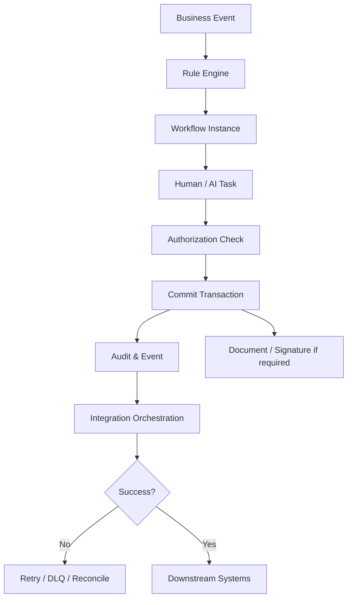

# Tổng quan nền tảng HCM: Luồng phê duyệt, Bảo mật, Tích hợp, Tài liệu và AI

---

> [!NOTE]
> **Phạm vi tham khảo:** Tài liệu này chỉ sử dụng nguồn chính thức của SAP, gồm SAP SuccessFactors, SAP Employee Central, SAP Employee Central Payroll, SAP Fieldglass, SAP Help Portal và các giải pháp SAP liên quan. Thuật ngữ tiếng Anh được giữ trong ngoặc khi cần thiết để hỗ trợ BA/PO đối chiếu với tài liệu cấu hình và triển khai của SAP.


## Mục lục

```text
HCM Platform: luồng phê duyệt (workflow), bảo mật (security), tích hợp (integration), tài liệu (document) & AI Overview
├── 1. Bối cảnh nghiệp vụ (Domain Context)
│   ├── 1.1. Vị trí trong HRIS
│   ├── 1.2. Vai trò trong vận hành doanh nghiệp
│   └── 1.3. Mối liên hệ trong hệ sinh thái hệ thống
├── 2. Khái niệm nghiệp vụ cốt lõi (Core Business Concepts)
│   ├── 2.1. Quy trình nghiệp vụ / Luồng phê duyệt (Business Process / Workflow)
│   ├── 2.2. Quy tắc nghiệp vụ (Business Rule)
│   ├── 2.3. Bảo mật theo vai trò và ngữ cảnh (Role-Based & Contextual Security)
│   ├── 2.4. Nhật ký kiểm toán và Dòng dữ liệu (Audit & Data Lineage)
│   ├── 2.5. API, Sự kiện và Luồng tích hợp (API, Event & Integration Flow)
│   ├── 2.6. Tài liệu và Chữ ký điện tử (Document & E-signature)
│   ├── 2.7. Cấu hình và Khả năng mở rộng (Configuration & Extensibility)
│   ├── 2.8. Trợ lý và Tác nhân AI (AI Assistant & Agent)
├── 3. Quy trình đầu-cuối điển hình (Typical End-to-End Process)
├── 4. So sánh chính sách (Policy) theo quy mô doanh nghiệp
├── 5. Các điểm đau phổ biến (Common Pain Points)
├── 6. Quy tắc nghiệp vụ trọng yếu (Key Quy tắc nghiệp vụ (Business Rule)s)
│   ├── 6.1. Quy tắc phân tuyến luồng phê duyệt (Workflow Routing Rule)
│   ├── 6.2. Quy tắc ủy quyền (Delegation Rule)
│   ├── 6.3. Quy tắc cấp quyền (Authorization Rule)
│   ├── 6.4. Quy tắc không xử lý trùng tích hợp (Integration Idempotency Rule)
│   ├── 6.5. Quy tắc thử lại và xử lý lỗi (Retry & Error Rule)
│   ├── 6.6. Quy tắc phiên bản tài liệu (Document Version Rule)
│   ├── 6.7. Quy tắc kiểm soát AI (AI Guardrail Rule)
├── 7. Góc nhìn dữ liệu và tích hợp (Data & Integration Perspective)
│   ├── 7.1. Dữ liệu cốt lõi trong miền nghiệp vụ (domain)
│   ├── 7.2. Logic quan hệ dữ liệu (Data Relationship Logic)
│   ├── 7.3. Luồng dữ liệu đầu-cuối (End-to-End Data Flow)
│   ├── 7.4. Rủi ro khuếch đại (Error Amplification Effect)
│   └── 7.5. Lưu ý cho BA/PO về dữ liệu và tích hợp
├── 8. Bản đồ phỏng vấn bên liên quan (Stakeholder Interview Mapping)
├── 9. Bảng thuật ngữ chuyên ngành
└── 10. Ghi chú nghiên cứu và nguồn SAP chính thức
```

---

## 1. Bối cảnh nghiệp vụ (Domain Context)

### 1.1. Vị trí trong HRIS
HCM Platform: luồng phê duyệt (workflow), bảo mật (security), tích hợp (integration), tài liệu (document) & AI Overview là một miền nghiệp vụ quan trọng trong hệ sinh thái HCM/HRIS.

Trong cấu trúc HCM, miền nghiệp vụ (domain) này thường nằm trong:
* **luồng phê duyệt (workflow) & Business Rules Platform**
* **bảo mật (security), Identity, Privacy & kiểm toán (audit)**
* **tích hợp (integration)/API/sự kiện (event) Platform**
* **tài liệu (document)/E-signature, Configuration, Extensibility và AI quản trị (governance)**

> [!NOTE]
> Nếu các business module quyết định “làm nghiệp vụ gì”, thì HCM Platform quyết định dữ liệu, quyền, luồng phê duyệt (workflow), tích hợp, tài liệu và automation được thực thi nhất quán như thế nào.

#### Vai trò kiến trúc hệ thống
* Cung cấp capability dùng chung cho toàn bộ HCM
* Tách configuration khỏi code để hỗ trợ thay đổi policy
* Kiểm soát giao dịch (transaction), quyền truy cập dữ liệu (data access) và tích hợp (integration) reliability
* Cho phép extension/AI nhưng vẫn giữ kiểm toán (audit), explainability và human control

#### Tham chiếu giải pháp SAP

| Giải pháp/tài liệu SAP | Phạm vi tham khảo |
| :--- | :--- |
| [SAP SuccessFactors Platform – SAP Help Portal](https://help.sap.com/docs/successfactors-platform) | Nền tảng dùng chung, trải nghiệm, tích hợp, bảo mật, báo cáo và quản trị. |
| [Role-Based Permissions](https://help.sap.com/docs/successfactors-platform/using-role-based-permissions/latest-role-based-permissions) | Mô hình phân quyền theo vai trò áp dụng trên toàn bộ SAP SuccessFactors. |
| [Integration Center](https://help.sap.com/docs/successfactors-platform/using-integration-center/role-based-permissions-for-integration-center) | Xây dựng, chạy, lập lịch và giám sát tích hợp đơn giản. |
| [Document Management](https://help.sap.com/docs/successfactors-platform/implementing-document-management-and-attachment-storage/using-document-management) | Quản lý tập trung tài liệu đính kèm trong bộ HCM. |
| [Joule in SAP SuccessFactors](https://help.sap.com/docs/successfactors-platform/setting-up-and-using-joule-in-sap-successfactors/setting-up-joule-in-sap-successfactors-595e73337eff407cb0c1ac645252cb0c?locale=en-US) | Thiết lập và cấp quyền sử dụng trợ lý AI Joule. |

---

### 1.2. Vai trò trong vận hành doanh nghiệp

#### Khả năng scale
Platform tốt giúp thêm module, pháp nhân và quốc gia mà không nhân bản logic.

#### Bảo mật và quyền riêng tư (security & privacy)
Dữ liệu HR rất nhạy cảm, cần quyền theo vai trò (role), org, relationship và field.

#### Độ tin cậy tích hợp
Sai hoặc mất sự kiện (event) có thể lan sang payroll, IAM và finance.

#### Tốc độ thay đổi
Low-code/configuration giảm time-to-market cho policy mới.

---

### 1.3. Mối liên hệ trong hệ sinh thái hệ thống

| miền nghiệp vụ (domain) liên quan | Mối quan hệ nghiệp vụ | Rủi ro nếu sai |
| :--- | :--- | :--- |
| All HCM Modules | luồng phê duyệt (workflow), rule, notification, kiểm toán (audit) | Logic không nhất quán |
| IAM/SSO | Authentication, provisioning, vai trò (role) | Truy cập sai |
| ERP/Finance/Payroll/ITSM | Master data và giao dịch (transaction) tích hợp (integration) | Data drift |
| tài liệu (document)/E-sign Provider | Contract, thư mời nhận việc (offer), acknowledgement | Mất legal bằng chứng (evidence) |
| Data Platform/BI | Extract, sự kiện (event), semantic data | Lộ dữ liệu/stale data |
| AI/LLM Services | Search, recommendation, agent hành động (action) | Hallucination/bias/over-permission |

> [!TIP]
> **Nhận định cho BA/PO:**
> miền nghiệp vụ (domain) không nên được thiết kế như một tập màn hình độc lập. Cần xác định rõ hệ thống dữ liệu gốc (system of record), ngày hiệu lực (effective date), chủ sở hữu luồng phê duyệt (workflow owner), tác động tới hệ thống phía sau (downstream impact) và cơ chế đối soát (reconciliation).

---

## 2. Khái niệm nghiệp vụ cốt lõi (Core Business Concepts)

### 2.1. Quy trình nghiệp vụ / Luồng phê duyệt (Business Process / Workflow)
Mô hình trigger, step, participant, condition, SLA, escalation và outcome.

#### Thành phần hoặc biến số nghiệp vụ
* Sequential/parallel
* Dynamic routing
* Delegation

#### Rủi ro phổ biến
* Deadlock
* Route sai
* phê duyệt (approval) bypass

### 2.2. Quy tắc nghiệp vụ (Business Rule)
Logic cấu hình để validate, derive, calculate hoặc determine điều kiện áp dụng (eligibility).

#### Thành phần hoặc biến số nghiệp vụ
* Effective phiên bản (version)
* Priority
* Test case

#### Rủi ro phổ biến
* Rule conflict
* Hard-code

### 2.3. Bảo mật theo vai trò và ngữ cảnh (Role-Based & Contextual Security)
Quyền dựa trên vai trò (role) kết hợp organization, relationship, field và hành động (action).

#### Thành phần hoặc biến số nghiệp vụ
* RBAC/ABAC
* Row/field bảo mật (security)
* Proxy

#### Rủi ro phổ biến
* Lộ lương/sức khỏe
* Privilege creep

### 2.4. Nhật ký kiểm toán và Dòng dữ liệu (Audit & Data Lineage)
Lưu ai làm gì, khi nào, trước–sau và dữ liệu đi từ đâu.

#### Thành phần hoặc biến số nghiệp vụ
* Immutable log
* Correlation ID
* lưu giữ (retention)

#### Rủi ro phổ biến
* Không điều tra được lỗi

### 2.5. API, Sự kiện và Luồng tích hợp (API, Event & Integration Flow)
Cơ chế trao đổi dữ liệu đồng bộ/bất đồng bộ.

#### Thành phần hoặc biến số nghiệp vụ
* REST/OData, webhook, batch
* thử lại (retry)/tính không trùng lặp (idempotency)
* ánh xạ (mapping)

#### Rủi ro phổ biến
* Duplicate/missing sự kiện (event)
* Loop

### 2.6. Tài liệu và Chữ ký điện tử (Document & E-signature)
Template, merge, phiên bản (version), signature, lưu giữ (retention) và legal bằng chứng (evidence).

#### Thành phần hoặc biến số nghiệp vụ
* Signer order
* ngày hiệu lực (effective date)
* Country template

#### Rủi ro phổ biến
* Ký sai bản
* Không lưu bằng chứng

### 2.7. Cấu hình và Khả năng mở rộng (Configuration & Extensibility)
Custom field/object/form/report và app extension.

#### Thành phần hoặc biến số nghiệp vụ
* Tenant config
* Transport
* Sandbox

#### Rủi ro phổ biến
* Config drift
* Upgrade conflict

### 2.8. Trợ lý và Tác nhân AI (AI Assistant & Agent)
AI hỗ trợ tìm kiếm, tạo nội dung, phân tích hoặc hành động trên HCM.

#### Thành phần hoặc biến số nghiệp vụ
* Grounding, permission, confidence
* Human phê duyệt (approval)
* Monitoring

#### Rủi ro phổ biến
* Hallucination
* Bias
* Hành động quá quyền

---

## 3. Quy trình đầu-cuối điển hình (Typical End-to-End Process)

1. Business sự kiện (event) phát sinh từ module
2. Rule engine validate/derive điều kiện áp dụng (eligibility)
3. luồng phê duyệt (workflow) khởi tạo và resolve participant
4. Notification/nhiệm vụ (task) được giao
5. User/agent thực hiện hành động (action) theo quyền
6. giao dịch (transaction) commit và tạo kiểm toán (audit)/sự kiện (event)
7. tích hợp (integration) đẩy sang downstream
8. thử lại (retry)/đối soát (reconcile) ngoại lệ (exception)
9. tài liệu (document)/e-sign nếu yêu cầu
10. Monitor SLA/bảo mật (security)/tích hợp (integration)
11. Promote configuration qua môi trường
12. đánh giá (review) quản trị (governance) và cải tiến



> [!IMPORTANT]
> BA cần mô tả riêng luồng chính (main flow), luồng thay thế (alternative flow), luồng ngoại lệ (exception flow), luồng phê duyệt (approval path) và luồng hoàn tác/sửa sai (rollback/correction path). Sơ đồ trên chỉ thể hiện luồng chuẩn (happy path) tổng quát.

---

## 4. So sánh chính sách (Policy) theo quy mô doanh nghiệp

| Yếu tố | Khởi nghiệp (Startup) | Doanh nghiệp vừa và nhỏ (SME) | Doanh nghiệp lớn (Enterprise) |
| :--- | :--- | :--- | :--- |
| luồng phê duyệt (workflow) | Cố định theo màn hình | Config theo module | Reusable process engine, dynamic routing |
| bảo mật (security) | vai trò (role) rộng | vai trò (role) + org | vai trò (role) + org + relationship + field + purpose |
| tích hợp (integration) | File thủ công | Scheduled API | sự kiện (event)-driven, orchestration, observability |
| Config | Admin sửa trực tiếp | Sandbox + change log | Transport, phiên bản (version), automated test |
| tài liệu (document) | Upload file | Template/e-sign | Country/legal phiên bản (version), lưu giữ (retention), bằng chứng (evidence) |
| AI | Chatbot FAQ | Recommendation/copilot | Agentic hành động (action) with quản trị (governance) and human-in-loop |

### Xu hướng tăng độ phức tạp theo quy mô
1. Số biến số và số đối tượng áp dụng (population) tăng; cùng một rule có thể khác theo pháp nhân, quốc gia, người lao động (worker) type, job và thời điểm.
2. phê duyệt (approval) từ một cấp chuyển thành dynamic routing, delegation, SLA và ngoại lệ (exception) phê duyệt (approval).
3. Tích hợp chuyển từ file thủ công sang API/hướng sự kiện (event-driven), cần tính không trùng lặp (idempotency), thử lại (retry), monitoring và đối soát (reconciliation).
4. Chi phí sai sót tăng theo quy mô đối tượng áp dụng (population) và độ nhạy cảm của quyết định.

### Lưu ý cho BA/PO theo cấp độ

| Cấp độ | Trọng tâm phân tích |
| :--- | :--- |
| Startup | Thiết kế tối giản nhưng tránh mã hóa cứng (hard-code); vẫn cần ID chuẩn, kiểm toán (audit) tối thiểu và khả năng mở rộng. |
| SME | Chuẩn hóa policy, vai trò (role), SLA, phê duyệt (approval), ngoại lệ (exception) và tích hợp (integration) boundary. |
| Enterprise | Rule engine, quản lý theo ngày hiệu lực (effective dating), bản địa hóa (localization), segregation of duties, immutable kiểm toán (audit) và data quản trị (governance). |

---

## 5. Các điểm đau phổ biến (Common Pain Points)

| Điểm đau (Pain Point) | Biểu hiện thực tế | Nguyên nhân gốc rễ | Tác động kinh doanh | Lưu ý cho BA/PO |
| :--- | :--- | :--- | :--- | :--- |
| luồng phê duyệt (workflow) mã hóa cứng (hard-code) | Mỗi policy change cần release code | Không process engine | Chậm thay đổi | Configurable rule/luồng phê duyệt (workflow) + phiên bản (version) |
| vai trò (role) explosion | Hàng trăm vai trò (role) khó quản lý | RBAC không có context | Privilege creep | Composable vai trò (role) + org/relationship scope |
| tích hợp (integration) silent failure | Dữ liệu không sang downstream nhưng không ai biết | Không observability/thử lại (retry) | Payroll/IAM sai | Monitoring, DLQ, đối soát (reconciliation) |
| Config drift | Prod khác test và không biết ai sửa | Không transport/phiên bản (version) | Lỗi khó tái hiện | Config package, phê duyệt (approval), kiểm toán (audit) |
| tài liệu (document) sai phiên bản | Ký policy/hợp đồng cũ | Template không effective-dated | Rủi ro pháp lý | Template phiên bản (version) + validity + bằng chứng (evidence) |
| AI trả lời/hành động sai | Nguồn không rõ hoặc vượt quyền | Không grounding/permission gate | Rủi ro privacy và decision | Source citation, confidence, human phê duyệt (approval), kiểm toán (audit) |

---

## 6. Quy tắc nghiệp vụ trọng yếu (Key Quy tắc nghiệp vụ (Business Rule)s)

Business Rules là tầng quyết định hệ thống diễn giải dữ liệu và cho phép giao dịch (transaction) như thế nào. Rule cần có chủ sở hữu (owner), effective phiên bản (version), test case và kiểm toán (audit) thay đổi.

### Bảng tổng hợp quy tắc nghiệp vụ (Quy tắc nghiệp vụ (Business Rule)s)

| Nhóm quy tắc (Rule) | Câu hỏi nghiệp vụ trọng tâm | Biến số cấu hình | Rủi ro nếu sai |
| :--- | :--- | :--- | :--- |
| luồng phê duyệt (workflow) Routing Rule | Participant được resolve thế nào? | quản lý (manager), HRBP, org, amount, sự kiện (event) | Route sai/deadlock |
| Delegation Rule | Ủy quyền gì, khi nào và loại trừ gì? | Time window, process, sensitive hành động (action) | phê duyệt (approval) vòng tròn/quá quyền |
| Authorization Rule | Ai làm hành động (action) trên data nào? | vai trò (role), org, relation, field, purpose | Rò rỉ hoặc block sai |
| tích hợp (integration) tính không trùng lặp (idempotency) Rule | sự kiện (event) lặp được xử lý thế nào? | Business key, phiên bản (version), sequence | Duplicate giao dịch (transaction) |
| thử lại (retry) & Error Rule | Lỗi nào thử lại (retry)/hold/manual? | Error type, max attempts, DLQ | Mất dữ liệu |
| tài liệu (document) phiên bản (version) Rule | Template nào áp dụng theo ngày/đối tượng? | Country, sự kiện (event), ngày hiệu lực (effective date) | Ký sai bản |
| AI Guardrail Rule | AI được đọc/đề xuất/thực thi đến đâu? | Data class, confidence, hành động (action) risk | Hallucination/overreach |

### 6.1. Quy tắc phân tuyến luồng phê duyệt (Workflow Routing Rule)
* **Câu hỏi trọng tâm:** Participant được resolve thế nào?
* **Biến số cấu hình:** quản lý (manager), HRBP, org, amount, sự kiện (event)
* **Rủi ro:** Route sai/deadlock
* **BA cần xác nhận:** rule áp dụng cho đối tượng áp dụng (population) nào, theo ngày hiệu lực nào, ai được ghi đè đặc quyền (override) và ghi đè đặc quyền (override) có cần phê duyệt/kiểm toán (approval/audit) hay không.

### 6.2. Quy tắc ủy quyền (Delegation Rule)
* **Câu hỏi trọng tâm:** Ủy quyền gì, khi nào và loại trừ gì?
* **Biến số cấu hình:** Time window, process, sensitive hành động (action)
* **Rủi ro:** phê duyệt (approval) vòng tròn/quá quyền
* **BA cần xác nhận:** rule áp dụng cho đối tượng áp dụng (population) nào, theo ngày hiệu lực nào, ai được ghi đè đặc quyền (override) và ghi đè đặc quyền (override) có cần phê duyệt/kiểm toán (approval/audit) hay không.

### 6.3. Quy tắc cấp quyền (Authorization Rule)
* **Câu hỏi trọng tâm:** Ai làm hành động (action) trên data nào?
* **Biến số cấu hình:** vai trò (role), org, relation, field, purpose
* **Rủi ro:** Rò rỉ hoặc block sai
* **BA cần xác nhận:** rule áp dụng cho đối tượng áp dụng (population) nào, theo ngày hiệu lực nào, ai được ghi đè đặc quyền (override) và ghi đè đặc quyền (override) có cần phê duyệt/kiểm toán (approval/audit) hay không.

### 6.4. Quy tắc không xử lý trùng tích hợp (Integration Idempotency Rule)
* **Câu hỏi trọng tâm:** sự kiện (event) lặp được xử lý thế nào?
* **Biến số cấu hình:** Business key, phiên bản (version), sequence
* **Rủi ro:** Duplicate giao dịch (transaction)
* **BA cần xác nhận:** rule áp dụng cho đối tượng áp dụng (population) nào, theo ngày hiệu lực nào, ai được ghi đè đặc quyền (override) và ghi đè đặc quyền (override) có cần phê duyệt/kiểm toán (approval/audit) hay không.

### 6.5. Quy tắc thử lại và xử lý lỗi (Retry & Error Rule)
* **Câu hỏi trọng tâm:** Lỗi nào thử lại (retry)/hold/manual?
* **Biến số cấu hình:** Error type, max attempts, DLQ
* **Rủi ro:** Mất dữ liệu
* **BA cần xác nhận:** rule áp dụng cho đối tượng áp dụng (population) nào, theo ngày hiệu lực nào, ai được ghi đè đặc quyền (override) và ghi đè đặc quyền (override) có cần phê duyệt/kiểm toán (approval/audit) hay không.

### 6.6. Quy tắc phiên bản tài liệu (Document Version Rule)
* **Câu hỏi trọng tâm:** Template nào áp dụng theo ngày/đối tượng?
* **Biến số cấu hình:** Country, sự kiện (event), ngày hiệu lực (effective date)
* **Rủi ro:** Ký sai bản
* **BA cần xác nhận:** rule áp dụng cho đối tượng áp dụng (population) nào, theo ngày hiệu lực nào, ai được ghi đè đặc quyền (override) và ghi đè đặc quyền (override) có cần phê duyệt/kiểm toán (approval/audit) hay không.

### 6.7. Quy tắc kiểm soát AI (AI Guardrail Rule)
* **Câu hỏi trọng tâm:** AI được đọc/đề xuất/thực thi đến đâu?
* **Biến số cấu hình:** Data class, confidence, hành động (action) risk
* **Rủi ro:** Hallucination/overreach
* **BA cần xác nhận:** rule áp dụng cho đối tượng áp dụng (population) nào, theo ngày hiệu lực nào, ai được ghi đè đặc quyền (override) và ghi đè đặc quyền (override) có cần phê duyệt/kiểm toán (approval/audit) hay không.

---

## 7. Góc nhìn dữ liệu và tích hợp (Data & Integration Perspective)

### 7.1. Dữ liệu cốt lõi trong miền nghiệp vụ (domain)

| Đối tượng dữ liệu (Data Object) | Vai trò nghiệp vụ | Phụ thuộc vào | Rủi ro nếu sai |
| :--- | :--- | :--- | :--- |
| Process Definition | Mẫu luồng phê duyệt (workflow) | Config/phiên bản (version) | Chạy sai flow |
| Process Instance | Giao dịch thực tế | Business sự kiện (event) | Không truy vết |
| Rule Definition/phiên bản (version) | Logic và thời hạn hiệu lực | Policy | Conflict/lỗi thời |
| vai trò (role)/Permission | Quyền chức năng và dữ liệu | IAM/org | Privilege creep |
| kiểm toán (audit) sự kiện (event) | Ai làm gì, trước–sau | System giao dịch (transaction) | Không điều tra được |
| tích hợp (integration) Message | Payload/status/correlation | Source/target | Duplicate/missing |
| tài liệu (document) phiên bản (version)/Signature | Bản pháp lý và bằng chứng ký | Template/e-sign | Không chứng minh được |
| AI Prompt/Response/hành động (action) Log | Dấu vết AI | Model/source/user | Không quản trị (governance) |

### 7.2. Logic quan hệ dữ liệu (Data Relationship Logic)
* `Business sự kiện (event) → Rule Evaluation → Process Instance`
* `Process Instance → N Steps/Tasks/Approvals`
* `giao dịch (transaction) → kiểm toán (audit) sự kiện (event) + tích hợp (integration) Message`
* `vai trò (role) + Context → Effective Permission`
* `tài liệu (document) Template phiên bản (version) → Generated tài liệu (document) → Signatures`
* `AI Request → Authorized Data Retrieval → Recommendation/hành động (action) → Human phê duyệt/kiểm toán (approval/audit)`

### 7.3. Luồng dữ liệu đầu-cuối (End-to-End Data Flow)


### 7.4. Rủi ro khuếch đại (Error Amplification Effect)

**Hiệu ứng khuếch đại:** Rule/bảo mật (security)/tích hợp (integration) nền tảng sai → nhiều module cùng sai → payroll, quyền truy cập (access), talent và compliance bị ảnh hưởng diện rộng.

### 7.5. Lưu ý cho BA/PO về dữ liệu và tích hợp

* **Nguồn dữ liệu chuẩn (source of truth):** object nào do hệ thống nào sở hữu?
* **Dữ liệu theo thời gian (temporal data):** dữ liệu lấy theo trạng thái hiện tại, ngày hiệu lực (effective date) hay ảnh chụp dữ liệu (snapshot)?
* **Chất lượng dữ liệu (data quality):** validation, duplicate, referential integrity và đối soát (reconciliation) report là gì?
* **tích hợp (integration):** synchronous hay asynchronous; batch hay sự kiện (event); full hay phần chênh lệch (delta)?
* **Xử lý lỗi (error handling):** thử lại (retry), tính không trùng lặp (idempotency), dead-letter queue và manual điều chỉnh (correction)?
* **Bảo mật và quyền riêng tư (security & privacy):** row/field-level quyền truy cập (access), masking, lưu giữ (retention) và sự đồng ý (consent)?
* **kiểm toán (audit):** có lưu giá trị trước/sau (before/after), rule phiên bản (version), actor, timestamp và correlation ID?

---

## 8. Bản đồ phỏng vấn bên liên quan (Stakeholder Interview Mapping)

| Nhóm mục tiêu | Bên liên quan chính | Tập trung vào | Câu hỏi ví dụ |
| :--- | :--- | :--- | :--- |
| luồng phê duyệt (workflow) platform | HRIS, Process chủ sở hữu (owner) | Trigger, routing, SLA, delegation | Pattern luồng phê duyệt (workflow) nào lặp lại giữa các module? |
| bảo mật (security)/privacy | InfoSec, Privacy, HR | vai trò (role), scope, field, kiểm toán (audit) | Dữ liệu nào cần restriction theo purpose hoặc relationship? |
| tích hợp (integration) | Enterprise Architecture, IT Ops | API/sự kiện (event)/batch, thử lại (retry), monitoring | SLA và đối soát (reconciliation) cho mỗi interface? |
| Configuration | Product Admin, Release quản lý (manager) | Environment, transport, testing | Ai được sửa config prod và quy trình promote? |
| tài liệu (document)/legal | Legal, HR Ops | Template, e-sign, lưu giữ (retention) | Phiên bản nào áp dụng theo ngày hiệu lực? |
| AI quản trị (governance) | AI/Data quản trị (governance), Legal, bảo mật (security) | Use case, data, model, human control | Use case nào cấm tự động hành động (action) hoặc cần phê duyệt (approval)? |

## 9. Bảng thuật ngữ chuyên ngành

| Thuật ngữ (viết tắt) | Dịch | Mô tả |
| :--- | :--- | :--- |
| **HCM** | Quản trị nguồn nhân lực | Nền tảng và bộ quy trình quản trị lực lượng lao động. |
| **Luồng phê duyệt (Workflow)** | Chuỗi bước xử lý | Cơ chế xác định người xử lý, thứ tự, điều kiện và trạng thái giao dịch. |
| **Quy tắc nghiệp vụ (Business Rule)** | Logic quyết định hệ thống | Điều kiện và hành động cấu hình để tự động hóa hoặc kiểm soát dữ liệu. |
| **RBP** | Phân quyền theo vai trò | Mô hình cấp quyền theo vai trò, nhóm được cấp và nhóm dữ liệu mục tiêu. |
| **Nhóm dữ liệu mục tiêu (Target Population)** | Đối tượng được phép truy cập | Tập hợp người hoặc dữ liệu mà một vai trò được quyền xem hay xử lý. |
| **MDF** | Khung dữ liệu siêu dữ liệu | Công cụ cấu hình đối tượng, trường, quy tắc và giao diện trong SAP SuccessFactors. |
| **OData API** | Giao diện lập trình OData | API chuẩn được dùng để đọc và ghi dữ liệu SAP SuccessFactors. |
| **Trung tâm tích hợp (Integration Center)** | Công cụ tích hợp cấu hình | Công cụ tạo, lập lịch và theo dõi luồng tích hợp không cần nhiều mã nguồn. |
| **Sự kiện (Event)** | Tín hiệu thay đổi | Thông báo cho biết một dữ liệu hoặc giao dịch đã thay đổi. |
| **Webhook** | Điểm gọi lại HTTP | Cơ chế gửi thông báo sang hệ thống khác khi sự kiện xảy ra. |
| **Tính không trùng lặp (Idempotency)** | Xử lý lặp không gây nhân đôi | Đảm bảo gọi lại cùng giao dịch không tạo kết quả trùng. |
| **Thử lại (Retry)** | Thực hiện lại khi lỗi | Cơ chế tự động chạy lại tích hợp hoặc tác vụ thất bại. |
| **Nhật ký kiểm toán (Audit Trail)** | Lịch sử thay đổi | Bản ghi ai làm gì, khi nào và giá trị trước/sau. |
| **Dòng dữ liệu (Data Lineage)** | Nguồn gốc và đường đi dữ liệu | Khả năng truy vết dữ liệu từ nguồn đến kết quả sử dụng. |
| **Chữ ký điện tử (E-signature)** | Xác nhận tài liệu số | Cơ chế ký và lưu bằng chứng đồng ý trên tài liệu điện tử. |
| **Lưu giữ (Retention)** | Thời hạn bảo quản dữ liệu | Quy định thời gian giữ, lưu trữ hoặc xóa dữ liệu và tài liệu. |
| **Khả năng mở rộng (Extensibility)** | Mở rộng giải pháp | Khả năng thêm đối tượng, quy tắc, tích hợp hoặc ứng dụng mà không sửa lõi. |
| **SAP BTP** | Nền tảng công nghệ doanh nghiệp SAP | Nền tảng tích hợp, mở rộng, dữ liệu và AI cho giải pháp SAP. |
| **Joule** | Trợ lý AI của SAP | Giao diện hội thoại và hỗ trợ tác vụ dựa trên ngữ cảnh SAP. |
| **Kiểm soát AI (AI Guardrail)** | Rào chắn sử dụng AI | Quy tắc về quyền, dữ liệu, giải thích, phê duyệt và giám sát đầu ra AI. |

---

## 10. Ghi chú nghiên cứu và nguồn SAP chính thức

### 10.1. Nguyên tắc nghiên cứu

* Chỉ sử dụng tài liệu và trang sản phẩm chính thức thuộc hệ sinh thái SAP.
* Nội dung được chuẩn hóa theo miền nghiệp vụ để BA/PO có thể dùng cho khám phá sản phẩm, phân rã quy trình, mô hình miền và quản lý tồn đọng sản phẩm.
* Tên tính năng cụ thể có thể thay đổi theo phiên bản phát hành và cấu hình của từng khách hàng SAP SuccessFactors.
* Quy tắc pháp lý theo quốc gia vẫn cần được xác minh riêng theo ngày hiệu lực trước khi chuyển thành yêu cầu chính thức.

### 10.2. Nguồn tham khảo

| Giải pháp/tài liệu SAP | Phạm vi sử dụng trong nghiên cứu |
| :--- | :--- |
| [SAP SuccessFactors Platform – SAP Help Portal](https://help.sap.com/docs/successfactors-platform) | Nền tảng dùng chung, trải nghiệm, tích hợp, bảo mật, báo cáo và quản trị. |
| [Role-Based Permissions](https://help.sap.com/docs/successfactors-platform/using-role-based-permissions/latest-role-based-permissions) | Mô hình phân quyền theo vai trò áp dụng trên toàn bộ SAP SuccessFactors. |
| [Integration Center](https://help.sap.com/docs/successfactors-platform/using-integration-center/role-based-permissions-for-integration-center) | Xây dựng, chạy, lập lịch và giám sát tích hợp đơn giản. |
| [Document Management](https://help.sap.com/docs/successfactors-platform/implementing-document-management-and-attachment-storage/using-document-management) | Quản lý tập trung tài liệu đính kèm trong bộ HCM. |
| [Joule in SAP SuccessFactors](https://help.sap.com/docs/successfactors-platform/setting-up-and-using-joule-in-sap-successfactors/setting-up-joule-in-sap-successfactors-595e73337eff407cb0c1ac645252cb0c?locale=en-US) | Thiết lập và cấp quyền sử dụng trợ lý AI Joule. |

